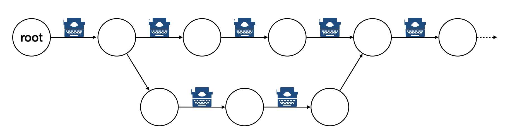
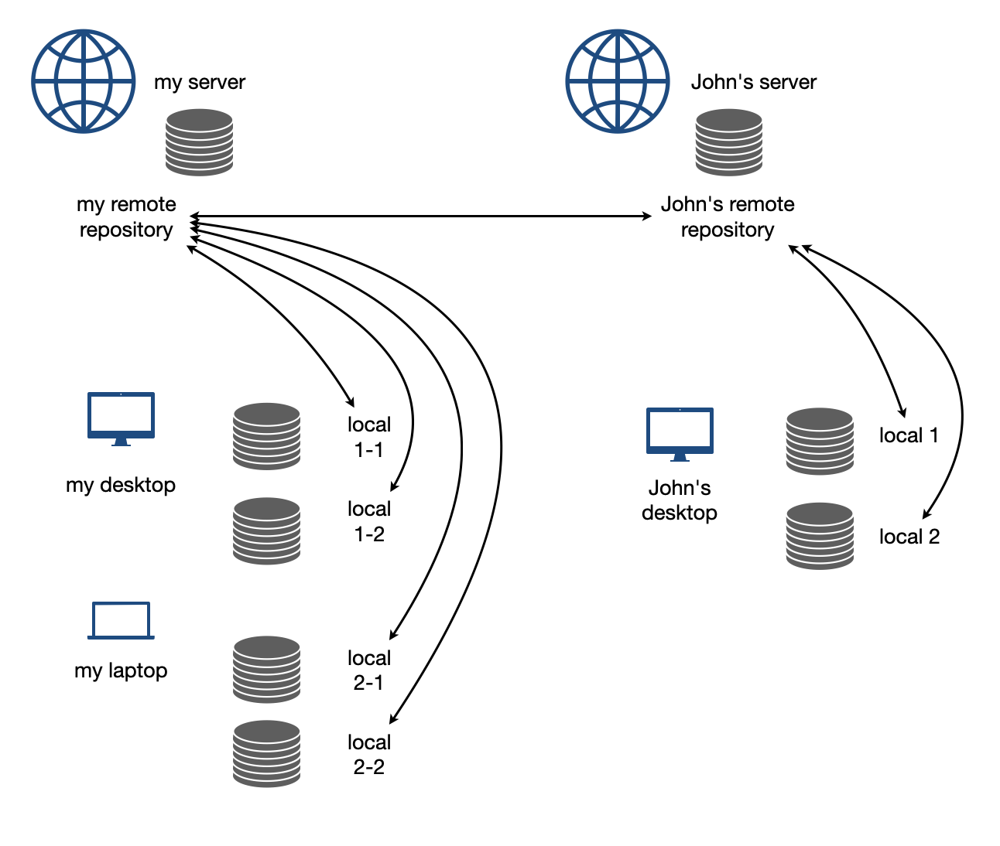
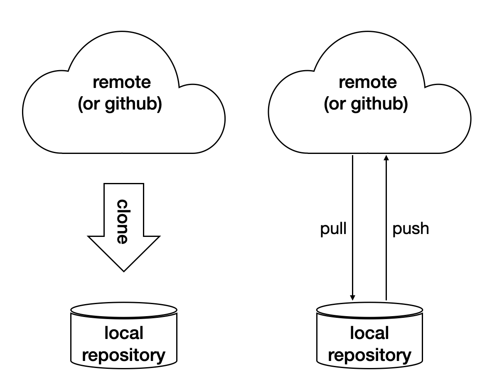
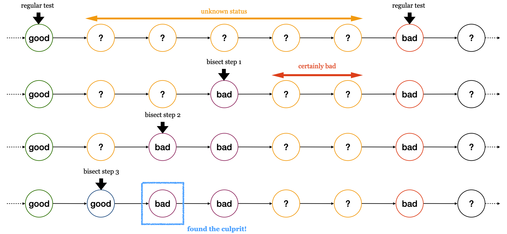

=================================
Fundamental Engineering Practices
=================================

Writing computer code is only a fraction of software engineering.  A large
chunk of efforts is spent in the coding infrastructure.  The keyword is
automation.

Bash Scripting
==============

Shell script is the most common way for automation.  A shell is responsible for
taking commands from users.  Every operating system provides shells.  Because
of the ubiquitous Linux, ``bash`` becomes the most popular shell.  A bash shell
script should work on almost all computer systems.

Structure of a simplest script:

1. Shebang.
2. Comment/document.
3. Setup.
4. Action.

.. code-block:: bash
  :caption: Bash script example: ``clone-python.sh``

  #!/bin/bash
  #
  # This script clones the cpython repository.

  # setup environment variables.
  root=${ROOT:-~/tmp}
  pkgname=python
  pkgbranch=${VERSION:-3.7}
  pkgfull=$pkgname-$pkgbranch
  pkgrepo=https://github.com/python/cpython.git

  # clone.
  mkdir -p $root
  cd $root
  echo `pwd`
  if [ ! -d $pkgfull ] ; then
    git clone -q -b $pkgbranch $pkgrepo $pkgfull
  fi

A shell script file contains commands to ``bash``.  Executing the bash script
file is almost the same as typing those commands directly in an interactive
shell.  Bash shell scripts are the most common way to record the commands and
automate the work.

Variables
+++++++++

Variables are essential in programming languages.  Variables in bash do not have types, but there are two kinds of variables distinguished by their scopes.  One is the _shell variable_, which lives in the current shell.  The other is the _environment variable_, which is also visible in child processes.

.. code-block:: bash

  shell_var="shell_value"

  env_var="env_value"
  export env_var
  export env_var2="other_env_value"

Default value when variable isn't set:

.. code-block:: console

  $ # show the fallback value since the variable isn't set
  $ THISVAR='something'
  $ unset THISVAR; echo ${THISVAR:-no such thing}
  no such thing
  $ THISVAR="some value"; echo ${THISVAR:-no such thing}
  some value

Sub-Process vs Source
+++++++++++++++++++++

A bash script may be run in two ways.  One is to run it like an ordinary
program.  A new process will be created by the current shell, and the script
will be run in that process.  The other way is to use ``source`` (or its
POSIX-compatible synonym, ``.``) to run it in the current shell.  The latter
makes the shell script work like a replay of the command sequence in it.

Assume we have a bash script called ``dosomething.sh``:

.. code-block:: bash

  #!/bin/bash
  export MYENVVAR="MYENVVAR is set to what I want"
  echo "do something"

The variable isn't set in the calling shell:

.. code-block:: console

  $ unset MYENVVAR; ./dosomething.sh; echo ${MYENVVAR:-"MYENVVAR is not set"}
  do something
  MYENVVAR is not set
  $ unset MYENVVAR; source ./dosomething.sh; echo ${MYENVVAR:-"MYENVVAR is not set"}
  do something
  MYENVVAR is set to what I want

Redirection
+++++++++++

When executing a command in a bash script it's commonplace to redirect the
output to a file or another command.

.. code-block:: console

  $ echo "a line output" > line.log
  $ cat line.log
  a line output

Sometimes we want to redirect both stdout and stderr to a file.  The idiom is:

.. code-block:: console

  $ echo "a line output" > line.log 2>&1
  $ cat line.log
  a line output

Note that ``2>&1`` should be written after ``> line.log``.

.. code-block:: console

  $ cp nothisfile.txt another.txt 2>&1 > /dev/null
  cp: nothisfile.txt: No such file or directory
  $ cp nothisfile.txt another.txt > /dev/null 2>&1
  $ cat another.txt
  cat: another.txt: No such file or directory

You may redirect only the standard error to null device.  It is often used to
capture the stdout result to a variable.

.. code-block:: console

  $ # without redirecting stderr we see unwanted messages
  $ var=$(grep impossiblestring *)
  grep: bind1: Is a directory
  grep: build: Is a directory
  grep: gtest: Is a directory
  grep: make1: Is a directory
  grep: make2: Is a directory
  grep: make3: Is a directory
  grep: make4: Is a directory
  grep: nsd: Is a directory
  grep: repo1: Is a directory
  $ echo $var

.. code-block:: console

  $ # throw stderr to null device and we get only the wanted information
  $ var=$(grep impossiblestring * 2> /dev/null)
  $ echo $var

Branching
+++++++++

To write smart scripts we need the ``if``-``else`` branching construct.  The
following example detects the OS and runs different commands to obtain the
number of (logical) processors on the machine:

.. code-block:: bash

  #!/bin/bash
  if [[ "$(uname)" == "Darwin" ]] ; then
    NP=${NP:-$(sysctl -n hw.ncpu)}
  elif [[ "$(uname)" == "Linux" ]] ; then
    NP=${NP:-$(cat /proc/cpuinfo | grep processor | wc -l)}
  else
    NP=${NP:=1}
  fi
  echo "NP may be set to $NP"

.. code-block:: console

  $ uname
  Darwin
  $ ./shownp.sh
  NP may be set to 8

Function
++++++++

``bash`` allows us to write functions to collect commands and rerun it over and
over in a script.

.. code-bash:: bash

  #!/bin/bash
  runcmd () {
    echo "run command: ${@:2}"
    { time "${@:2}" ; } > $1 2>&1
    echo "done; log file: $(cd "$(dirname $1)" && pwd)/$1"
  }
  runcmd line1.log echo "first command"
  runcmd line2.log echo "second command"

.. code-block:: console

  $ ./bashfunction.sh
  run command: echo first command
  done; log file: /Users/yungyuc/hack/code/nsd/notebook/20au_nctu/02_engineering/line1.log
  run command: echo second command
  done; log file: /Users/yungyuc/hack/code/nsd/notebook/20au_nctu/02_engineering/line2.log
  $ cat line1.log
  first command

  real	0m0.000s
  user	0m0.000s
  sys	0m0.000s
  $ cat line2.log
  second command

  real	0m0.000s
  user	0m0.000s
  sys	0m0.000s

Makefile
========

``Makefile`` is the input file of a tool called ``make``.  ``make`` has many
derived implementations since its creation in 1976 at Bell Labs.  The most
popular implementation is GNU ``make``, which is also required in building the
Linux kernel.  We will be focusing on GNU ``make``.
 
A Makefile consists of rules in the following format:

.. code-block:: make

  target : prerequisites [...]
          recipe (1)
          recipe (2)
          ...

Note a tab is **required** at the beginning of each recipe line.  And rules and
recipes are line-based.  If a recipe should use a single line and no more, or
it needs to use ``\`` for line continuation.  So is the rule.

``make``: Automating Your Recipes
+++++++++++++++++++++++++++++++++

``make`` keeps track of the file timestamps.

* If the source file is older than its object file, ``make`` knows that it
  doesn't need to invoke the compiler.
* If, in the other way around, the source file is newer than its object file,
  or the executable is newer than the object and library file, ``make`` will
  run the building tools according to the recipes written in the ``Makefile``.

.. note::

  Make originated with a visit from Steve Johnson (author of yacc, etc.),
  storming into my office, cursing the Fates that had caused him to waste a
  morning debugging a correct program (bug had been fixed, file hadn't been
  compiled, cc \*.o was therefore unaffected). As I had spent a part of the
  previous evening coping with the same disaster on a project I was working on,
  the idea of a tool to solve it came up. It began with an elaborate idea of a
  dependency analyzer, boiled down to something much simpler, and turned into
  Make that weekend. Use of tools that were still wet was part of the culture.
  Makefiles were text files, not magically encoded binaries, because that was
  the Unix ethos: printable, debuggable, understandable stuff.

  -- *Stuart Feldman*

Makefile Format
+++++++++++++++

.. the example is in code/make1/

Use the simple hello world program as an example for writing a make file.
First we set a variable ``CXX`` to designate the compiler command to be used:

.. code-block:: make

  CXX = g++

Write the first rule for linking the executable.  The first rule is the default
rule that ``make`` will use when it is invoked without a target.

.. code-block:: make

  hello: hello.o hellomain.o
          $(CXX) hello.o hellomain.o -o hello

Then write two rules for the object files.  First ``hello.o``:

.. code-block:: make

	hello.o: hello.cpp hello.hpp
          $(CXX) -c hello.cpp -o hello.o

Second ``hellomain.o``:

.. code-block:: make

  hellomain.o: hellomain.cpp hello.hpp
  	        $(CXX) -c hellomain.cpp -o hellomain.o

Now we can use a single command to run all the recipes for building ``hello``:

.. code-block:: console

  $ rm -f hello *.o
  $ make
  g++ -c hello.cpp -o hello.o
  g++ -c hellomain.cpp -o hellomain.o
  g++ hello.o hellomain.o -o hello

``make`` the second time.  Nothing needs to be done:

.. code-block:: console

  $ make
  make: `hello' is up to date.

If we change one of the source files (say, ``hello.cpp``), ``make`` knows from
the prerequisites (dependencies) that the other one doesn't need to be rebuilt.

.. code-block:: console

  $ touch hello.cpp
  $ make
  g++ -c hello.cpp -o hello.o
  g++ hello.o hellomain.o -o hello

Change the shared prerequisites (the header file ``hello.hpp``).  Everything
needs to be rebuilt:

.. code-block:: console

  $ touch hello.hpp
  $ make
  g++ -c hello.cpp -o hello.o
  g++ -c hellomain.cpp -o hellomain.o
  g++ hello.o hellomain.o -o hello

Automatic Variables
+++++++++++++++++++

.. the example is in code/make2/

We found some duplicated file names in the recipes in the above example.
``make`` provides *automatic variables* that allow us to remove them.

* ``$@`` is the file name of the target of the rule.
* ``$^`` is the file names of all the prerequisites.
* ``$<`` is the file name of the first prerequisite.

Aided by the automatic variables, we can simplify the recipes:

.. code-block:: make

  hello: hello.o hellomain.o
          $(CXX) $^ -o $@

  hello.o: hello.cpp hello.hpp
          $(CXX) -c $< -o $@

  hellomain.o: hellomain.cpp hello.hpp
          $(CXX) -c $< -o $@

The new ``Makefile`` works exactly the same as the previous one, but doesn't
have the duplicated file names.

.. code-block:: console

  $ rm -f hello *.o
  $ make
  g++ -c hello.cpp -o hello.o
  g++ -c hellomain.cpp -o hellomain.o
  g++ hello.o hellomain.o -o hello

Implicit Rule
+++++++++++++

.. the example is in code/make3/

Even with the automatic variable, we see duplicated recipes for the two object
file targets.  It can be removed by rewriting the *implicit rule* for ``.o``
file:

.. code-block:: make

  %.o: %.cpp hello.hpp
          $(CXX) -c $< -o $@

``%`` in the target will match any non-empty characters, and it is expanded in
the prerequisite.  Thus, the ``Makefile`` will become much simpler.  And there
are fewer places for mistakes:

.. code-block:: make

  CXX = g++

  hello: hello.o hellomain.o
          $(CXX) $^ -o $@

  %.o: %.cpp hello.hpp
          $(CXX) -c $< -o $@

.. code-block:: console

  $ rm -f hello *.o
  $ make
  g++ -c hello.cpp -o hello.o
  g++ -c hellomain.cpp -o hellomain.o
  g++ hello.o hellomain.o -o hello

Popular Phony Targets
+++++++++++++++++++++

.. the example is in code/make4/

It is handy to have some targets that are not files, and use them to accomplish
some pre-defined operations.  For example, almost all practical ``Makefile``\ s
has a target called ``clean``, and it removes all the built files.

.. code-block:: console

  $ make clean
  rm -rf hello *.o

These targets are called *phony targets* (not real files).  The above operation
is accomplished by the following rule:

.. code-block:: make

  .PHONY: clean
  clean:
          rm -rf hello *.o

Another common use of phony targets is to redirect the default rule:

.. code-block:: make

  # If the following two lines are commented out, the default target becomes hello.o.
  .PHONY: default
  default: hello

  # Implicit rules will be skipped when searching for default.
  #%.o: %.cpp hello.hpp
  #	$(CXX) -c $< -o $@

  hello.o: hello.cpp hello.hpp
          $(CXX) -c $< -o $@

  hellomain.o: hellomain.cpp hello.hpp
          $(CXX) -c $< -o $@

  hello: hello.o hellomain.o
          $(CXX) $^ -o $@

.. code-block:: console

  $ make clean
  rm -rf hello *.o
  $ make
  g++ -c hello.cpp -o hello.o
  g++ -c hellomain.cpp -o hellomain.o
  g++ hello.o hellomain.o -o hello

Cmake
=====

Automation is needed to simplify entangled operations which induce human
errors.  Cross-platform building is a common example of such operations.  We've
seen in a previous example (a bash shell script) how it comes to us:

.. code-block:: bash

  #!/bin/bash
  if [[ "$(uname)" == "Darwin" ]] ; then
    NP=${NP:-$(sysctl -n hw.ncpu)}
  elif [[ "$(uname)" == "Linux" ]] ; then
    NP=${NP:-$(cat /proc/cpuinfo | grep processor | wc -l)}
  else
    NP=${NP:=1}
  fi
  echo "NP may be set to $NP"

As the software grows, such simple conditional statements fail to handle the
complexity.  It applies to both shell scripts and make files.  We need a
dedicated tool for orchestrating the build process.  Cmake is such a tool.

Although it has "make" in the name, cmake is _not_ a variant of make.  It
requires its own configuration file, called ``CMakeLists.txt``.  On Linux, we
usually let cmake to generate GNU make files, and then run make to build the
software.  This is a so-called two-stage building process.  Cmake provides many
helpers so that we may relatively easily configure the real build commands to
deal with compiler flags, library and executable file names, and third-party
libraries (dependencies).

It is easy to let cmake use a separate build directory (it's the default
behavior); the built files will be in a different directory from the source
tree.  In this way, a single source tree may easily produce multiple binary
trees.

Since cmake is only used to deal with complex configuration, we may not use a
simple example to show how it is used.  Instead, high-level information about
what it does will be provided.

How to Run Cmake
++++++++++++++++

By default cmake expects to be run in a separate build directory.  Assume the
current working directory is the project root.  The common way to invoke cmake
for building the project is:

.. code-block:: console

  $ mkdir -p build/dev
  $ cd build/dev
  $ cmake ../.. -DCMAKE_BUILD_TYPE=Release
  -- The C compiler identification is AppleClang 10.0.1.10010046
  -- The CXX compiler identification is AppleClang 10.0.1.10010046
  ...
  -- Configuring done
  -- Generating done
  -- Build files have been written to: /absolute/path/to/build/dev

Select C++ Standard
+++++++++++++++++++

We may use cmake to pick which standard the C++ compiler should use:

.. code-block:: cmake

  set(CMAKE_CXX_STANDARD 14)
  set(CMAKE_CXX_STANDARD_REQUIRED ON)

Different compilers may have different options for the C++ standard.  Clang and
gcc use ``-std=``, while msvc uses ``/std:``.  The cmake variables know what to
use for each of the supported compilers.  The generated make file will result
in a recipe like:

.. code-block:: console

  c++ -O3 -DNDEBUG -fPIC -flto -std=c++14 -o CMakeFiles/_libst.dir/src/python/libst.cpp.o -c /absolute/path/to/src/python/libst.cpp

Add a Custom Option
+++++++++++++++++++

Cmake allows to add any custom option that is consumed from the command line.
For example, a new ``DEBUG_SYMBOL`` option can be added by the following cmake
list code:

.. code-block:: cmake

  option(DEBUG_SYMBOL "add debug information" ON)

  if(DEBUG_SYMBOL)
      set(CMAKE_CXX_FLAGS "${CMAKE_CXX_FLAGS} -g")
  endif()

The option is supplied to cmake as such:

.. code-block:: console

  cmake root -DDEBUG_SYMBOL=ON

Git Version Control System
==========================

Version control system (VCS), which is also called source control management
(SCM), is essential for programmers to engineer software.  There are only two
things that programmers may engineer: the contents in source files, and the
locations of them.  VCS is to tool to track their changes.

Git (https://git-scm.com) is a popular VCS.  Created in 2005, it's a fairly
young tool, while the history of VCS is at least 3 decades.  There are other
tools for version control, but the popularity of git makes it a right tool for
most scenarios.

Github
++++++

Github (https://github.com) is a service tightly related to git.  It is a
hosting service for git repositories.  A repository is the basic unit for a
software project that is controlled with git.  Most of the time, a
git-controlled project is equivalent to a git repository.  Github allows you to
upload repositories and share them with others.  You may make the repository
public (to the world) or private (accessible by only selected accounts).

Create a Repository
+++++++++++++++++++

The way git keeps track of the version is to store the differences into a
graph.  The graph is directed and acyclic, like the following diagram:

Each of the circle is called a changeset, or simply change.  Each changeset
stores the difference of all the files in a repository.  The difference is also
called diff or patch.

The first step to use git is to create the graph database, i.e., the
repository.

.. code-block:: console

  $ rm -rf repo1 # Reset working directory.

.. code-block:: console

  $ # Create a brand new repository.
  $ git init repo1
  Initialized empty Git repository in /Users/yungyuc/hack/code/nsd/notebook/20au_nctu/02_engineering/repo1/.git/

.. code-block:: console

  $ # The repository is empty.
  $ cd repo1
  $ git log
  fatal: your current branch 'master' does not have any commits yet

Add a File and Commit
+++++++++++++++++++++

.. code-block:: console

  $ echo "This is a new repository" > README
  $ git add README

.. code-block:: console

  $ git status
  On branch master

  No commits yet

  Changes to be committed:
    (use "git rm --cached <file>..." to unstage)

    new file:   README

  $ git commit -m "Initialize the repository"
  [master (root-commit) e8df15c] Initialize the repository
   1 file changed, 1 insertion(+)
   create mode 100644 README
  $ git log --graph --pretty=format:%x1b[31m%h%x09%x1b[32m%d%x1b[0m%x20%s
  * e8df15c	 (HEAD -> master) Initialize the repository

What we saved to the git repository is a changeset.  A git repository is a
database consist of a graph.

Add More Changes
++++++++++++++++

We may add more files to the repository.  If there's only one programmer, it's
common that our history will be a straight line.

.. code-block:: console

  $ cp ../make1/*.cpp ../make1/*.hpp ../make1/Makefile .
  $ git add * ; git commit -m "Add code"
  [master f575053] Add code
   4 files changed, 29 insertions(+)
   create mode 100644 Makefile
   create mode 100644 hello.cpp
   create mode 100644 hello.hpp
   create mode 100644 hellomain.cpp
  $ cp ../make2/*.cpp ../make2/*.hpp ../make2/Makefile .
  $ git add * ; git commit -m "Change code; first time"
  [master 6ff5581] Change code; first time
   2 files changed, 3 insertions(+), 4 deletions(-)
  $ cp ../make3/*.cpp ../make3/*.hpp ../make3/Makefile
  $ git add * ; git commit -m "Change code; second time"
  [master 0dcf4b9] Change code; second time
   1 file changed, 1 insertion(+), 4 deletions(-)
  $ cp ../make4/*.cpp ../make4/*.hpp ../make4/Makefile repo1
  $ git add * ; git commit -m "Change code; last time"
  [master 46033cd] Change code; last time
   1 file changed, 17 insertions(+), 2 deletions(-)

.. code-block:: console

  $ # After adding more changes, show how the history looks.
  $ git log --graph --pretty=format:%x1b[31m%h%x09%x1b[32m%d%x1b[0m%x20%s
  * 46033cd	 (HEAD -> master) Change code; last time
  * 0dcf4b9	 Change code; second time
  * 6ff5581	 Change code; first time
  * f575053	 Add code
  * e8df15c	 Initialize the repository

Show Differences
++++++++++++++++

.. code-block:: console

  $ git diff HEAD~1
  diff --git a/Makefile b/Makefile
  index 596e595..81a3d63 100644
  --- a/Makefile
  +++ b/Makefile
  @@ -1,9 +1,24 @@
   CXX = g++
   
  +# If the following two lines are commented out, the default target becomes hello.o.
  +.PHONY: default
  +default: hello
  +
  +# Implicit rules will be skipped when searching for default.
  +#%.o: %.cpp hello.hpp
  +#	$(CXX) -c $< -o $@
  +
  +hello.o: hello.cpp hello.hpp
  +	$(CXX) -c $< -o $@
  +
  +hellomain.o: hellomain.cpp hello.hpp
  +	$(CXX) -c $< -o $@
  +
   hello: hello.o hellomain.o
    $(CXX) $^ -o $@
   
  -%.o: %.cpp hello.hpp
  -	$(CXX) -c $< -o $@
  +.PHONY: clean
  +clean:
  +	rm -rf hello *.o
   
   # vim: set noet nobomb fenc=utf8 ff=unix:

.. code-block:: console

  $ git diff HEAD~1 HEAD~2
  diff --git a/Makefile b/Makefile
  index 596e595..a55350c 100644
  --- a/Makefile
  +++ b/Makefile
  @@ -3,7 +3,10 @@ CXX = g++
   hello: hello.o hellomain.o
    $(CXX) $^ -o $@
   
  -%.o: %.cpp hello.hpp
  +hello.o: hello.cpp hello.hpp
  +	$(CXX) -c $< -o $@
  +
  +hellomain.o: hellomain.cpp hello.hpp
    $(CXX) -c $< -o $@
   
   # vim: set noet nobomb fenc=utf8 ff=unix:

Clone
+++++

Git is a distributed VCS.  It means that when we use git to track history, we
don't need to rely on a remote server.  The way git does it is to make every
location that needs the history to have a full copy of it.  When we develop
code and add patches to the repository, we don't need to talk to a server.

In a collaborative environment, we usually have an "origin", or "blessed"
repository.  It is where we get the authentic history.  Then it is _cloned_ to
our workstation, where we do software development.  After we make the necessary
changes and check in to the (local) repository, we synchronize to the remote
repository.

Try to clone a repository from github.

.. code-block:: console

  $ git clone git@github.com:yungyuc/nsd.git
  Cloning into 'nsd'...
  remote: Enumerating objects: 50, done.
  remote: Counting objects: 100% (50/50), done.
  remote: Compressing objects: 100% (38/38), done.
  remote: Total 1987 (delta 16), reused 40 (delta 11), pack-reused 1937
  Receiving objects: 100% (1987/1987), 1.93 MiB | 1.93 MiB/s, done.
  Resolving deltas: 100% (1195/1195), done.

Synchronization
+++++++++++++++

The synchronization is two-way: *push* means to upload the local changes to the
remote repository, and *pull* downloads changes in the remote repository to
local.  Git is responsible for making sure to have no duplication of changes.

Branching and Merging
+++++++++++++++++++++

.. figure:: https://nvie.com/img/git-model@2x.png
  :align: center
  :width: 560px

`A successful Git branching model, Vincent Driessen, 2010
<https://nvie.com/posts/a-successful-git-branching-model/>`__.

In addition to branching and merging, rebase is also a critical technique for
operating a git repository, but it is best to learn it by yourself when
developing code in this course.

Bisecting
+++++++++

With the clear history in a repository, when we have a bug in a system, it
becomes relatively easy to hunt down when and how the problem is introduced by
bisection.

Automatic testing
=================

Automatic testing is part of software development flow.  When working on a
project, we may first build the code:

.. code-block:: console

  $ mkdir -p build/dev
  $ pushd build/dev
  $ cmake ../.. -DCMAKE_BUILD_TYPE=Release
  ...
  $ popd
  $ make -C build/dev
  ...

Then make some modification:

.. code-block:: console

  $ vi include/spacetime.hpp
  ...

Rebuild:

.. code-block:: console

  $ make -C build/dev
  ...

After the building succeeds, run testing code included in the project to make
sure the code we added didn't break the system:

.. code-block::

  $ ./build/dev/gtests/libst_gtests
  [==========] Running 3 tests from 2 test cases.
  [----------] Global test environment set-up.
  [----------] 2 tests from CopyTest
  [ RUN      ] CopyTest.Grid
  [       OK ] CopyTest.Grid (0 ms)
  [ RUN      ] CopyTest.Solver
  [       OK ] CopyTest.Solver (0 ms)
  [----------] 2 tests from CopyTest (0 ms total)

  [----------] 1 test from SolverTest
  [ RUN      ] SolverTest.Celm
  [       OK ] SolverTest.Celm (0 ms)
  [----------] 1 test from SolverTest (0 ms total)

  [----------] Global test environment tear-down
  [==========] 3 tests from 2 test cases ran. (0 ms total)
  [  PASSED  ] 3 tests.
  $ env PYTHONPATH=$(pwd) pytest tests
  ============================= test session starts ==============================
  platform darwin -- Python 3.7.3+, pytest-4.4.1, py-1.8.0, pluggy-0.9.0
  rootdir: /Users/yungyuc/hack/code/turgon/spacetime
  collected 51 items

  tests/test_celm_selm.py .............................                    [ 56%]
  tests/test_grid.py ....                                                  [ 64%]
  tests/test_inviscid_burgers.py ..                                        [ 68%]
  tests/test_linear_scalar.py ......                                       [ 80%]
  tests/test_solution.py ..........                                        [100%]

  ========================== 51 passed in 0.38 seconds ===========================

The testing needs to be automatic.  If they weren't, we are introducing an
unnecessary factor for human error.

Why Test
++++++++

To err is human.  It's possible to be free from mistakes for 20 lines of code,
but it is unrealistic to write 1,000 lines of code and expect no error.
There's a time I changed 200 lines of code without running a compiler while
typing, at the end when the compiler builds without an error I fell out of my
chair.

Thus, it's commonplace that programmers write "experimental code" during
development.  Numerical code is no different.  Compared to other applications,
numerical code tends to formulate a full problem for the experiment.  If the
code is for a research project, the "experiment" itself may sometimes be the
purpose.

For any application, the experimental code isn't much different from a test
that will be used to check for regressions.  We may run the tests every time we
change the code.  Thus, it's important to make the automatic tests fast.

Sensitivity is an equivalently important point for automatic tests.  We want
the tests to capture regressions.  But we don't want them to fail with expected
change of results and slow down the development.

Automatic testing is a simple but important tool to improve coding productivity
as well as code quality.

Google Test for C++
+++++++++++++++++++

A test framework provides assertions, test discovery, runners, and reports.
`Google test <https://github.com/google/googletest>`__ is a popular test
framework for C++.

.. code-block:: cpp

  #include <gtest/gtest.h>

  #include "spacetime.hpp"

  namespace st = spacetime;

  TEST(CopyTest, Grid) {

      std::shared_ptr<st::Grid> grid=st::Grid::construct(0, 100, 100);
      st::Grid copied_grid(*grid);
      EXPECT_NE(grid.get(), &copied_grid);

  }

  TEST(CopyTest, Solver) {

      std::shared_ptr<st::Grid> grid=st::Grid::construct(0, 100, 100);

      std::shared_ptr<st::Solver> sol=st::Solver::construct(grid, 1, 1);
      std::shared_ptr<st::Solver> cloned_sol=sol->clone();
      EXPECT_NE(sol.get(), cloned_sol.get());
      EXPECT_EQ(&sol->grid(), &cloned_sol->grid());

      std::shared_ptr<st::Solver> cloned_grid_sol=sol->clone(true);
      EXPECT_NE(sol.get(), cloned_grid_sol.get());
      EXPECT_NE(&sol->grid(), &cloned_grid_sol->grid());

  }

  TEST(SolverTest, Celm) {

      std::shared_ptr<st::Grid> grid=st::Grid::construct(0, 100, 100);
      std::shared_ptr<st::Solver> sol=st::Solver::construct(grid, 1, 1);

      st::Celm ce0 = sol->celm(0, false);
      st::Celm ce99 = sol->celm(99, false);
      EXPECT_FALSE(ce0 == ce99);
      EXPECT_TRUE (ce0 != ce99);
      EXPECT_TRUE (ce0 <  ce99);
      EXPECT_TRUE (ce0 <= ce99);
      EXPECT_FALSE(ce0 >  ce99);
      EXPECT_FALSE(ce0 >= ce99);

  }

  int main(int argc, char **argv) {
      ::testing::InitGoogleTest(&argc, argv);
      return RUN_ALL_TESTS();
  }

  /* vim: set et ts=4 sw=4: */

Python Tests
++++++++++++

Python standard library has :doc:`a unit-test framework
<python:library/unittest>`.  It serves the same purpose for Python as
Google-test for C++.  This sort of tests is called unit tests because they test
the smallest unit of constructs in a system.  Since our requirements of the
automatic testing is speed and sensitivity, it usually becomes equivalent to
unit tests.

.. code-block:: python

  import unittest

  import numpy as np

  import libst

  class GridTC(unittest.TestCase):

      def setUp(self):

          self.grid10 = libst.Grid(xmin=0.0, xmax=10.0, nelm=10)

      def test_construction(self):

          with self.assertRaisesRegex(
              ValueError,
              "Grid::Grid\(xmin=0, xmax=10, ncelm=0\) invalid argument: "
              "ncelm smaller than 1",
          ):
              libst.Grid(0, 10, 0)

          with self.assertRaisesRegex(
              ValueError,
              "Grid::Grid\(xmin=10, xmax=10, ncelm=10\) invalid arguments: "
              "xmin >= xmax",
          ):
              libst.Grid(10, 10, 10)

          with self.assertRaisesRegex(
              ValueError,
              "Grid::Grid\(xmin=11, xmax=10, ncelm=10\) invalid arguments: "
              "xmin >= xmax",
          ):
              libst.Grid(11, 10, 10)

          # Simply test for passing.
          libst.Grid(xloc=np.arange(2) * 0.1)

          for s in [0, 1]:
              with self.assertRaisesRegex(
                  ValueError,
                  "Grid::init_from_array\(xloc\) invalid arguments: "
                  "xloc.size\(\)=%d smaller than 2" % s
              ):
                  libst.Grid(xloc=np.arange(s) * 0.1)

          with self.assertRaisesRegex(
              ValueError,
              "Grid::init_from_array\(xloc\) invalid arguments: "
              "xloc\[0\]=1 >= xloc\[1\]=0.9"
          ):
              libst.Grid(xloc=np.arange(10, -1, -1) * 0.1)

      def test_xcoord(self):

          nx = (self.grid10.ncelm + self.grid10.BOUND_COUNT)*2 + 1
          golden_x = np.arange(0.0, 10.1, 0.5)
          golden_front = golden_x[0] - golden_x[self.grid10.BOUND_COUNT:0:-1]
          golden_back = golden_x[-1] - golden_x[-2:-self.grid10.BOUND_COUNT-2:-1]
          golden_back += golden_x[-1]
          golden_x = np.hstack([golden_front, golden_x, golden_back])

          self.assertEqual(nx, len(self.grid10.xcoord))
          self.assertEqual(golden_x.tolist(), self.grid10.xcoord.tolist())
          self.grid10.xcoord.fill(10)
          self.assertEqual([10]*nx, self.grid10.xcoord.tolist())

      def test_number(self):

          self.assertEqual(10, self.grid10.ncelm)
          self.assertEqual(11, self.grid10.nselm)

      def test_str(self):

          self.assertEqual("Grid(xmin=0, xmax=10, ncelm=10)",
                           str(self.grid10))

There are many other types of testing.  General software quality assurance is a
bigger subject, and relate less directly to code development.

Wrap to Python: pybind11
++++++++++++++++++++++++

A numerical software system is hybrid in language.  C++ is used in the low
level for speed and architecture.  Python or another scripting language is in
the high level for easy customization.  If users have the source code, they
have the option to change the software at any level, but most of the time they
would like to stay at the high-level scripting layer that we provide as the
user interface.

The high-level scripting layer will be also useful for testing.  But the first
step is to make the low-level C++ available to Python.  Here comes pybind11.
It is a header-only library to expose C++ types in Python, and vice versa.  We
primarily use it for wrapping C++ to Python.

Here is an example demonstrating how pybind11 works.  We rotate a vector in the
2-dimensional Cartesian coordinate system by an angle.  Let :math:`\mathbf{v}`
be the original vector, :math:`\theta` the rotation angle, and
:math:`\mathbf{v}'` the rotated vector.  The formula for the rotation is
simple:

.. math::

  \mathbf{v}' = \left( \begin{array}{cc}
    \cos\theta & -\sin\theta \\
    \sin\theta & \cos\theta
  \end{array} \right) \mathbf{v}

The formula can be easily turned into any language.  Since we are showing
pybind11, it may be implemented in C++ and wrapped to Python, and then we can
test it easily.

Continuous Integration
======================

Continuous integration (CI) is a practice that each developer in a team
integrates the individual work into the shared mainstream regularly and
frequently.  Thus, the chance for the developers to step on each other's toes
is reduced.

Here is a simple example.  Assume a developer, Abby, wrote the rotate function:

.. code-block:: cpp

  // vector before angle
  std::tuple<double, double> rotate(std::tuple<double, double> const & vec, double rad);

But another developer, Bob, assumed another signature:

.. code-block:: cpp

  // angle before vector
  std::tuple<double, double> rotate(double rad, std::tuple<double, double> const & vec);

When they merge their branches, it is obvious that their code won't work
together.  Because the difference in signature, the discrepancy is likely to be
detected when they try to build the merged source code.

But oftentimes, compiler cannot tell the discrepancy.  It can only be detected
during runtime.

.. code-block:: cpp

  // the angle is in radian
  std::tuple<double, double> rotate(std::tuple<double, double> const & vec, double rad);

  int main(int argc, char ** argv)
  {
      std::tuple<double, double> vec = get_vector();
      double deg = get_angle();
      // the angle is in degree
      std::tuple<double, double> ret = rotate(vec, deg);
      return 0;
  }

If the function assumes the angle to be in radian but the caller uses the wrong
unit which is degree, we will need a test to detect the error.

CI Service
++++++++++

Continuous integration (CI) is tightly coupled with a version control system.
Recall bisection:

For bisection to work, we need to know the test results for every change.
There needs to be a CI server to monitor each of the check-ins to the shared
repository, build the software, and run necessary tests.

`Github Action <https://github.com/features/actions>`__ is one of such services
available for public use, and fully integrated with Github.

For large-scale software development team, it is commonplace to build their
in-house CI system.  It may be built from scratch or by customizing a general
system like `Jenkins <https://jenkins.io/>`__.  The in-house system usually
will be highly integrated to the internal infrastructure and offer features
very specific to the products it serves.

Code Review
===========

Software development takes a lot of communication.  This may be
counter-intuitive to non-developers.  In an ideal, entropy free world, there is
no cost to transfer information between minds, and collaboration is conducted
without friction in communication.

In real world, communication doesn't work like that.  To develop useful
software, the goal itself must be defined first.  This takes a lot of work and,
intuitively, communication.  But after the goal is clarified and defined, we
still need to spend a lot of efforts in communication.

You may be curious why?  Let's use our vector example again:

.. code-block:: cpp

  // vector before angle by Abby
  std::tuple<double, double> rotate(std::tuple<double, double> const & vec, double rad);
  // angle before vector by Bob
  std::tuple<double, double> rotate(double rad, std::tuple<double, double> const & vec);

Assume Abby develop her version first.  If she kept that herself, nothing
prevents Bob's incompatible version from being written.  But if Abby somehow
tells her colleagues her design, Bob may not create the incompatible version in
the first place.

Code review is an efficient way for Abby to communicate with Bob about her
change.  It actually works in two way:

1. When Abby develops the function ``rotate``, she post a code review and Bob
   learns from her how ``rotate`` should work.
2. When Bob develops code that uses ``rotate``, he posts a code review, and
   Abby can comment that his version isn't compatible to the existing
   implementation, and asks Bob to modify.

Here is a real-world example for how code review works: https://github.com/QuantStack/xtensor-python/pull/175.

Timing
======

Measurement is the first and most important thing to do for developing
high-performance code.

There are usually two "times" we measure: CPU time and wall time.  The latter
is also called elapsed time.  To know how fast a specific code snippet runs,
CPU time provides accurate measurement.  It takes into account only the time
when the processor is allocated to the process, and isn't mixed with other
processes or system calls.

But when measuring the performance of the overall system, for which usually
everything is taken into account, we may use the wall time.  The wall time is
the time that elapses in the real world.

Timing Command
++++++++++++++

In Linux, you can issue a ``bash`` command for timing: ``time``.  It reports
the time spent in the command that is passed to it:

.. code-block:: console

  $ time ls > /dev/null

  real	0m0.003s
  user	0m0.001s
  sys	0m0.001s

The "real" time means the wall time.  The "user" time is the CPU time spent in
the executable's code.  The "system" time is the CPU time spent in the OS calls
from the executable.  The total CPU time is the user and system times combined.

Linux Timing Functions
++++++++++++++++++++++

In C and C++ programs, we can use the timing functions provided by the `C
library
<https://www.gnu.org/software/libc/manual/html_node/Date-and-Time.html>`__.
For example, the CPU time may be obtained from:

.. code-block:: c

  clock_t times (struct tms *buffer);

The wall time may be obtained from:

.. code-block:: c

  int gettimeofday (struct timeval *tp, struct timezone *tzp);

Timing is tricky for multi-threading and on an multi-process system.

Python Timing Tool
++++++++++++++++++

Python has a module ``timeit`` in its standard library for timing.  By default
it uses wall time.

.. code-block:: console

  $ python3 -m timeit '"-".join(str(n) for n in range(100))'

Exercises
=========

1. Write a bash shell script to build all of the example programs in the
   previous lectures.
2. Write a Makefile to build all of the example programs in the previous
   lecture.
3. Write a C++ function that calculates the angle (in radians) between two
   vectors in the 2-dimensional Cartesian coordinate system.  Use pybind11 to
   wrap it to Python.  Use Python unit-test to check the result is correct.
   You may use third-party test runners, e.g., py.test or nosetest.
4. Use the package ipybind (https://github.com/aldanor/ipybind) to enable
   building C++ code in Jupyter notebook.  Repeat problem 3 without the unit
   tests, but do it in a Jupyter notebook.  Test code should be included in the
   Jupyter notebook, but the execution can be manual.

References
==========

.. [1] https://www.gnu.org/software/bash/manual/bash.html
.. [2] https://www.gnu.org/software/make/manual/make.html
.. [3] https://pybind11.readthedocs.io/

.. vim: set ff=unix fenc=utf8 et sw=2 ts=2 sts=2:
