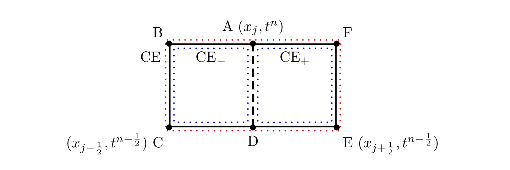
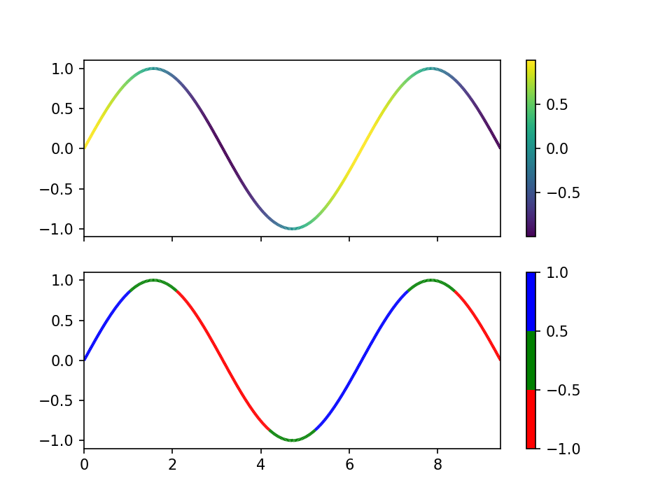

================
Python and Numpy
================

Python is easy to use and popular among scientists and engineers for its
simplicity.  It is suitable for almost every task, and the versatility makes is
one of the best tool as the programming interface for numerical applications.

Organize Python Code
====================

To help the discussions for Python code organization, we make a simple
categorization:

* One file containing Python code as a **script**.
* One Python file is a ":term:`module <python:module>`".
* One directory containing Python files (satisfying some rules) is a
  ":term:`package <python:package>`".
* "Module" is usually used in a loose way to refer to things that may be
  imported by Python :ref:`import <python:import>` statement.  Then a "module"
  can mean (the strictly defined) module or a package.

How a Python Script Works
+++++++++++++++++++++++++

A script is a text file that the program loader sends to an engine (usually
interpreter) to execute with the content.  We usually write scripts for
automating repetitive work, and they should be short for quick implementation.
Assume that we have a simple task: count the number of lines in a file.  For
the simple example script, see: :ref:`nsd-numpy-example-step0`.

Running a script requires the executable permission to be set.  Otherwise, the
script file cannot be executed in the shell as a command:

.. code-block:: console

  $ ls -al step0.py      # executable bit is not set
  -rw-r--r--  1 yungyuc  staff  574 Apr  7 22:18 step0.py

  $ ./step0.py pstake.py # can't run without permission
  -bash: ./step0.py: Permission denied

.. code-block:: console

  $ chmod a+x step0.py   # set the executable bit

  $ ls -al step0.py      # executable bit is set
  -rwxr-xr-x  1 yungyuc  staff  574 Apr  7 22:18 step0.py*

  $ ./step0.py pstake.py # properly it runs
  811 lines in pstake.py

If we do not need to run the script like an executable, it can be run by
explicitly calling Python:

.. code-block:: console

  $ chmod u-x step0.py

  $ python3 step0.py pstake.py
  811 lines in pstake.py

Python Script Shebang
---------------------

The leading line in a script that starts with ``#!`` is called the *shebang*.
It tells the program loader which executable to run for the script.  For a
Python script, `it is recommended
<https://www.python.org/dev/peps/pep-0394/#for-python-script-publishers>`__ to
use ``/usr/bin/env python3`` in the shebang.  It allows the interactive shell
to search for the Python binary configured by the user.

.. code-block:: python

  #!/usr/bin/env python3
  # ...

Modeline
--------

At the end of the script we have the `vim modeline magic
<https://vim.fandom.com/wiki/Modeline_magic>`__:

.. code-block:: python

  ...
  # vim: set ff=unix fenc=utf8 ft=python et sw=4 ts=4 sts=4 tw=79:

A script runs without it, but it may be used to specify how the file should be
formatted in the editor.  Vim runs the command in the modeline when reading a
file having it.  The modeline is useful to specify how the source code is
formatted and provide the minimal information about the coding convention.  The
modeline should not contain commands that changes the global or cosmetic
behaviors, e.g., show or hide the line numbers.  The above example does the
following:

``ff=unix``
  Use ``<LF>`` to for the end-of-line character.

``fenc=utf8``
  Use UTF-8 for file content encoding.

``ft=python``
  Use Python syntax highlighting.

``et``
  Expand tab characters.

``sw=4``
  Number of spaces for each step of indent.

``ts=4``
  Number of spaces for a tab.

``sts=4``
  Number of spaces for a tab during editing.

``tw=79``
  Maximum number or characters in a line to be inserted.  `PEP-8
  <https://www.python.org/dev/peps/pep-0008/>`__ recommends to use 79.

Emacs has a similar feature called `file variable
<https://www.gnu.org/software/emacs/manual/html_node/emacs/Specifying-File-Variables.html>`__:

.. code-block:: lisp

  ...
  ;; -*- mode: Lisp; fill-column: 75; comment-column: 50; -*-

One-Liner
---------

Python executable supports the ``-c`` argument for one-liner.  The content of
the script is passed from the command line.  It's called one-liner because it
usually only takes one line.

One-liners are convenient for code that is only run once.  Quick to write but
hard to read.

.. code-block:: console

  $ python3 -c 'print(len(open("pstake.py").readlines()), "lines")'
  811 lines

Make a Module
+++++++++++++

A :term:`Python module <python:module>` is pretty much a Python source file.  A
Python script is also a file containing Python code.  They differ in the way
the code is invoked.  A script is used as a command.  A module is imported as a
library.

Can a script be used as a module?  It depends on how it is written.  For
example, the script :ref:`step0.py <nsd-numpy-example-step0>` is not suitable
for being imported as a module:

.. code-block:: console

  $ python3 -c 'import step0'
  missing file name

The :ref:`import <python:import>` statement runs the Python source code and
puts the results in the module namespace.  However, the code in :ref:`step0.py
<nsd-numpy-example-step0>` simply does the work without leaving anything useful
in the module to be imported.

We should modify the script to be make it suitable for a module.  See:
:ref:`nsd-numpy-example-step1`.

Because a module is not supposed to be run as a command, the file no longer has
a shebang.  In addition to that, we made two changes.  First, the module file
factors out the line-counting code from the script example:

.. code-block:: python

  if os.path.exists(fname):
      with open(fname) as fobj:
          lines = fobj.readlines()
      sys.stdout.write('{} lines in {}\n'.format(len(lines), fname))
  else:
      sys.stdout.write('{} not found\n'.format(fname))

into a function:

.. code-block:: python

  def count_line(fname):
      if os.path.exists(fname):
          with open(fname) as fobj:
              lines = fobj.readlines()
          sys.stdout.write('{} lines in {}\n'.format(len(lines), fname))
      else:
          sys.stdout.write('{} not found\n'.format(fname))

Second, the rest of the code is moved into an ``if`` test:

.. code-block:: python

  # This tests whether the code is evaluated as a script.
  if __name__ == '__main__':
      if len(sys.argv) < 2:
          sys.stdout.write('missing file name\n')
      elif len(sys.argv) > 2:
          sys.stdout.write('only one argument is allowed\n')
      else:
          count_line(sys.argv[1])

.. note::

  :py:mod:`__main__ <python:__main__>` is the name of the scope in which the
  top-level code execute in Python.

After the change, :py:mod:`!step1` acts like a module.  When it is imported,
nothing happens in the calling site:

.. code-block:: console

  $ python3 -c 'import step1'

To run the code defined in the :py:mod:`!step1` module, the function
:py:func:`!count_line` should be explicitly called:

.. code-block:: console

  $ python3 -c 'import step1 ; step1.count_line("pstake.py")'
  811 lines in pstake.py

While modifying the file, we keep the capability to run the file as a script:

.. code-block:: console

  $ python3 step0.py pstake.py
  811 lines in pstake.py
  $ python3 step1.py pstake.py
  811 lines in pstake.py

Move Everything inside Function
-------------------------------

We can improve the module by factoring out all code to functions.  See:
:ref:`nsd-numpy-example-step2`.  It moves the argument-processing code to the
function :py:func:`!main`:

.. code-block:: python

  def main():
      if len(sys.argv) < 2:
          sys.stdout.write('missing file name\n')
      elif len(sys.argv) > 2:
          sys.stdout.write('only one argument is allowed\n')
      else:
          count_line(sys.argv[1])

  # This tests whether the file is evaluated as a script.
  if __name__ == '__main__':
      main()

:ref:`step1.py <nsd-numpy-example-step1>` and :ref:`step2.py
<nsd-numpy-example-step2>` have the same behavior, except :ref:`step2.py
<nsd-numpy-example-step2>` has a :py:func:`!main` function, which allows it to
behave like a script:

.. code-block:: console

  $ # only import the module
  $ python3 -c 'import step2'
  $ # import and then run the new main function
  $ python3 -c 'import step2 ; step2.main()' pstake.py
  811 lines in pstake.py

Run Module as Script
--------------------

If there is a module, Python allows to run the module as a script without
knowing where the module file is.  The functionality is supported with the
``-m`` argument.

.. code-block:: console

  $ python3 -m step1 pstake.py
  811 lines in pstake.py

Make a Package
++++++++++++++

When the code grows to a point that a single file is not enough to house
everything, we should split the code into multiple files and put them in a
directory.  Python :term:`package <python:package>` provides a framework to
organize source-code files in a directory and allows them to be imported like a
module.  Now we will turn the line-counting example code into a package.  Make
a directory with the following layout:

* ``step3/``

  * ``__init__.py``: :ref:`nsd-numpy-example-step3-init`
  * ``_core.py``: :ref:`nsd-numpy-example-step3-core`
  * ``__main__.py``: :ref:`nsd-numpy-example-step3-main`

Python recognizes a directory containing an ``__init__.py`` file as a package.
The :ref:`__init__.py <nsd-numpy-example-step3-init>` file usually just takes
functions (or classes) from the internal modules via relative import:

.. code-block:: python

  from ._core import count_line
  from ._core import main

Code that does the real work is put in :ref:`_core.py
<nsd-numpy-example-step3-core>`:

.. code-block:: python

  def count_line(fname):
      if os.path.exists(fname):
          with open(fname) as fobj:
              lines = fobj.readlines()
          sys.stdout.write('{} lines in {}\n'.format(len(lines), fname))
      else:
          sys.stdout.write('{} not found\n'.format(fname))

  def main():
      if len(sys.argv) < 2:
          sys.stdout.write('missing file name\n')
      elif len(sys.argv) > 2:
          sys.stdout.write('only one argument is allowed\n')
      else:
          count_line(sys.argv[1])

For simple and short code like the example we are showing, it doesn't matter
how to organize the code.  But if there are 10,000 lines of Python, the
directory structure becomes handy.  The import statements in the
:ref:`__init__.py <nsd-numpy-example-step3-init>` serves as documentation for
where to find the implementation.  The real code in implementation files
(:ref:`_core.py <nsd-numpy-example-step3-core>`) may be organized differently,
but users don't need to know the detail.

While having the code implemented in :ref:`_core.py
<nsd-numpy-example-step3-core>`, the package :py:mod:`!step3` allows users to
run the code directly from its top-level namespace:

.. code-block:: console
  :caption: Call :py:func:`!count_line`

  $ # This works just like a module.
  $ python3 -c 'import step3 ; step3.count_line("pstake.py")'
  811 lines in pstake.py

.. code-block:: console
  :caption: Call :py:func:`!main`

  $ # This also works just like a module.
  $ python3 -c 'import step3 ; step3.main()' pstake.py
  811 lines in pstake.py

Since the package is a directory, and no file in the directory contains the
complete code to do all the work, we cannot run the package as a script:

.. code-block:: console

  $ python3 step3/__init__.py pstake.py
  Traceback (most recent call last):
    File "/Users/yungyuc/work/web/ynote/nsd/02numpy/code/step3/__init__.py", line 12, in <module>
      from ._core import count_line
  ImportError: attempted relative import with no known parent package

But the ``-m`` option still works, because we have added :ref:`__main__.py
<nsd-numpy-example-step3-main>`:

.. code-block:: console

  $ python3 -m step3 pstake.py
  811 lines in pstake.py

A Real Useful Script
++++++++++++++++++++

Here is a real-world example: :ref:`nsd-numpy-example-pstake`.  It converts
`pstricks <http://tug.org/PSTricks/main.cgi/>`__ commands (see:
:ref:`nsd-numpy-example-cce`) to an image file.

.. code-block:: console

  $ rm -f cce.png
  $ ./pstake.py cce.tex cce.png > /dev/null 2>&1

Numpy for Array-Centric Code
============================

Arrays offer the highest performance when dealing with homogeneous data.  In
Python, the `numpy <http://www.numpy.org/>`__ library provides everything we
need for arrays.

Arrays use contiguous memory.  Python provides a different set of sequential
data: :ref:`python:typesseq`, which do not require contiguity.

.. code-block:: pycon
  :caption: Make a list (one of Python sequence types) of integers

  >>> lst = [1, 1, 2, 3, 5]
  >>> print('A list:', lst)
  A list: [1, 1, 2, 3, 5]

When using Python, it is conventional to alias it as :py:mod:`np
<numpy:numpy>`:

.. code-block:: pycon
  :caption: Import :py:mod:`numpy:numpy` and alias it to :py:mod:`!np`

  >>> import numpy as np

There are many ways to create a numpy array.  But in pure Python code, the most
common approach is to convert from a sequence:

.. code-block:: pycon
  :caption: Make an array from a sequence

  >>> array = np.array(lst)
  >>> print('An array:', np.array(array))
  An array: [1 1 2 3 5]

.. note::

  It should be obvious that the created array uses a copy of the input
  sequence:

  .. code-block:: pycon

    >>> array[2] = 8
    >>> print(array)  # The array changes.
    [1 1 8 3 5]
    >>> print(lst)  # The input sequence is not changed.
    [1, 1, 2, 3, 5]

Basic Meta-Data
+++++++++++++++

A numpy array object contains two data: the contiguous data buffer for the
array elements, and the meta-data describing the buffer.  Here is a list of
some frequently used meta-data.

.. _nsd-numpy-shape:

:py:attr:`!shape`
-----------------

:py:attr:`numpy:numpy.ndarray.shape` returns a tuple for array dimensions:

.. code-block:: pycon

  >>> array = np.array([0, 1, 2, 3, 4, 5])
  >>> print("shape:", array.shape)
  shape: (6,)
  >>> array = np.array([[0, 1, 2], [3, 4, 5]])
  >>> print("shape:", array.shape)
  shape: (2, 3)

.. _nsd-numpy-size:

:py:attr:`!size`
----------------

:py:attr:`numpy:numpy.ndarray.size` returns the number of elements in an
array:

.. code-block:: pycon

  >>> array = np.array([0, 1, 2, 3])
  >>> print("size:", array.size)
  size: 4
  >>> array = np.array([[0, 1, 2], [3, 4, 5]])
  >>> print("size:", array.size)
  size: 6

.. _nsd-numpy-dtype:

:py:attr:`!dtype`
-----------------

:py:attr:`numpy:numpy.ndarray.dtype` returns the data type of the array's
elements.

.. code-block:: pycon

  >>> array = np.array([[0, 1, 2], [3, 4, 5]])
  >>> print("dtype:", array.dtype)
  dtype: int64

When creating an :py:class:`~numpy:numpy.ndarray`, the factory function
:py:func:`numpy:numpy.array` uses the input sequence to determine the
appropriate :py:class:`~numpy:numpy.dtype` for the constructed array:

.. code-block:: pycon
  :caption: All-integer input results in an integer array

  >>> array1 = np.array([1, 1, 2, 3, 5])
  >>> print("only int:", array1, type(array1), array1.dtype)
  only int: [1 1 2 3 5] <class 'numpy.ndarray'> int64

.. code-block:: pycon
  :caption: All-real input results in a real array

  >>> array2 = np.array([1.0, 1.0, 2.0, 3.0, 5.0])
  >>> print("only real:", array2, type(array2), array2.dtype)
  only real: [1. 1. 2. 3. 5.] <class 'numpy.ndarray'> float64

.. code-block:: pycon
  :caption: Input mixed with integer and real number result in a real array

  >>> array3 = np.array([1, 1, 2, 3, 5.0])
  >>> print("int and real:", array3, type(array3), array3.dtype)
  int and real: [1. 1. 2. 3. 5.] <class 'numpy.ndarray'> float64

This is where a Python list (or sequence) differs from an array.  A list does
not know the type of the data it contains, but the array does.  The type
information allows numpy to process the array data using pre-compiled C code.

The following table lists commonly used dtypes:

.. list-table:: Commonly used dtypes
  :header-rows: 1
  :align: center

  * - dtype (object)
    - dtype string name
    - C++ type name
  * - ``numpy.bool_``
    - ``"bool"``
    - ``bool``
  * - ``numpy.int8``
    - ``"int8"``
    - ``int8_t``
  * - ``numpy.int16``
    - ``"int16"``
    - ``int16_t``
  * - ``numpy.int32``
    - ``"int32"``
    - ``int32_t``
  * - ``numpy.int64``
    - ``"int64"``
    - ``int64_t``
  * - ``numpy.uint8``
    - ``"uint8"``
    - ``uint8_t``
  * - ``numpy.uint16``
    - ``"uint16"``
    - ``uint16_t``
  * - ``numpy.uint32``
    - ``"uint32"``
    - ``uint32_t``
  * - ``numpy.uint64``
    - ``"uint64"``
    - ``uint64_t``
  * - ``numpy.float32``
    - ``"float32"``
    - ``float``
  * - ``numpy.float64``
    - ``"float64"``
    - ``double``

When specifying dtype in a numpy function, the string names are oftentimes more
convenient than the object, like the example code in
:ref:`nsd-numpy-construction`.

For the full list of dtypes, see :ref:`numpy:basics.types` in the numpy
document

.. _nsd-numpy-itemsize:

:py:attr:`!itemsize`
--------------------

:py:attr:`numpy:numpy.ndarray.itemsize` is the length of one array element in
bytes.

.. code-block:: pycon

  >>> array = np.array([[0, 1, 2], [3, 4, 5]])
  >>> print("itemsize:", array.itemsize)
  itemsize: 8

.. _nsd-numpy-nbytes:

:py:attr:`!nbytes`
------------------

:py:attr:`numpy:numpy.ndarray.nbytes` is the total bytes consumed by the
elements of the array:

.. code-block:: pycon

  >>> array = np.array([[0, 1, 2], [3, 4, 5]])
  >>> print("nbytes:", array.nbytes)
  nbytes: 48

.. _nsd-numpy-construction:

Construction
++++++++++++

There are several ways to construct numpy arrays.

.. note::

  See :doc:`numpy:reference/routines.array-creation` for more complete
  information.

:py:func:`!empty`
-----------------

:py:func:`numpy:numpy.empty` allocates memory but does not initialize the
elements.  After the empty array object is created, the value garbage:

.. code-block:: pycon

  >>> empty_array = np.empty(4)
  >>> print(empty_array)
  [0.0e+000 4.9e-324 9.9e-324 1.5e-323]

:py:meth:`numpy:numpy.ndarray.fill` can be used to fill the value of the array
object:

.. code-block:: pycon

  >>> empty_array.fill(7)
  >>> print(empty_array)
  [7. 7. 7. 7.]

We can also fill the array using the :py:data:`ellipsis (...)
<python:Ellipsis>`:

.. code-block:: pycon

  >>> empty_array[...] = 11
  >>> print(empty_array)
  [11. 11. 11. 11.]

For one-dimensional arrays, ``[:]`` can also be used to assign value of the
full array:

.. code-block:: pycon

  >>> empty_array[:] = 13
  >>> print(empty_array)
  [13. 13. 13. 13.]

If the keyword argument ``dtype`` is not specified, the array is assumed to be
double-precision floating point:

.. code-block:: pycon

  >>> print(np.empty(4).dtype)
  float64

For readability (not everyone knows or remembers the default data type), it is
a good practice to always supply the ``dtype`` argument:

.. code-block:: pycon

  >>> print(np.empty(4, dtype='int32').dtype)
  int32
  >>> print(np.empty(4, dtype='float64').dtype)
  float64

:py:func:`!zeros`
-----------------

:py:func:`numpy:numpy.zeros` creates an array object and initialize the
elements to 0:

.. code-block:: pycon

  >>> zeroed_array = np.zeros(4)
  >>> print(zeroed_array)
  [0. 0. 0. 0.]

:py:func:`!ones`
----------------

:py:func:`numpy:numpy.ones` creates an array object and initialize the elements
to 1:

.. code-block:: pycon

  >>> unity_array = np.ones(4)
  >>> print(unity_array)
  [1. 1. 1. 1.]

:py:func:`!fulls`
-----------------

:py:func:`numpy:numpy.full` is a shorthand for :py:func:`numpy:numpy.empty`
and then :py:meth:`numpy:numpy.ndarray.fill`:

.. code-block:: pycon

  >>> empty_array = np.empty(4)
  >>> empty_array.fill(7)
  >>> print(empty_array)
  [7. 7. 7. 7.]
  >>> filled_real_array = np.full(4, 7.0)
  >>> print(filled_real_array)
  [7. 7. 7. 7.]

But :py:func:`numpy:numpy.full` uses the initial value to determine the data
type of the constructed array:

.. code-block:: pycon

  >>> filled_int_array = np.full(4, 7)
  >>> print(filled_int_array, filled_int_array.dtype)
  [7 7 7 7] int64
  >>> filled_real_array = np.full(4, 7.0)
  >>> print(filled_real_array, filled_real_array.dtype)
  [7. 7. 7. 7.] float64

Although it may be convenient in interactive mode, it is suggested to
explicitly add the ``dtype`` argument to improve readability:

.. code-block:: pycon

  >>> filled_int_array = np.full(4, 7, dtype='int64')
  >>> print(filled_int_array, filled_int_array.dtype)
  [7 7 7 7] int64
  >>> filled_real_array = np.full(4, 7, dtype='float64')
  >>> print(filled_real_array, filled_real_array.dtype)
  [7. 7. 7. 7.] float64

:py:func:`!arange`
------------------

:py:func:`numpy:numpy.arange` returns an array with the given step size:

.. code-block:: pycon

  >>> ranged_array = np.arange(4)
  >>> print("Build an array with range:", ranged_array)
  Build an array with range: [0 1 2 3]
  >>> ranged_real_array = np.arange(4.0)
  >>> print("Build with real range:", ranged_real_array)
  Build with real range: [0. 1. 2. 3.]

:py:func:`!linspace`
--------------------

:py:func:`numpy:numpy.linspace` returns an array whose elements are evenly
placed in a closed interval:

.. code-block:: pycon

  >>> linear_array = np.linspace(11, 13, num=6)
  >>> print("6 evenly placed elements:", linear_array)
  6 evenly placed elements: [11.  11.4 11.8 12.2 12.6 13. ]

Multi-dimensional arrays
++++++++++++++++++++++++

Multi-dimensional arrays are the building-block of matrices and linear algebra
and much more useful than one-dimensional arrays.  We need to understand the
memory layout needs to be understood before using them.  There are two ways to
order the elements in the multi-dimensional arrays:

1. Row-majoring, or the "C"-style in the numpy terminology.  In the row-major
   arrays, the trailing index changes the fastest while looping in the memory
   sequentially.
2. Column-majoring, or the "F"-style in the numpy terminology.  It is also the
   layout used by Fortran.  In the column-major arrays, the leading index
   changes the fastest while loop in the memory sequentially.

:py:class:`~numpy:numpy.ndarray` by default uses row-majoring:

.. math::

  A = \left(\begin{array}{ccc}
    a_{00} & a_{01} & a_{02} \\
    a_{10} & a_{11} & a_{12}
  \end{array}\right)
  = \left(\begin{array}{ccc}
    0 & 1 & 2 \\
    3 & 4 & 5
  \end{array}\right)

.. code-block:: pycon

  >>> original_array = np.arange(6)
  >>> print("original 1D array:", original_array)
  original 1D array: [0 1 2 3 4 5]

.. code-block:: pycon

  >>> print("reshaped 2D array:\n%s" % original_array.reshape((2,3)))
  reshaped 2D array:
  [[0 1 2]
   [3 4 5]]

We can reshape an array with column-majoring ("F"-style):

.. code-block:: pycon

  >>> print("reshaped 2D array:\n%s" % original_array.reshape((2,3), order='f'))
  reshaped 2D array:
  [[0 2 4]
   [1 3 5]]

Stacking
--------

In addition to manipulating the shape, multi-dimensional arrays can also be
created by stacking one-dimensional arrays:

.. code-block:: pycon

  >>> ranged_array = np.arange(10)
  >>> print("A 1D array:", ranged_array)
  A 1D array: [0 1 2 3 4 5 6 7 8 9]
  >>> hstack_array = np.hstack([ranged_array, ranged_array])
  >>> print("Horizontally stacked array:", hstack_array)
  Horizontally stacked array: [0 1 2 3 4 5 6 7 8 9 0 1 2 3 4 5 6 7 8 9]
  >>> vstack_array = np.vstack([ranged_array, ranged_array+100])
  >>> print("Vertically stacked array:", vstack_array)
  Vertically stacked array: [[  0   1   2   3   4   5   6   7   8   9]
   [100 101 102 103 104 105 106 107 108 109]]

Higher Dimension
----------------

Example for 3D arrays:

.. code-block:: pycon

  >>> original_array = np.arange(24)
  >>> print("original 1D array:\n%s" % original_array)
  original 1D array:
  [ 0  1  2  3  4  5  6  7  8  9 10 11 12 13 14 15 16 17 18 19 20 21 22 23]
  >>> reshaped_array = original_array.reshape((2,3,4))
  >>> print("reshaped 3D array:\n%s" % reshaped_array)
  reshaped 3D array:
  [[[ 0  1  2  3]
    [ 4  5  6  7]
    [ 8  9 10 11]]

   [[12 13 14 15]
    [16 17 18 19]
    [20 21 22 23]]]

Numpy supports operations to be done along any axes of multi-dimensional
arrays.  For example, to sum the above array of shape (2, 3, 4) along axis 0

.. math::

  a_{jk} = \sum_{i=0}^1a_{ijk} ,\; j=0, 1, 2; \; k=0, 1, 2, 3

the resulting array has shape (3, 4):

.. code-block:: pycon

  >>> summed = reshaped_array.sum(axis=0)
  >>> print("Summation along axis 0:\n%s" % summed)
  Summation along axis 0:
  [[12 14 16 18]
   [20 22 24 26]
   [28 30 32 34]]

For summing along axis 1

.. math::
  a_{ik} = \sum_{j=0}^2a_{ijk} ,\; i=0, 1; \; k=0, 1, 2, 3

the resulting array has shape (2, 4):

.. code-block:: pycon

  >>> summed = reshaped_array.sum(axis=1)
  >>> print("Summation along axis 1:\n%s" % summed)
  Summation along axis 1:
  [[12 15 18 21]
   [48 51 54 57]]

Sub-Array Extraction
++++++++++++++++++++

:py:class:`numpy:numpy.ndarray` supports creation of sub-arrays through the
bracket operator (``[]`` or :py:meth:`~python:object.__getitem__`).

Slicing
-------

:ref:`Array slicing <numpy:arrays.indexing>` allows to create sub-arrays
sharing the buffer of the original one by using the :py:class:`python:slice`
object.  Here we demonstrate how it works.  First, create the original array:

.. code-block:: pycon

  >>> array = np.arange(10)
  >>> print("This is the original array:", array)
  This is the original array: [0 1 2 3 4 5 6 7 8 9]

Calling :py:meth:`~python:object.__getitem__` to create a sub-array of the
first half of the original array:

.. code-block:: pycon

  >>> sub_array = array[:5]
  >>> print("This is the sub-array:", sub_array)
  This is the sub-array: [0 1 2 3 4]

Try to write to the sub-array:

.. code-block:: pycon

  >>> sub_array[:] = np.arange(4, -1, -1)
  >>> print("The sub-array is changed:", sub_array)
  The sub-array is changed: [4 3 2 1 0]

After that, we see the content of the original array is changed because both
arrays share the same memory buffer:

.. code-block:: pycon

  >>> print("And the original array is changed too (!):", array)
  And the original array is changed too (!): [4 3 2 1 0 5 6 7 8 9]

We may also avoid sharing the buffer by copying after slicing:

.. code-block:: pycon

  >>> sub_array = array[:5].copy()

For convenience, in real code we usually write like the above one-liner, but it
might not be the most clear way to show what really happened.  The two things
it does can be expanded:

.. code-block:: pycon

  >>> # Get a slice from the original array.
  >>> sub_array = array[:5]
  >>> # Copy all elements of the sub-array to a new one.
  >>> sub_array = sub_array.copy()

Aided by :py:meth:`~numpy:numpy.ndarray.copy`, the new array uses a separate
buffer.  Writing to the new array doesn't change the original array:

.. code-block:: pycon

  >>> sub_array[:] = np.arange(4, -1, -1)
  >>> print("The sub-array is changed, again:", sub_array)
  The sub-array is changed, again: [4 3 2 1 0]
  >>> print("But original array remains the same:", array)
  But original array remains the same: [0 1 2 3 4 5 6 7 8 9]

:ref:`Slicing <numpy:arrays.indexing>` works for multi-dimensional arrays as
well.  This example take a one-dimensional sub-array from a three-dimensional
array:

.. code-block:: pycon

  >>> array = np.arange(24).reshape((2,3,4))
  >>> print("orignal:\n%s" % array)
  orignal:
  [[[ 0  1  2  3]
    [ 4  5  6  7]
    [ 8  9 10 11]]

   [[12 13 14 15]
    [16 17 18 19]
    [20 21 22 23]]]
  >>> print(array[:,1,3].shape)
  (2,)

Set the values in the sliced array and see the original array changes:

.. code-block:: pycon

  >>> array[:,1,3] = np.arange(300,302)
  >>> print("find 300, 301:\n%s" % array)
  find 300, 301:
  [[[  0   1   2   3]
    [  4   5   6 300]
    [  8   9  10  11]]

   [[ 12  13  14  15]
    [ 16  17  18 301]
    [ 20  21  22  23]]]

The same can be done to a two-dimensional sliced array:

.. code-block:: pycon

  >>> array[:,0,:] = np.arange(200,208).reshape((2,4))
  >>> print(array[:,0,:].shape)
  (2, 4)
  >>> print("find the number [200,208):\n%s" % array)
  find the number [200,208):
  [[[200 201 202 203]
    [  4   5   6   7]
    [  8   9  10  11]]

   [[204 205 206 207]
    [ 16  17  18  19]
    [ 20  21  22  23]]]

Integer Indexing
----------------

The second approach to create sub-arrays is to use an index array, which should
contain integers.  Let's say we have an index array named ``slct`` (shorthand
for "selector"):

.. code-block:: pycon

  >>> slct = np.array([1, 3])

.. code-block:: pycon

  >>> array = np.arange(100, 106)
  >>> print("select by indice 1, 3:", array[slct])
  select by indice 1, 3: [101 103]

The statement ``array[slct]`` works like a loop:

.. code-block:: pycon

  >>> new_array = np.empty(slct.shape, dtype=array.dtype)
  >>> for it, idx in enumerate(slct):
  ...   new_array[it] = array[idx]
  ...
  >>> print("select by looping:", new_array)
  select by looping: [101 103]

.. note::

  Looping in Python gives horrible performance.  Later it will be discussed in
  :doc:`../11arraydesign/arraydesign`.  Be alarming to the slow Python loops in
  your high-performance code.

Sub-arrays created by the indexing array may be of any size and possibly longer
than the source array:

.. code-block:: pycon

  >>> slct = np.array([0, 0, 1, 1, 2, 2, 3, 3, 4, 4, 5, 5])
  >>> print("new array is bigger than the old one:", array[slct])
  new array is bigger than the old one: [100 100 101 101 102 102 103 103 104 104 105 105]

The selected new array must use a different buffer than the original one.
Value written to the sub-array has nothing to do with the original array:

.. code-block:: pycon

  >>> array = np.arange(100, 106)
  >>> new_array = array[slct]
  >>> new_array = -10
  >>> print("original array remains unchanged:", array)
  original array remains unchanged: [100 101 102 103 104 105]

But don't be confused with the following code, which changes the original
arrays by calling :py:meth:`~python:object.__setitem__`:

.. code-block:: pycon

  >>> array = np.arange(100, 106)
  >>> array[slct] = -10
  >>> print("directly change the original array:", array)
  directly change the original array: [100 -10 102 -10 104 105]

.. note::

  ``array[key]`` invokes :py:meth:`~python:object.__getitem__`, while
  ``array[key] = value`` invokes :py:meth:`~python:object.__setitem__`.

Index arrays work with multi-dimensional arrays.  If the index array is
one-dimensional and the original array is two-dimensional, the resulting array
will be two-dimensional:

.. code-block:: pycon

  >>> array2 = np.arange(100, 106).reshape((2, 3))
  >>> slct = np.array([1])
  >>> print(array2[slct].shape)
  (1, 3)
  >>> print("select by indice 1:", array2[slct])
  select by indice 1: [[103 104 105]]

To get one-dimensional output, create a two-dimensional array and feed it to
:py:meth:`~python:object.__getitem__` in different axis:

.. code-block:: pycon

  >>> slct = np.array([[0,0], [0,1], [1,2]])
  >>> print("select by indice (0,0), (0,1), (1,2):", array2[slct[:,0], slct[:,1]],
  ...       "using", slct)
  select by indice (0,0), (0,1), (1,2): [100 101 105] using [[0 0]
   [0 1]
   [1 2]]

Boolean Selection
-----------------

The third approach to create sub-arrays is to use a Boolean array (an
:py:class:`~numpy:numpy.ndarray` of :py:class:`~numpy:numpy.dtype` ``bool``).
A Boolean array for selection is similar to index arrays.

.. code-block:: pycon

  >>> ranged_array = np.arange(10)
  >>> less_than_5 = ranged_array < 5
  >>> print("The mask for less than 5:", less_than_5)
  The mask for less than 5: [ True  True  True  True  True False False False False False]
  >>> print("The values that are less than 5", ranged_array[less_than_5])
  The values that are less than 5 [0 1 2 3 4]

Unlike index array, Boolean array cannot make arrays larger than the original
one.  The most we can get is to select all elements from the original:

.. code-block:: pycon

  >>> all_on_mask = np.ones(10, dtype='bool')
  >>> print("All on mask:", all_on_mask)
  All on mask: [ True  True  True  True  True  True  True  True  True  True]
  >>> print(ranged_array[all_on_mask].shape)
  (10,)
  >>> print("Everything:", ranged_array[all_on_mask])
  Everything: [0 1 2 3 4 5 6 7 8 9]

If the mask is all-false, the resulting array will have zero length:

.. code-block:: pycon

  >>> all_off_mask = np.zeros(10, dtype='bool')
  >>> print("All off mask:", all_off_mask)
  All off mask: [False False False False False False False False False False]
  >>> print(ranged_array[all_off_mask].shape)
  (0,)
  >>> print("Nothing:", ranged_array[all_off_mask])
  Nothing: []

In the same way as index array, Boolean array always copies the original array:

.. code-block:: pycon

  >>> new_array = ranged_array[all_on_mask]
  >>> new_array[:] = -1
  >>> print(ranged_array)
  [0 1 2 3 4 5 6 7 8 9]

:py:meth:`~python:object.__setitem__` may also take a Boolean array to set the
original array:
.. code-block:: pycon

  >>> ranged_array[all_on_mask] = -1
  >>> print(ranged_array)
  [-1 -1 -1 -1 -1 -1 -1 -1 -1 -1]

Broadcasting
++++++++++++

Array arithmetic usually requires the participating arrays to have the same
shape:

.. code-block:: pycon

  >>> a = np.arange(2)
  >>> print("a =", a)
  a = [0 1]
  >>> b = np.arange(10,12):
  >>> print("b =", b)
  b = [10 11]
  >>> print("a+b =", a+b) # good: same shape
  a+b = [10 12]

When two arrays have different shapes, the operation fails:

.. code-block:: pycon

  >>> c = np.arange(3); print("c =", c)
  c = [0 1 2]
  >>> print(a+c) # bad: different shape
  Traceback (most recent call last):
    File "<stdin>", line 1, in <module>
  ValueError: operands could not be broadcast together with shapes (2,) (3,)

But :ref:`broadcasting <numpy:ufuncs.broadcasting>` may make arrays of
different shapes participate in one operation.  For example, set up two arrays
of shapes ``2x1`` and ``1x3``, respectively:

.. code-block:: pycon

  >>> a = np.arange(5,7).reshape((2,1))
  >>> print("a:\n%s, shape=%s" % (a, a.shape))
  a:
  [[5]
   [6]], shape=(2, 1)
  >>> b = np.arange(10,13).reshape((1,3))
  >>> print("b:\n%s, shape=%s" % (b, b.shape))
  b:
  [[10 11 12]], shape=(1, 3)

Now the two array of different shapes may add:

.. code-block:: pycon

  >>> r = a+b
  >>> print("a+b:\n%s, shape=%s" % (r, r.shape))
  a+b:
  [[15 16 17]
   [16 17 18]], shape=(2, 3)

and multiply:

.. code-block:: pycon

  >>> r = a*b
  >>> print("a*b:\n%s, shape=%s" % (r, r.shape))
  a*b:
  [[50 55 60]
   [60 66 72]], shape=(2, 3)

:ref:`Broadcasting <numpy:ufuncs.broadcasting>` uses the following rules:

1. All input arrays with number of dimension smaller than the input array of
   largest number of dimension, have 1’s prepended to their shapes.
2. The size in each dimension of the output shape is the maximum of all the
   input sizes in that dimension.
3. An input can be used in the calculation if its size in a particular
   dimension either matches the output size in that dimension, or has value
   exactly 1.
4. If an input has a dimension size of 1 in its shape, the first data entry in
   that dimension will be used for all calculations along that dimension.

.. note::

  Broadcasting is a powerful tool.  It allows to write complex array
  calculation.  The down side is that the code may usually be too complex to
  understand.  Oftentimes element-wise code is much more maintainable than
  broadcasting code.

Python Tools for Numerical Analysis
===================================

There are two equally important activities for software development.  One is to
write code.  We will need to learn some basic concepts to write meaningful
code.

The other is to use code written by other people.  Especially in the early
stage of development, we want to quickly see the results.  We may just use the
results of other software.  We may directly incorporate the foreign (usually,
also called "third-party") software, if the situation allows.  Otherwise, we
can replace the quick prototype in a later phase.

In this lecture, I will introduce 3 useful tools for numerical analysis that
you may use throughout the course and your future work.

Drawing Using Matplotlib
++++++++++++++++++++++++

`Matplotlib <https://matplotlib.org>`__ is a library for 2D plotting.  It can
be used standalone or integrated with Jupyter notebook.

The recipe of (blindly) using matplotlib:

0. Visit the gallery: https://matplotlib.org/gallery/index.html.  Pick the
   category of the plot you want to make.
1. Copy the example code and run.
2. Modify the example to what you want.

Demonstration:
https://matplotlib.org/gallery/lines_bars_and_markers/multicolored_line.html#sphx-glr-gallery-lines-bars-and-markers-multicolored-line-py

.. code-block:: python

  import numpy as np
  import matplotlib.pyplot as plt
  from matplotlib.collections import LineCollection
  from matplotlib.colors import ListedColormap, BoundaryNorm

  x = np.linspace(0, 3 * np.pi, 500)
  y = np.sin(x)
  dydx = np.cos(0.5 * (x[:-1] + x[1:]))  # first derivative

  # Create a set of line segments so that we can color them individually
  # This creates the points as a N x 1 x 2 array so that we can stack points
  # together easily to get the segments. The segments array for line collection
  # needs to be (numlines) x (points per line) x 2 (for x and y)
  points = np.array([x, y]).T.reshape(-1, 1, 2)
  segments = np.concatenate([points[:-1], points[1:]], axis=1)

  fig, axs = plt.subplots(2, 1, sharex=True, sharey=True)

  # Create a continuous norm to map from data points to colors
  norm = plt.Normalize(dydx.min(), dydx.max())
  lc = LineCollection(segments, cmap='viridis', norm=norm)
  # Set the values used for colormapping
  lc.set_array(dydx)
  lc.set_linewidth(2)
  line = axs[0].add_collection(lc)
  fig.colorbar(line, ax=axs[0])

  # Use a boundary norm instead
  cmap = ListedColormap(['r', 'g', 'b'])
  norm = BoundaryNorm([-1, -0.5, 0.5, 1], cmap.N)
  lc = LineCollection(segments, cmap=cmap, norm=norm)
  lc.set_array(dydx)
  lc.set_linewidth(2)
  line = axs[1].add_collection(lc)
  fig.colorbar(line, ax=axs[1])

  axs[0].set_xlim(x.min(), x.max())
  axs[0].set_ylim(-1.1, 1.1)
  plt.show()

Linear Algebra with Numpy
+++++++++++++++++++++++++

Numpy provides wrappers for BLAS and LAPACK and can readily be used for solving
linear systems.  For example, consider the system:

.. math::

  3x_1 +  x_2 + 5x_3 &= 9 \\
   x_1 + 2x_2 +  x_3 &= 8 \\
  4x_1 + 3x_2 +  x_3 &= 2

.. code-block:: pycon

  >>> a = np.array([[3,1,5], [1,2,1], [4,3,1]])
  >>> b = np.array([9,8,2])
  >>> x = np.linalg.solve(a, b)
  >>> print(x)
  [-3.4  4.2  3. ]
  >>> print(np.dot(a, x))
  [9. 8. 2.]

See also :doc:`numpy:references/routines.linalg`.

Package Managers
++++++++++++++++

To write code we need a runtime environment that has the dependency software
installed.  Although manually building all the dependencies from source is
sometimes unavoidable, it's too time-consuming to do it always.

Usually we will use a package manager to help.  A package manager provides
recipes for building package from source, and also pre-built binary packages.
It defines the dependencies between the packages.  For example, for scipy to
work, numpy needs to be installed beforehand.  A package manager should allow
automatic installation of numpy when you request scipy.

In the numerical analysis world, `conda <https://conda.io/>`__ is one of the
most versatile package manager that we will use.  There are two major sources
of packages:

* Anaconda: https://www.anaconda.com, an open and commercially maintained
  package repository.
* Conda-forge: https://conda-forge.org, a community maintained package
  repository.

In addition to conda, `pip <https://pip.pypa.io/>`__ is another popular choice.
pip is the package installer for Python.  You can use pip to install packages
from the `Python Package Index <https://pypi.org/>`__ and other indexes.

Exercises
=========

1. List all primitive types supported by :py:class:`numpy:numpy.ndarray` on
   x86-64.
2. Port "``step0.py``" to use bash.
3. Modify the script "``step0.py``" so that it reads the environment variable
   named "``PYTHON_BIN``" that specifies the location of the Python executable
   for the script.  Hint: play a trick (or tricks) using bash, and note it's
   possible to write no-op command in bash.

References
==========

.. [1] :doc:`./example`

.. [2] `Broadcasting arrays in Numpy
   <https://eli.thegreenplace.net/2015/broadcasting-arrays-in-numpy/>`__ by Eli
   Bendersky

.. vim: set ff=unix fenc=utf8 sw=2 ts=2 sts=2:
