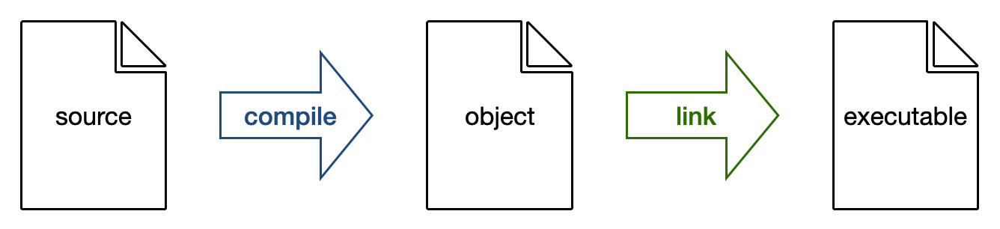

=============================
C++ and Computer Architecture
=============================

C++ is the programming language chosen for implementing numerical methods
because it runs fast.  C++ has one of the most advanced compilers.  The
compiler is able to generate fast machine code.  C++ also allows to directly
write fast assembly.

The second is maintenance.  A numerical system usually takes years to develop.
When proven useful, it will be maintained for decades.  Such a long-living
system needs extensive support from the compiler.  C++ offers it.  The stable
interface makes it possible to access a wide range of third-party software.

C++ is hard and it is impossible to cover it from end to end.  In this chapter
we will make a basic introduction with :ref:`nsd-cpp-compile`,
:ref:`nsd-cpp-int`, :ref:`nsd-cpp-pointer`, and :ref:`nsd-cpp-float`.  Then we
will discuss :ref:`nsd-cpp-oop`, which is critically important for a system
achieving speed and flexibility in the same time.  After that, we will cover
the productive skills of :ref:`nsd-cpp-stl`, :ref:`nsd-cpp-poly`, and
:ref:`nsd-cpp-crtp`.

.. _nsd-cpp-compile:

Compile and Link
================

.. contents:: Contents in the section
  :local:
  :depth: 1

Compiler is a complex system.  The most common way to use it is to execute the
compiler driver from the command-line.  For example, of GCC, the C++ compiler
driver is ``g++``.  It accepts a lot of command-line arguments.  The simplest
for is to supply an input and an output.

Before run the compiler, assume the program file is:

.. literalinclude:: code/helloworld.cpp
  :name: nsd-cpp-example-helloworld-cpp
  :caption:
    A complete C++ file (:download:`helloworld.cpp <code/helloworld.cpp>`)
  :language: cpp
  :linenos:
  :end-before: // vim: set

Run the compiler:

.. code-block:: console

  $ g++ helloworld.cpp -o helloworld

A binary named ``helloworld`` is produced by using the command-line argument
``-o``.  The binary contains the executable code:

.. code-block:: console

  $ ./helloworld
  hello, world

The ``g++`` command does two things: compilation and then `linking
<https://www.linuxjournal.com/article/6463>`__.  When running the compiler with
the argument ``-c``, it performs only the compiling part to take the source
code and output the object file.  The object file contains the machine code,
but doesn't include the functions not defined in the source file.

.. admonition:: Useful tool: compiler explorer

  When you want to test any code snippets or any command-line arguments in any
  compilers on any platforms, check the compiler explorer website:
  https://godbolt.org.

The argument ``-o`` is also used to specify the output object file name:

.. code-block:: console

  $ g++ -c helloworld.cpp -o helloworld.o
  $ file helloworld.o
  helloworld.o: Mach-O 64-bit object x86_64

Although an object file contains the compiled code, it may not be directly
executed, because it is not linked yet:

.. code-block:: console

  $ chmod a+x helloworld.o
  $ ./helloworld.o
  -bash: ./helloworld.o: cannot execute binary file
  $ file helloworld.o
  helloworld.o: Mach-O 64-bit object x86_64

By dropping the ``-c`` argument, and supplying the object file as the input,
``g++`` will link the object file and necessary libraries into the executable:

.. code-block:: console

  $ g++ helloworld.o -o helloworld2
  $ file helloworld2
  helloworld: Mach-O 64-bit executable x86_64
  $ ./helloworld2
  hello, world

Separate Compilation Units
++++++++++++++++++++++++++

.. contents:: Contents in the sub-section
  :local:
  :depth: 1

In a larger project, it is common to separate the declaration of functions to
header files.  The code implementing the functions is put in the so-called
implementation files.  Usually a header file uses the extension name ``.h``,
``.hxx``, or ``.hpp``:

.. literalinclude:: code/hello.hpp
  :name: nsd-cpp-example-hello-hpp
  :language: cpp
  :linenos:
  :end-before: // vim: set

An implementation file uses ``.cc``, ``.cxx``, or ``.cpp``:

.. literalinclude:: code/hello.cpp
  :name: nsd-cpp-example-hello-cpp
  :language: cpp
  :linenos:
  :end-before: // vim: set

Worker Code
-----------

Because the ``main()`` function is not defined in ``hello.cpp``, the file
cannot be built as a binary executable:

.. code-block:: console

  $ g++ hello.cpp -o hello
  Undefined symbols for architecture x86_64:
  "_main", referenced from:
     implicit entry/start for main executable
  ld: symbol(s) not found for architecture x86_64
  clang: error: linker command failed with exit code 1 (use -v to see invocation)

We need to build the object file using ``-c``.

.. code-block:: console

  $ g++ -c hello.cpp -o hello.o

Main Program
------------

The function ``main()`` is implemented in another file ``hellomain.cpp``:

.. literalinclude:: code/hellomain.cpp
  :name: nsd-cpp-example-hellomain-cpp
  :language: cpp
  :linenos:
  :end-before: // vim: set

If trying to build a binary executable solely with this file, we will receive a
different linking error:

.. code-block:: console

  $ g++ hellomain.cpp -o hellomain.o
  Undefined symbols for architecture x86_64:
    "hello()", referenced from:
        _main in hellomain-ce1e94.o
  ld: symbol(s) not found for architecture x86_64
  clang: error: linker command failed with exit code 1 (use -v to see invocation)

We should also build ``hellomain.cpp`` as an object file:

.. code-block:: console

  # hellomain.cpp also needs to be built as an object file
  $ g++ -c hellomain.cpp -o hellomain.o

Link Object Files
-----------------

Now we have two object files and we can call ``g++`` to link them to an
executable and run it:

.. code-block:: console

  $ g++ hello.o hellomain.o -o hellomain
  $ ./hellomain
  hello with standalone compiling unit

Include Syntax
++++++++++++++

.. contents:: Contents in the sub-section
  :local:
  :depth: 1

The directive ``#include`` may use two delimiters: ``""`` or ``<>``.  The
former (see :ref:`above <nsd-cpp-example-hellomain-cpp>`) will search for the
include file in the current directory and then the system directories.  The
latter will search only in the system directories:

.. literalinclude:: code/hellomain_sys.cpp
  :name: nsd-cpp-example-hellomain-sys-cpp
  :language: cpp
  :linenos:
  :end-before: // vim: set

Since the *current directory* is not a system-search directory for the include
file, the above file cannot be built with the same command line:

.. code-block:: console

  $ g++ -c hellomain.cpp -o hellomain.o
  hellomain_sys.cpp:1:10: error: 'hello.hpp' file not found with <angled> include; use "quotes" instead
  #include <hello.hpp>
           ^~~~~~~~~~~
           "hello.hpp"

We need to tell the compiler frontend to search in the current directory by
using ``-I.``:

.. code-block:: console

  $ g++ -I. -c hellomain.cpp -o hellomain.o

Make Static Library
+++++++++++++++++++

.. contents:: Contents in the sub-section
  :local:
  :depth: 1

If we have multiple object files, they can be combined into a static library
for linking later.  The following example uses the only object file we have to
show how to do it:

.. code-block:: console

  $ g++ -c hello.cpp -o hello.o
  $ ar rcs libhello.a hello.o

To use the library file, tell ``g++`` using ``-l`` followed by the library name
``hello``.  The path to search for the library files should be supplied with
``-L`` followed by the path.

.. code-block:: console

  $ g++ -c hellomain.cpp -o hellomain.o
  $ g++ hellomain.o -L. -lhello -o hellomain2
  $ ./hellomain2
  hello with standalone compiling unit

Make Shared Object
++++++++++++++++++

.. contents:: Contents in the sub-section
  :local:
  :depth: 1

A shared object is a library that is linked when the program binary is loaded,
not when it is built.  It is also called dynamically linked library (DLL).
Before making a shared object, we need to tell the compiler to generate the
position-independent code (PIC) with the command-line option ``-fPIC``:

.. code-block:: console

  $ g++ -c -fPIC hello.cpp -o hello_pic.o

Then use ``-shared`` to create the shared object, which usually has the
extension name ``.so``:

.. code-block:: console

  $ g++ -shared hello_pic.o -o libshared_hello.so

Then link to create the executable binary:

.. code-block:: console

  $ g++ hellomain.o -L. -lshared_hello -o hellomain3
  $ ./hellomain3
  hello with standalone compiling unit

Compare the binary generated with linking statically and dynamically.  The
latter is smaller than the former.

.. code-block:: console

  $ ls -l hellomain2 hellomain3
  -rwxr-xr-x  1 yungyuc  staff  56000 Mar 12 14:43 hellomain2*
  -rwxr-xr-x  1 yungyuc  staff  49432 Mar 12 14:43 hellomain3*

Use Existing Library
++++++++++++++++++++

Usually we will use libraries that is prepared by someone else (third-party).
In the following example, the code includes the header file (which is assumed
to be in the header file search paths) for the `BLAS
<http://www.netlib.org/blas/>`__ library:

.. literalinclude:: code/distance.cpp
  :name: nsd-cpp-example-distance-cpp
  :caption:
    Example code using `BLAS <http://www.netlib.org/blas/>`__
    (:download:`distance.cpp <code/distance.cpp>`)
  :language: cpp
  :linenos:
  :end-before: // vim: set

Although the compiler recognizes the functions declared in the header file
``cblas.h``, the linker does not see it in object file:

.. code-block:: console

  $ g++ distance.cpp -o distance
  Undefined symbols for architecture x86_64:
    "_cblas_ddot", referenced from:
        _main in distance-903338.o
  ld: symbol(s) not found for architecture x86_64
  clang: error: linker command failed with exit code 1 (use -v to see invocation)

We need to tell the linker to link the library ``cblas`` (which is also assumed
to be in the library search paths):

.. code-block:: console

  $ g++ distance.cpp -o distance -lcblas
  $ ./distance
  x = (1, 2)
  y = (-2, 1)
  x \dot y = 0

.. note::

  We are also responsible for making sure the header file and library file are
  reachable by the compiler and linker.  The compiler shows error when not
  finding the header file:

  .. code-block:: console
    :caption: Error message of missing header file

    $ g++ distance.cpp -o distance
    distance.cpp:2:10: fatal error: 'cblas.h' file not found
    #include <cblas.h>
             ^~~~~~~~~
    1 error generated.

  The linker error:

  .. code-block:: console
    :caption: Error message of missing library file

    $ g++ distance.cpp -o distance -lcblas
    ld: library not found for -lcblas
    clang: error: linker command failed with exit code 1 (use -v to see invocation)

.. _nsd-cpp-int:

C++ Integer Types
=================

.. contents:: Contents in the section
  :local:
  :depth: 1

Basic Integer Types
+++++++++++++++++++

Width of `the fundamental types
<https://en.cppreference.com/w/cpp/language/types>`__ is specified by the
standard to assist writing portable code.

.. list-table:: Integer size in C++ standard
  :header-rows: 1
  :align: center

  * -
    - Type Name
    - Width
  * - Boolean
    - ``bool``
    -
  * - Signed integer
    - ``short``
    - at least 16 bits
  * -
    - ``int``
    - at least 16 bits
  * -
    - ``long``
    - at least 32 bits
  * -
    - ``long long``
    - at least 64 bits
  * - Unsigned integer
    - ``unsigned short``
    - at least 16 bits
  * -
    - ``unsigned int``
    - at least 16 bits
  * -
    - ``unsigned long``
    - at least 32 bits
  * -
    - ``unsigned long long``
    - at least 64 bits
  * - Character
    - ``char``
    - 8 bits
  * - Unsigned character
    - ``unsigned char``
    - 8 bits

You can check the number of bytes of each of types using the example code
:ref:`types.cpp <nsd-cpp-example-types-cpp>`:

.. code-block:: console
  :caption: Size of C++ integer types

  $ g++ types.cpp -o types
  $ ./types
  unit is byte
  sizeof(char): 1
  sizeof(short): 2
  sizeof(int): 4
  sizeof(long): 8
  sizeof(long long): 8
  sizeof(unsigned char): 1
  sizeof(unsigned short): 2
  sizeof(unsigned int): 4
  sizeof(unsigned long): 8
  sizeof(unsigned long long): 8

Fixed-Width Integer Types
+++++++++++++++++++++++++

The C++ standard library provides the `fixed-width (bit) integer types
<https://en.cppreference.com/w/cpp/types/integer>`__ which are the same as C in
the header file `<cstdint>`.  Fixed width matters for numerical code more than
hardware architecture does.  It's easier for numerical code to break by changed
width of indexing integer than by changed addressing space.

.. list-table:: Fixed-width integer size in C++ standard
  :header-rows: 1
  :align: center

  * -
    - Type Name
    - Width
  * - Signed integer
    - ``int8_t``
    - 8 bits / 1 byte
  * -
    - ``int16_t``
    - 16 bits / 2 byte
  * -
    - ``int32_t``
    - 32 bits / 4 byte
  * -
    - ``int64_t``
    - 64 bits / 8 byte
  * - Unsigned integer
    - ``uint8_t``
    - 8 bits / 1 byte
  * -
    - ``uint16_t``
    - 16 bits / 2 byte
  * -
    - ``uint32_t``
    - 32 bits / 4 byte
  * -
    - ``uint64_t``
    - 64 bits / 8 byte

You can check the number of bytes of each of types using the example code
:ref:`cstdint.cpp <nsd-cpp-example-cstdint-cpp>`:

.. code-block:: console

  $ g++ cstdint.cpp -o cstdint
  $ ./cstdint
  unit is byte
  sizeof(int8_t): 1
  sizeof(uint8_t): 1
  sizeof(int16_t): 2
  sizeof(uint16_t): 2
  sizeof(int32_t): 4
  sizeof(uint32_t): 4
  sizeof(int64_t): 8
  sizeof(uint64_t): 8

Signness
++++++++

Care should be taken when signed and unsigned integers are both used in code.
Comparison result between signed and unsigned integers is sometimes surprising.
That's see what it is with the example code:

.. literalinclude:: code/signness.cpp
  :caption:
    The example for the undesirable effect of mixing signed and unsigned value
    (:download:`signness.cpp <code/signness.cpp>`)
  :language: cpp
  :linenos:
  :end-before: // vim: set

It shows that the negative value is greater than the positive value:

.. code-block:: console

  $ g++ signness.cpp -o signness
  $ ./signness
  sint: -1
  uint: 1
  sint > uint, although it can't be

It's such a common mistake that compiler provides a check:

.. code-block:: console

  $ g++ signness.cpp -o signness -Wsign-compare -Werror
  signness.cpp:9:14: error: comparison of integers of different signs: 'long' and 'unsigned long' [-Werror,-Wsign-compare]
      if (sint > uint) { std::cout << "sint > uint, although it can't be" << std::endl; }
          ~~~~ ^ ~~~~
  1 error generated.

.. note::

  The common wisdom advises to not mixing signed and unsigned integer, but in
  numerical code negative indices are commonplace.  On the other hand, STL
  almost always uses unsigned integers for indexing.  It is unavoidable to mix
  the signed and unsigned integer in some places.  When we are forced to write
  it, make the reasons very clear in the code.

.. _nsd-cpp-pointer:

Pointer and Array Indexing
==========================

.. contents:: Contents in the section
  :local:
  :depth: 1

Integers are used extensively in array indexing.  It wouldn't surprise anyone
for they are the only thing that can be used to index elements in arrays.  Here
we use the example of ":ref:`nsd-cpp-example-arrays-cpp`" to explain how they
are used.  The code is built with:

.. code-block:: console

  $ g++ arrays.cpp -o arrays -Wall -Wextra -Werror

The code creates a conventional C-style array :cpp:var:`!data`.  Two pointers
:cpp:var:`!pdata` and :cpp:var:`!odata` are created for the array.

.. code-block:: cpp

  // C-style POD array.
  int32_t data[100];
  // Make a pointer to the head address of the array.
  int32_t * pdata = data;
  // Make another pointer to the 50-th element from the head of the array.
  int32_t * odata = pdata + 50;
  // Initialize the array.
  for (size_t it=0; it<100; ++it) { data[it] = it + 5000; }

Pointer as Array
++++++++++++++++

Both :cpp:var:`!data` "the array" and :cpp:var:`!pdata` "the pointer" work like
arrays when indexing.  It is shown by printing the 10-th element of
:cpp:var:`!data` and :cpp:var:`!pdata`:

.. code-block:: cpp

  std::cout << "data[10]: " << data[10] << std::endl;
  std::cout << "pdata[10]: " << pdata[10] << std::endl;

Both show the same element:

.. code-block:: console

  data[10]: 5010
  pdata[10]: 5010

In the other way around, :cpp:var:`!data` works like a pointer:

.. code-block:: cpp

  std::cout << "*(data+20): " << *(data+20) << std::endl;
  std::cout << "*(pdata+20): " << *(pdata+20) << std::endl;

:cpp:var:`!data` and :cpp:var:`!pdata` point to the same address, and the 20-th
offset element is the same:

.. code-block:: console

  *(data+20): 5020
  *(pdata+20): 5020

Now look at the pointer that is already offset by 50 element, :cpp:var:`!odata`:

.. code-block:: cpp

  std::cout << "data[50]: " << data[50] << std::endl;
  std::cout << "odata[0]: " << odata[0] << std::endl;

The two statements print the same element:

.. code-block:: console

  data[50]: 5050
  odata[0]: 5050

Negative Index
++++++++++++++

Now we show how negative index works:

.. code-block:: cpp

  std::cout << "data[40]: " << data[40] << std::endl;
  std::cout << "odata[-10]: " << odata[-10] << std::endl;

Since :cpp:var:`!odata` points to the 50-th element of :cpp:var:`!data`, the
"-10"-th element of :cpp:var:`!odata` should be the 40-th of :cpp:var:`data`:

.. code-block:: console

  data[40]: 5040
  odata[-10]: 5040

The same can be done with pointer offset, which may look more reasonable
although it works the same as array indexing:

.. code-block:: cpp

  std::cout << "*(data+40): " << *(data+40) << std::endl;
  std::cout << "*(odata-10): " << *(odata-10) << std::endl;

The output:

.. code-block:: console

  *(data+40): 5040
  *(odata-10): 5040

.. note::

  Negative indices should only be used when we know they do not go out of
  range.  That is why in the above example we set :cpp:var:`!odata` by
  offsetting :cpp:var:`!data` by 50 elements.  Accessing memory out of range
  may result in segmentation fault or corrupted memory.  The former crashes the
  process immediately and the latter leads to unpredictable behaviors, which is
  much harder to debug than the former.

.. _nsd-cpp-float:

Floating-Point Value
====================

.. contents:: Contents in the section
  :local:
  :depth: 1

x86 architecture follows the IEEE 754-1985 standard for floating-point.  A
floating-point value uses 3 fields to represent: sign, exponent (biased)
(denoted by :math:`p`), and fraction (denoted by :math:`f` and :math:`f<1`).
The formula is:

.. math::

  \pm(1+f)_2 \times 2^p

Note that the number is binary-based.

x86 follows IEEE 754 standard for floating-point.  There are two commonly used
floating-point formats: single and double precision.  The C++ type names are
``float`` and ``double``, respectively.

Single-Precision (``float``)
++++++++++++++++++++++++++++

Single-precision floating-point value uses 32 bits (4 bytes).  The first 23
bits are fraction.  The following 8 bits are exponent.  The last (highest) bit
is sign; 0 is positive while 1 is negative.  In C++, the type name is
``float``.

Conisder a decimal number 2.75, which we use as an example to show how to get
the fields.  Write it by using the base of 2:

.. math::

  2.75 &= 2 + \frac{1}{2} + \frac{1}{2^2} = 1\times2^1 + 0\times2^0 + 1\times2^{-1} + 1\times2^{-2} \\
  &= (10.11)_2 = (1.011)_2 \times 2^1 .

The bit fields for its IEEE 754 single-precision floating-point are:

.. table::
  :align: center

  ================ ====================== ==================================
   sign (1 bit)     exponent (8 bits)      fraction (23 bits)
  ================ ====================== ==================================
   ``0``            ``1000 0000``          ``011 0000 0000 0000 0000 0000``
  ================ ====================== ==================================

The exponent bias for single-precision floating-point is 127
(:math:`(\mathtt{0111 \, 1111})_2`).

The floating-point value is usually inexact.  For example, ``0.3``, although it
is rational, cannot be exactly represented as a single-precision
floating-point.  Because the single-precision is 2-based, you should not follow
the arithmetic intuition learned from the 10-based number system.

.. literalinclude:: code/float.cpp
  :caption: Print the bit field of a ``float``
  :language: cpp
  :linenos:
  :end-before: // vim: set

Execution results:

.. code-block:: console
  :linenos:

  $ g++ float.cpp -o float
  $ ./float
  fvalue: 0.3000000119
  b32value (float sep):    0 01111101 00110011001100110011010
                        sign exponent fraction
  fvalue: 3
  b32value (float sep):    0 10000000 10000000000000000000000
                        sign exponent fraction

Double-Precision (``double``)
+++++++++++++++++++++++++++++

Double-precision floating-point value uses 64 bits (8 bytes).  The first 52
bits are fraction.  The following 11 bits are exponent.  The last (highest) bit
is sign; 0 is positive while 1 is negative.  In C++, the type name is ``double``.

Use the same example of 2.75 for the double-precision floating-point.  Write
:math:`2.75 = (1.011)_2 \times 2^1`.  The exponent bias for double-precision
floating-point is 1023 (:math:`(\mathtt{011 \, 1111 \, 1111})_2`).  The bit
fields are:

.. table::
  :align: left

  ================ ====================== ======================================================================
   sign (1 bit)     exponent (11 bits)     fraction (52 bits)
  ================ ====================== ======================================================================
   ``0``            ``100 0000 0000``      ``0110 0000 0000 0000 0000 0000 0000 0000 0000 0000 0000 0000 0000``
  ================ ====================== ======================================================================

Compared with the single-precision version:

.. table::
  :align: left

  ================ ====================== ==================================
   sign (1 bit)     exponent (8 bits)      fraction (23 bits)
  ================ ====================== ==================================
   ``0``            ``1000 0000``          ``011 0000 0000 0000 0000 0000``
  ================ ====================== ==================================

Numeric Limits
++++++++++++++

Both C and C++ provides constants for the value limit of each type.  In C++,
the constants are available through include file ``limits``.

.. literalinclude:: code/nlimits.cpp
  :caption: Print the limit of selected fundamental types
  :language: cpp
  :linenos:
  :end-before: // vim: set

Execution results:

.. code-block:: console
  :linenos:

  $ g++ nlimits.cpp -o nlimits
  $ ./nlimits
  type		lowest()	min()		max()		epsilon()

  float		-3.40282e+38	1.17549e-38	3.40282e+38	1.19209e-07
  double		-1.79769e+308	2.22507e-308	1.79769e+308	2.22045e-16
  int32_t		-2147483648	-2147483648	2147483647	0
  uint32_t	0		0		4294967295	0
  int64_t		-9223372036854775808	-9223372036854775808	9223372036854775807	0
  uint64_t	0		0		18446744073709551615	0

Exception Handling
++++++++++++++++++

The pragma "``#pragma STDC FENV_ACCESS ON``" turns on floating-point exception
handling in CPU.  C++ defines the following floating-point exception that is
supported by the hardware:

.. table::
  :align: left

  =================== ====================== =================================================================
   macro               math error condition   description
  =================== ====================== =================================================================
   ``FE_DIVBYZERO``    pole error             math result was infinite or undefined
   ``FE_INEXACT``      inexact result         rounding was required for the operation
   ``FE_INVALID``      domain error           the argument was outside the domain in which the math operation
   ``FE_OVERFLOW``     range error            the result was too large to be representable
   ``FE_UNDERFLOW``    range error            the result became subnormal due to loss of precision
   ``FE_ALL_EXCEPT``   n/a                    bitwise OR of all supported floating-point exceptions
  =================== ====================== =================================================================

.. literalinclude:: code/fpexc.cpp
  :caption: Example code for floating-point exceptions
  :language: cpp
  :linenos:
  :end-before: // vim: set

Execution results:

.. code-block:: console
  :linenos:

  $ g++ fpexc.cpp -o fpexc
  $ ./fpexc
  result: inf
    FE_DIVBYZERO
  std::sqrt(2): 1.41421
    FE_INEXACT
  std::acos(2): nan
    FE_INVALID
  std::numeric_limits<float>::max() * 2: inf
    FE_OVERFLOW
  std::numeric_limits<float>::min() / 10: 1.17549e-39
    FE_UNDERFLOW

.. _nsd-cpp-oop:

Object-Oriented Programming
===========================

.. contents:: Contents in the section
  :local:
  :depth: 1

Object-oriented programming (OOP) allows us to organize data with logic.  The
organized entities are called objects.  The point of using OOP is to make it
easier to process the data.  It usually may result in fewer lines of code and
make more helper functions memorable.  Because numerical software needs to
process a lot of data, OOP becomes a natural design.

When writing OOP code, we should keep the SOLID principles in mind:

* Single responsibility: Each class has one and only one responsibility.
* Open-closed: Open for extension but closed for modification.
* Liskov substitution: Reference to a base class can be replaced by a derived
  class without special code.
* Interface segregation: Multiple smaller, client-specific interfaces work
  better than single bigger, general interface.
* Dependency inversion: Depend on abstraction rather than concrete
  implementation.

Encapsulation
+++++++++++++

Encapsulation is a central concept of OOP.  C++ uses classes as a basic
construct for encapsulation, i.e., separating the interface from the
implementation detail.  Consumers of the class should not know how the class is
implemented internally.

C++ class uses 3 access controls to realize encapsulation:

* The ``private`` access means only the class itself may access the member
  (data or functions).
* The ``public`` access means everything can access the member.
* The ``protected`` applies to inherited classes.  Only the defining class and
  its derived classes can access ``protected``.

For private member data, we want a convention to distinguish them from other
variables.  Prefixing ``m_`` is a common one.  Other popular choices include
``mMember`` (prefixing ``m`` with camel-case) and ``member_`` (postfixing
``_``).

Encapsulation is very useful for numerical code.  In the first impression, the
access control prevents "straight-forward" code to access data.  However, when
we start development it's impossible to foresee all the logic and constructs.
Without proper encapsulation, we may not productively move forward.

Class & Accessors
+++++++++++++++++

+++++

C++ provides two keywords to define a class: ``class`` and ``struct``.

In most cases one can be used to replace the other.  By default, the
accessibility of ``class`` is ``private``, if no access specifier is used.

.. code-block:: cpp
  :caption: Use ``class`` to declare a point class
  :linenos:

  class PointClass
  {
      float m_x, m_y; // by default private.
  public:
      // Accessors
      float getX() const { return m_x; }
      float getY() const { return m_y; }
      void setX(float v) { m_x = v; }
      void setY(float v) { m_y = v; }
  }; /* end class PointClass */

On the other hand, ``struct``\ 's default accessibility is ``public``.

.. code-block:: cpp
  :caption: Use ``struct`` to declare a point class
  :linenos:

  struct PointStruct
  {
      float m_x, m_y; // by default public.
  }; /* end class PointStruct */

The full example code can be found in :ref:`class.cpp <nsd-cpp-example-class>`.

In addition to the mostly equivalent behavior, conventionally, ``struct`` has a
strong implication that the type is a POD (plain old data).  As such, when you
need a class, prefer ``class`` over ``struct``.  If you want a POD, use
``struct``.

To access the private member data, accessors are usually needed.  It may be
argued that in a good OO design, classes should not let their consumers know
about its member data.  But it is impractical to eliminate data classes from
numerical code.  If you cannot totally hide it from outside, accessors must be
provided.

There are two major styles for accessors: get/set and one-method-name.  The
second style uses a reference to directly access member data.

.. literalinclude:: code/accessor.cpp
  :caption: Example code for C++ accessors
  :language: cpp
  :linenos:
  :end-before: // vim: set

Execution results:

.. code-block:: console
  :linenos:

  $ g++ accessor.cpp -o accessor --std=c++11
  $ ./accessor
  pntc.getX() = 2, pntc.getY() = 4
  pntc.x() = 12, pntc.y() = 24

Reference
+++++++++

Reference is an important construct in C++ and used everywhere.

Like a pointer, a C++ reference allow aliasing.  But unlike a pointer, a reference cannot be constructed without initialization, and is safer than a pointer.

.. code-block:: cpp
  :linenos:

  int v = 10;
  std::cout << "v = " << v << std::endl;
  int * pv; // pointer; danger: uninitialized
  pv = &v;
  *pv = 11;
  std::cout << "v = " << v << std::endl;
  int & rv = v; // reference
  rv = 12;
  std::cout << "v = " << v << std::endl;
  // error: declaration of reference variable 'nrv' requires an initializer
  //int & nrv;

A const reference is often used to alias a read-only object.

.. code-block:: cpp
  :linenos:

  int const & crv = v; // const reference
  // error: cannot assign to variable 'crv' with const-qualified type 'const int &'
  //crv = 12;

.. literalinclude:: code/reference.cpp
  :caption: Full example for C++ reference
  :language: cpp
  :linenos:
  :end-before: // vim: set

Execution results:

.. code-block:: console
  :linenos:

  $ g++ reference.cpp -o reference --std=c++11
  $ ./reference
  v = 10
  v = 11
  v = 12
  &v, pv, &rv, &crv (address):
    0x7ffee458314c
    0x7ffee458314c
    0x7ffee458314c
    0x7ffee458314c

Constructor and Destructor
++++++++++++++++++++++++++

A constructor of a class is called when an object of the class is
*instantiated* (the *object* can also be called an *instance*).  You may have
as many constructors as you like.  There are special constructors that the
compiler provides even if you don't.  The most essential one is the *default
constructor*.  It does not have any argument, and is called when you declare a
variable of the class.

.. code-block:: cpp
  :linenos:

  class Line // assume it possesses heavy resources
  {
  public:
      Line(); // default constructor.
  };

The other two special constructors are *copy constructor* and *move
constructor*.

.. code-block:: cpp
  :linenos:

  Line & Line(Line const & ); // copy constructor
  Line & Line(Line       &&); // move constructor

A copy constructor is called when the compiler needs to copy the object:

.. code-block:: cpp
  :linenos:

  Line line1; // invokes default constructor
  Line line2(line1); // invokes copy constructor

A move constructor is called when the compiler knows the object to be
instantiated will move the resources from the argument:

.. code-block:: cpp
  :linenos:

  Line line3(std::move(line2)); // invokes move constructor

(Move semantics will be discussed in later lectures.)

When an object is no longer in use, the compiler calls its destructor to remove
it from memory.  The destructor is responsible for releasing the resources that
it no longer needs.  (Failure to release the unused resource is called resource
leak.)

.. code-block:: cpp
  :linenos:

  class Line
  {
  public:
      Line(size_t size) : m_size(size), m_coord(new float[size*2]) {}
      // Destructor.
      ~Line() { if (nullptr != m_coord) { delete[] m_coord; } }
  private:
      size_t m_size = 0; // number of points.
      float * m_coord = nullptr; // memory buffer for the points.
  };

.. literalinclude:: code/constructor.cpp
  :caption: Full example for constructor and destructor
  :language: cpp
  :linenos:
  :end-before: // vim: set

Execution results:

.. code-block:: console
  :linenos:

  g++ constructor.cpp -o constructor --std=c++11
  ./constructor
  line: number of points = 3
  point 0: x = 0 y = 1
  point 1: x = 1 y = 3
  point 2: x = 2 y = 5
  line2: number of points = 3
  point 0: x = 9 y = 1
  point 1: x = 1 y = 3
  point 2: x = 2 y = 5

Rule of Five
++++++++++++

In C++ programming there are many coding guidance concluded by years of
practice, and the rule of five is one of them.  Originally it was the rule of
three, stating that if any of the destructor, copy constructor, and copy
assignment operator is customized, all of them should need to be
customized.

.. note::

  Default constructor, copy constructor, move constructor, copy assignment
  operator, move assignment operator, and destructor are the special member
  functions.

Modern C++ (C++11 and beyond) extends it to the rule of five, because of the
addition of the move semantics.  It becomes that if any of the following is
implemented (does not use the implicit implementation), all of them should be
explicitly implemented:

* Destructor
* Copy constructor
* Copy assignment operator
* Move constructor
* Move assignment operator

When a class declaration is long, sometimes it is not obvious whether or not
the rule of five is followed.  We can use the ``default`` keyword to always
write the special member functions even though we want to use the implicit
implementation.

.. code-block:: cpp
  :linenos:

  class Line
  {
  public:
      Line() = default; // default constructor.
      Line(Line const & ) = default; // copy constructor.
      Line(Line       &&) = default; // move constructor.
      Line & operator=(Line const & ) = default; // copy assignment operator.
      Line & operator=(Line       &&) = default; // move assignment operator.
      ~Line() = default;
  };

If there is not a custom implementation to a special member function, the
compiler generates an implicit one.  But it is also possible to tell the
compiler to avoid the implicit implementation without providing the custom one.
It uses the ``delete`` keyword.

.. code-block:: cpp
  :linenos:

  class Line
  {
  public:
      Line(double x0, double y0, double x1, double y1); // custom constructor.
      Line() = delete; // remove the default constructor.
      Line(Line const & ) = delete; // remove the copy constructor.
      Line(Line       &&) = delete; // remove the move constructor.
      Line & operator=(Line const & ) = delete; // remove the copy assignment operator.
      Line & operator=(Line       &&) = delete; // remove the move assignment operator.
      ~Line() = default; // removing destructor doesn't make sense.
  };

.. note::

  Only the special member functions can be defaulted or deleted.

.. _nsd-cpp-stl:

Standard Template Library (STL)
===============================

.. contents:: Contents in the section
  :local:
  :depth: 1

Containers are essential to data processing.  The STL provides efficient
implementation of commonly used containers.  They can be grouped in 3
categories:

1. Sequence containers: ``std::vector``, ``std::array``, ``std::list``,
   ``std::forward_list``, ``std::deque``.
2. Associative containers: ``std::map``, ``std::set``, ``std::multimap``,
   ``std::multiset``.
3. Unordered associated containers: ``std::unordered_map``,
   ``std::unordered_set``, ``std::unordered_multimap``,
   ``std::unordered_multiset``.

We will make a quick recapitulation for those we always use in numerical code:
``std::vector``, ``std::array``, ``std::list``, ``std::map``, ``std::set``,
``std::unordered_map``, ``std::unordered_set``.

``std::vector``
+++++++++++++++

``std::vector`` is one of the most useful STL containers.  Whenever thinking of
using one-dimensional, variable-length arrays, we should consider whether or
not ``std::vector`` may be applicable.

.. literalinclude:: code/vector.cpp
  :caption: Example code for ``std::vector``
  :language: cpp
  :linenos:
  :end-before: // vim: set

Execution results:

.. code-block:: console
  :linenos:

  $ g++ vector.cpp -o vector --std=c++11
  $ ./vector
  sizeof(std::vector<int>) = 24
  sizeof(std::vector<double>) = 24
  sizeof(std::vector<std::vector<double>>) = 24
  vec1 indices [20-25):
    1020
    1021
    1022
    1023
    1024
  out of range exception: vector
  vec1 modified:
    1020
    1021
    500
    600
    1024
  &data.at(0) = 0x7fa868405c40
  &data.at(0) = 0x7fa868406150
  oops, address changes

``std::array``
++++++++++++++

The class template ``array`` provides a type-safe alternate to C-style
fixed-size arrays.

.. literalinclude:: code/array.cpp
  :caption: Example code for ``std::array``
  :language: cpp
  :linenos:
  :end-before: // vim: set

Execution results:

.. code-block:: console
  :linenos:

  $ g++ array.cpp -o array --std=c++11
  $ ./array
  sizeof(std::array<int, 3>) = 12
  sizeof(std::array<int, 10>) = 40
  arr1:
    100
    101
    102

``std::list``
+++++++++++++

STL ``list`` supports constant time insertion and deletion of elements.  Unlike
``vector``, iterators and references to an element in a ``list`` don't get
invalidated by adding or removing other elements.  The price to pay, however,
is the slow random access.

``std::list`` is usually implemented as a doubly-linked list.

.. literalinclude:: code/list.cpp
  :caption: Example code for ``std::list``
  :language: cpp
  :linenos:
  :end-before: // vim: set

Execution results:

.. code-block:: console
  :linenos:

  $ g++ list.cpp -o list --std=c++11
  $ ./list
  lst1: 100 101 102
  lst2: 202 201 200
  lst2 (modified): 202 301 200
  lst1 (after splice): 100
  lst2 (after splice): 202 301 101 102 200

``std::map`` and ``std::set``
+++++++++++++++++++++++++++++

STL ``map`` is an ordered container for key-value pairs.  The keys are unique
and don't allow duplication.  ``map`` is usually implemented as a red-black
tree.

STL ``set`` is a unique key container.  Like ``map``, it's usually implemented
as a red-black tree.

.. literalinclude:: code/map.cpp
  :caption: Example code for ``std::map`` and ``std::set``
  :language: cpp
  :linenos:
  :end-before: // vim: set

Execution results:

.. code-block:: console
  :linenos:

  $ g++ map.cpp -o map --std=c++11
  $ ./map
  map1: (1,1) (2,0.5) (3,0.333333) (4,0.25) (5,0.2)
  map1 has key 3
  map1 does not have key 6
  set1: 1 2 3 4 5
  set1 has key 3
  set1 does not have key 6

``std::unordered_map`` and ``std::unordered_set``
+++++++++++++++++++++++++++++++++++++++++++++++++

STL ``unordered_map`` is also a container for key-value pairs.  While the keys
are unique and don't allow duplication, they do not have order.
``unordered_map`` is usually implemented using hash table.

Search, insertion, and removal of elements in an ``unordered_map`` have
constant time complexity.  On the other hand, those in a ``map`` have
logarithmic time complexity.  While ``unordered_map`` usually offers faster
runtime than ``map``, it tends to use more memory since red-black trees is very
efficient in memory usage.

Like ``set`` is a valueless version of ``map``, ``unordered_map`` also has a
valueless version called ``unordered_set``.  STL ``unordered_set``, like
``unordered_map``, is usually implemented using hash table.

.. literalinclude:: code/unordered_map.cpp
  :caption: Example code for ``std::unordered_map`` and ``std::unordered_set``
  :language: cpp
  :linenos:
  :end-before: // vim: set

Execution results:

.. code-block:: console
  :linenos:

  $ g++ unordered_map.cpp -o unordered_map --std=c++11
  $ ./unordered_map
  map1: (1,1) (2,0.5) (3,0.333333) (4,0.25) (5,0.2)
  map1 has key 3
  map1 does not have key 6
  set1: 1 2 3 4 5
  set1 has key 3
  set1 does not have key 6

.. _nsd-cpp-poly:

Polymorphism
============

.. contents:: Contents in the section
  :local:
  :depth: 1

In C++, when a class has any member function that is virtual, it is
polymorphic.  C++ compiler knows the object is polymorphic, and uses the type
information to find the associated member function in runtime.

To make the class ``Line`` polymorphic, we add an additional virtual function
``length()``, and make the destructor virtual too.

.. code-block:: cpp
  :linenos:

  class Line
  {
  public:
      Line() = default;
      Line(Line const & );
      Line(Line       &&);
      Line & operator=(Line const & );
      Line & operator=(Line       &&);
      Line(size_t size) : m_size(size), m_coord(new float[size*2]) {}
      virtual ~Line() { if (nullptr != m_coord) { delete[] m_coord; } }
      virtual float length() const;
      size_t size() const { return m_size; }
      float & x(size_t it) const { check_range(it); return m_coord[it*2  ]; }
      float & x(size_t it)       { check_range(it); return m_coord[it*2  ]; }
      float & y(size_t it) const { check_range(it); return m_coord[it*2+1]; }
      float & y(size_t it)       { check_range(it); return m_coord[it*2+1]; }
  private:
      void check_range(size_t it) const
      { if (it >= m_size) { throw std::out_of_range("Line index out of range"); } }
      size_t m_size = 0; // number of points.
      float * m_coord = nullptr; // memory buffer for the points.
  }; /* end class Line */

Then derive the class ``WeighedLine`` from it and override the virtual
functions:

.. code-block:: cpp
  :linenos:

  class WeighedLine : public Line
  {
  public:
      WeighedLine(WeighedLine const & );
      WeighedLine(WeighedLine       &&);
      WeighedLine & operator=(WeighedLine const & );
      WeighedLine & operator=(WeighedLine       &&);
      WeighedLine(size_t size) : Line(size), m_weight(new float[size-1]) {}
      virtual ~WeighedLine() override { delete[] m_weight; }
      virtual float length() const override;
      float const & weight(size_t it) const { return m_weight[it]; }
      float       & weight(size_t it)       { return m_weight[it]; }
  private:
      float * m_weight = nullptr; // weight on line segments.
  }; /* end class WeighedLine */

.. literalinclude:: code/polymorphic.cpp
  :caption: Full example for polymorphism
  :language: cpp
  :linenos:
  :end-before: // vim: set

To make the polymorphism work correctly, the derived class also needs to
implement the copy and move constructors and assignment operators by taking the
base class into account.

With the example we will observe the following things:

1. When the derived class needs addition data, the memory management becomes
   much more complex.
2. A pointer to the base class can point to a derived object.  (Up-casting is
   fine.)
3. A pointer to the derived class can NOT point to a base object.
   (Down-casting is forbidden by default.)
4. To downcast polymorphic objects, you need to use ``dynamic_cast`` to let
   RTTI (run-time type information) do the work.
5. RTTI makes the object know the correct virtual function to call.  Although
   ``line3`` is declared as reference to the base class (``Line &``),
   ``WeighedLine::length()`` is called.

Execution results:

.. code-block:: console
  :linenos:

  $ g++ polymorphic.cpp -o polymorphic --std=c++11
  $ ./polymorphic
  sizeof(Line) = 24
  sizeof(WeighedLine) = 32
  downcasting from Line * to WeighedLine * works on a WeighedLine object: pwline3= 0x7fda8dc05b00
  downcasting from Line * to WeighedLine * fails on a Line object: pwline2 = 0x0
  Object type of pwline3: 11WeighedLine
  Object type of pline3: 11WeighedLine
  line: number of points = 3
  point 0: x = 0 y = 1
  point 1: x = 5 y = 1 weight = 1
  point 2: x = 5 y = 4 weight = 2
    length = 11
  line2: number of points = 3
  point 0: x = 2 y = 1
  point 1: x = 5 y = 1
  point 2: x = 5 y = 4
    length = 6
  line3: number of points = 3
  point 0: x = 3 y = 1
  point 1: x = 5 y = 1
  point 2: x = 5 y = 4
    length = 8
  wline3: number of points = 3
  point 0: x = 3 y = 1
  point 1: x = 5 y = 1 weight = 1
  point 2: x = 5 y = 4 weight = 2
    length = 8

Polymorphism incurs runtime penalty.  It is OK in two scenarios:

1. Runtime work is unavoidable.  We trust the compiler does a better job than
   writing branching code ourselves.
2. Timing doesn't matter.  When the code isn't in the inner loop of
   computation, inefficiency may be negligible.

As we see, to make polymorphism work, there is a lot of code to write.
Therefore in high-performance numerical code we use polymorphism with great
caution.

.. _nsd-cpp-crtp:

Curiously Recursive Template Pattern (CRTP)
===========================================

If we want to make a class hierarchy polymorphic without the runtime overhead,
CRTP helps.  Usually the word polymorphism means *dynamic* polymorphism, as we
described in the previous section.  If the classes behave as polymorphic but
all the type information is determined during *compile* time, it is called
*static* polymorphism.

Static polymorphism has two major benefits (at the cost of being limited in
compile time).  First is to not have runtime overhead.  The second is to avoid
the memory overhead associated with virtual functions.  RTTI needs some
information to determine types in runtime.  That is usually (if not always)
accomplished by a virtual function table, which at least add one more word on
_every_ polymorphic object.  For very small objects, like a resource handle,
which usually occupies one or two words, it's a great overhead.

This is how a CRTP hierarchy looks like.  ``PointBase`` is our class template
base.  ``CartesianPoint`` and ``PolarPoint`` pass themselves into the base
class' template argument, so ``PointBase`` can see and access the derived
classes' function to provide a common interface.

.. code-block:: cpp
  :linenos:

  template <class Derived>
  class PointBase
  {
  public:
      constexpr static const double PI = 3.14159265358979323846;
      PointBase(float v0, float v1) : m_v0(v0), m_v1(v1) {}
      float const & v0() const { return m_v0; }
      float       & v0()       { return m_v0; }
      float const & v1() const { return m_v1; }
      float       & v1()       { return m_v1; }
      float dist() const
      {
          // Prevent the derived class from working if it doesn't define dist(),
          // just like what a pure virtual function does.
          static_assert(&PointBase<Derived>::dist != &Derived::dist,
                        "derived class must define dist()");
          return derived().dist();
      }
  private:
      Derived const & derived() const { return *static_cast<Derived const *>(this); }
      float m_v0, m_v1;
  }; /* end class PointBase */

  class CartesianPoint : public PointBase<CartesianPoint>
  {
  public:
      using base_type = PointBase<CartesianPoint>;
      using base_type::base_type;
      float dist() const
      {
          return std::hypot(v0(), v1());
      }
  }; /* end class CartesianPoint */

  class PolarPoint : public PointBase<PolarPoint>
  {
  public:
      using base_type = PointBase<PolarPoint>;
      using base_type::base_type;
      float dist() const
      {
          return std::abs(v0());
      }
  }; /* end class PolarPoint */

.. literalinclude:: code/crtp.cpp
  :caption: Full example for CRTP
  :language: cpp
  :linenos:
  :end-before: // vim: set

Execution results:

.. code-block:: console
  :linenos:

  $ g++ crtp.cpp -o crtp --std=c++11
  $ ./crtp
  sizeof(CartesianPoint) = 8
  sizeof(PolarPoint) = 8
  CartesianPoint(1,1)::dist() = 1.41421
  PolarPoint(1, pi/4)::dist() = 1

Exercises
=========

1. In `array.cpp`, what may happen if you write the following code?

   .. code-block:: cpp

     data[-1] = 0;

2. Given 2 single-precision floating-point values, 0.3 and -0.3.  Reinterpret
   (not integer to floating-point casting) their data (bits) as 32-bit unsigned
   integers.  What is the integer value after performing XOR of the two
   integers?  Change the floating-point values to 183.2 and -183.2.  What is
   the value after XOR again?
3. What are the member data (including types) in the ``std::vector``
   implementation in the STL in the compiler you use?
4. Reimplement the class ``Line`` by using STL containers instead of raw
   pointers (do not copy-n-paste the following code listing):

   .. code-block:: cpp
    :linenos:

    class Line
    {
    public:
        Line();
        Line(Line const & );
        Line(Line       &&);
        Line & operator=(Line const & );
        Line & operator=(Line       &&);
        Line(size_t size);
        ~Line();
        size_t size() const;
        float & x(size_t it) const;
        float & x(size_t it);
        float & y(size_t it) const;
        float & y(size_t it);
    private:
        // Member data.
    }; /* end class Line */

    int main(int, char **)
    {
        Line line(3);
        line.x(0) = 0; line.y(0) = 1;
        line.x(1) = 1; line.y(1) = 3;
        line.x(2) = 2; line.y(2) = 5;

        Line line2(line);
        line2.x(0) = 9;

        std::cout << "line: number of points = " << line.size() << std::endl;
        for (size_t it=0; it<line.size(); ++it)
        {
            std::cout << "point " << it << ":"
                      << " x = " << line.x(it)
                      << " y = " << line.y(it) << std::endl;
        }

        std::cout << "line2: number of points = " << line.size() << std::endl;
        for (size_t it=0; it<line.size(); ++it)
        {
            std::cout << "point " << it << ":"
                      << " x = " << line2.x(it)
                      << " y = " << line2.y(it) << std::endl;
        }

        return 0;
    }

.. vim: set ff=unix fenc=utf8 sw=2 ts=2 sts=2:
