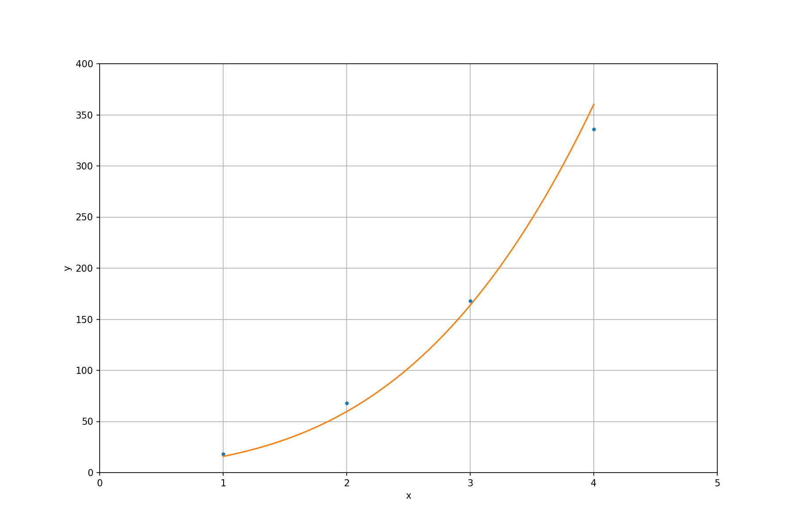

=================
Matrix Operations
=================

.. contents:: Contents in the chapter
  :local:
  :depth: 1

Matrices are broadly used in numerical analysis, and arrays are used to allow
computer code to process matrices.  Arrays are also the data structure that is
the closest to the fundamental types that are supported by hardware.

Linear Algebra
==============

.. contents:: Contents in the section
  :local:
  :depth: 1

One of the most frequent use of matrices and arrays is linear algebra.  BLAS_
[1]_ and LAPACK_ [2]_ are the two most important libraries for numerical
calculations for linear algebra.  BLAS stands for Basic Linear Algebra
Subprograms, and LAPACK is Linear Algebra PACKage.  They were originally
developed in Fortran_.  Although the Fortran code is still being maintained
today, it serves more like a reference implementation.  Multiple vendors
provide optimized implementation, e.g., Intel's Math Kernel Library (MKL) [3]_,
Apple's vecLib [4]_, etc.

BLAS is organized in 3 levels:

* `Level 1 <http://www.netlib.org/blas/#_level_1>`__ is vector operations, e.g.,

  * ``SAXPY()``: :math:`\mathbf{y} = a\mathbf{x} + \mathbf{y}`, constant times a
    vector plus a vector.
  * ``SDOT()``: :math:`\mathbf{x}\cdot\mathbf{y}`, dot product of two vectors.
  * ``SNRM2()``: :math:`\sqrt{\mathbf{y}\cdot\mathbf{y}}`, Euclidean norm.
* `Level 2 <http://www.netlib.org/blas/#_level_2>`__ is matrix-vector
  operations, e.g., ``SGEMV()`` that performs the general matrix-vector
  multiplication.
* `Level 3 <http://www.netlib.org/blas/#_level_3>`__ is matrix-matrix
  operations, e.g., ``SGEMM()`` that performs the general matrix-matrix
  multiplication.

.. note::

  In the naming convention of BLAS, the leading character denotes the precision
  of the data that is to be processed.  It may be one of ``S``, ``D``, ``C``,
  and ``Z``, for single-precision real, double-precision real, single-precision
  complex, and double-precision complex, respectively.

LAPACK is designed to rely on the underneath BLAS, so the two libraries are
usually used together.  While BLAS offers basic operations like matrix
multiplication, LAPACK provides more versatile computation helpers or solvers,
e.g., a system of linear equations, least square, and eigen problems.

Both BLAS and LAPACK provide C API (no native C++ interface).  CBLAS is the C
API for BLAS, and LAPACKE is that for LAPACK.

POD Arrays
==========

.. contents:: Contents in the section
  :local:
  :depth: 1

The plain-old-data (POD) arrays are also called C-style arrays.  They are given
the names because they are nothing more than just data and support no mechanism
fancier than arithmetic.  We do, oftentimes, wrap POD with fancy C++
constructs, but all the heavy-lifting numerical calculations still need to be
done with POD.  That's how von Neumann computers work.  (It clearly reveals
itself in the machine code.)

Vector: 1D Array
++++++++++++++++

We may use a 1D array (a contiguous memory buffer of sequentially ordered
elements) to store a vector.  Small vectors may be created on the stack:

.. code-block:: cpp

  constexpr size_t width = 5;
  double vector[width];

It can be indexed and populated using the index:

.. code-block:: cpp

  // Populate a vector.
  for (size_t i=0; i<width; ++i)
  {
      vector[i] = i;
  }

It is common to use the index to manipulate the 1-D array.  The following code
prints the contents:

.. code-block:: cpp

  std::cout << "vector elements in memory:" << std::endl << " ";
  for (size_t i=0; i<width; ++i)
  {
      std::cout << " " << vector[i];
  }
  std::cout << std::endl;

The execution results are:

.. code-block:: none

  vector elements in memory:
    0 1 2 3 4

The full example code can be found in :ref:`pod01_vector.cpp
<nsd-matrix-example-pod01-vector>`.

Matrix: 2D Array
++++++++++++++++

In mathematics, we usually write a matrix like:

.. math::

  \mathrm{A} = \left[ a_{ij} \right] = \left(\begin{array}{ccccc}
    a_{11} & a_{12} & a_{13} & a_{14} & a_{15} \\
    a_{21} & a_{22} & a_{23} & a_{24} & a_{25} \\
    a_{31} & a_{32} & a_{33} & a_{34} & a_{35} \\
    a_{41} & a_{42} & a_{43} & a_{44} & a_{45} \\
    a_{51} & a_{52} & a_{53} & a_{54} & a_{55}
  \end{array}\right)

It is a :math:`5\times5` square matrix.  :math:`i` is the row index (in the
horizontal direction).  :math:`j` is the column index (in the vertical
direction).

However, computer code usually uses 0-based index, so the first index starts
with 0, not 1.  It would make coding easier to rewrite the matrix using the
0-based index:

.. math::

  \mathrm{A} = \left[ a_{ij} \right] = \left(\begin{array}{ccccc}
    a_{00} & a_{01} & a_{02} & a_{03} & a_{04} \\
    a_{10} & a_{11} & a_{12} & a_{13} & a_{14} \\
    a_{20} & a_{21} & a_{22} & a_{23} & a_{24} \\
    a_{30} & a_{31} & a_{32} & a_{33} & a_{34} \\
    a_{40} & a_{41} & a_{42} & a_{43} & a_{44}
  \end{array}\right)

In C++ we can use an auto variable for the matrix:

.. code-block:: cpp

  constexpr size_t width = 5;

  double amatrix[width][width];

The elements are accessed through two consecutive operators ``[]``:

.. code-block:: cpp

  // Populate the matrix on stack (row-major 2D array).
  for (size_t i=0; i<width; ++i) // the i-th row
  {
      for (size_t j=0; j<width; ++j) // the j-th column
      {
          amatrix[i][j] = i*10 + j;
      }
  }

  std::cout << "2D array elements:";
  for (size_t i=0; i<width; ++i) // the i-th row
  {
      std::cout << std::endl << " ";
      for (size_t j=0; j<width; ++j) // the j-th column
      {
          std::cout << " " << std::setfill('0') << std::setw(2)
                    << amatrix[i][j];
      }
  }
  std::cout << std::endl;

The execution results are:

.. code-block:: none

  2D array elements:
    00 01 02 03 04
    10 11 12 13 14
    20 21 22 23 24
    30 31 32 33 34
    40 41 42 43 44

The full example code can be found in :ref:`pod02_matrix_auto.cpp
<nsd-matrix-example-pod02-matrix-auto>`.

.. _nsd-vla:

Variable-Length Array
+++++++++++++++++++++

The C++ multi-dimensional array index is convenient, but it doesn't always work
when the array size is unknown in the compile time, which is also known as
variable-length arrays (VLA).  VLA is included in the C standard [6]_, but not
in the C++ standard.

``g++`` accepts the following code for GCC provides the `VLA extension
<https://gcc.gnu.org/onlinedocs/gcc/Variable-Length.html>`__ in C++:

.. code-block:: cpp

  void work(double * buffer, size_t width)
  {
      // This should not work since width is unknown in compile time.
      double (*matrix)[width] = reinterpret_cast<double (*)[width]>(buffer);
      
      //...
  }

``clang++`` doesn't:

.. code-block:: console

  $ clang++ pod_bad_matrix.cpp -o pod_bad_matrix -std=c++17 -O3 -g -m64
  pod_bad_matrix.cpp:7:14: error: cannot initialize a variable of type 'double (*)[width]' with an rvalue of type 'double (*)[width]'
      double (*matrix)[width] = reinterpret_cast<double (*)[width]>(buffer);
               ^                ~~~~~~~~~~~~~~~~~~~~~~~~~~~~~~~~~~~~~~~~~~~
  1 error generated.
  make: *** [pod_bad_matrix] Error 1

The full example code can be found in :ref:`pod_bad_matrix.cpp
<nsd-matrix-example-pod-bad-matrix>`.

Row-Major 2D Array
++++++++++++++++++

The elements of a row-major 2D array are stored so that the fastest changing
index is the trailing index of the 2D array:

.. code-block:: cpp

  constexpr size_t width = 5;

  double * buffer = new double[width*width];
  std::cout << "buffer address: " << buffer << std::endl;

.. math::

  \mathrm{buffer} = [a_{00}, a_{01}, a_{02}, a_{03}, a_{04},
    a_{10}, a_{11}, a_{12}, \ldots, a_{43}, a_{44}]

When accessing the elements, what we need to do is to remember how long we need
to *stride* per row (leading) index.  In the above case, it is ``i*width``.
Then we can use the stride to calculate the correct index in the buffer (the
following code populates the buffer):

.. code-block:: cpp
  :emphasize-lines: 6

  // Populate a buffer (row-major 2D array).
  for (size_t i=0; i<width; ++i) // the i-th row
  {
      for (size_t j=0; j<width; ++j) // the j-th column
      {
          buffer[i*width + j] = i*10 + j;
      }
  }

We may play the pointer trick (which didn't work for :ref:`VLA <nsd-vla>`) to
use two consecutive operators ``[]`` for accessing the element:

.. code-block:: cpp
  :emphasize-lines: 12

  // Make a pointer to double[width].  Note width is a constexpr.
  double (*matrix)[width] = reinterpret_cast<double (*)[width]>(buffer);
  std::cout << "matrix address: " << matrix << std::endl;

  std::cout << "matrix (row-major) elements as 2D array:";
  for (size_t i=0; i<width; ++i) // the i-th row
  {
      std::cout << std::endl << " ";
      for (size_t j=0; j<width; ++j) // the j-th column
      {
          std::cout << " " << std::setfill('0') << std::setw(2)
                    << matrix[i][j];
      }
  }
  std::cout << std::endl;

The execution results are:

.. code-block:: none

  buffer address: 0x7f88e9405ab0
  matrix address: 0x7f88e9405ab0
  matrix (row-major) elements as 2D array:
    00 01 02 03 04
    10 11 12 13 14
    20 21 22 23 24
    30 31 32 33 34
    40 41 42 43 44
  matrix (row-major) elements in memory:
    00 01 02 03 04 10 11 12 13 14 20 21 22 23 24 30 31 32 33 34 40 41 42 43 44
  row majoring: the fastest moving index is the trailing index

The full example code can be found in :ref:`pod03_matrix_rowmajor.cpp
<nsd-matrix-example-pod03-matrix-rowmajor>`.

Column-Major 2D Array
+++++++++++++++++++++

The elements of a column-major 2D array are stored so that the fastest changing
index is the leading index of the 2D array:

.. code-block:: cpp

  constexpr size_t width = 5;

  double * buffer = new double[width*width];
  std::cout << "buffer address: " << buffer << std::endl;

The code is the same as that of the row-majoring since the number of column and
row is the same.  But for column-majoring arrays, the elements order
differently:

.. math::

  \mathrm{buffer} = [a_{00}, a_{10}, a_{20}, a_{30}, a_{40}, a_{01}, a_{11}, a_{21}, \ldots, a_{34}, a_{44}]

Similar to a row-major array, we need to know the stride.  But this time it's
for the column (trailing) index:

.. code-block:: cpp
  :emphasize-lines: 6

  // Populate a buffer (column-major 2D array).
  for (size_t i=0; i<width; ++i) // the i-th row
  {
      for (size_t j=0; j<width; ++j) // the j-th column
      {
          buffer[j*width + i] = i*10 + j;
      }
  }

The same pointer trick allows to use two consecutive operators ``[]``, but it
does not know the different stride needed by column-majoring, and does not work
well.  We need to flip ``i`` and ``j`` to hack out the column-major stride:

.. code-block:: cpp
  :emphasize-lines: 12

  // Make a pointer to double[width].  Note width is a constexpr.
  double (*matrix)[width] = reinterpret_cast<double (*)[width]>(buffer);
  std::cout << "matrix address: " << matrix << std::endl;

  std::cout << "matrix (column-major) elements as 2D array:";
  for (size_t i=0; i<width; ++i) // the i-th row
  {
      std::cout << std::endl << " ";
      for (size_t j=0; j<width; ++j) // the j-th column
      {
          std::cout << " " << std::setfill('0') << std::setw(2)
                    << matrix[j][i];
      }
  }
  std::cout << std::endl;

In the above code, to access the element :math:`a_{ij}` (at ``i``\ -th row and
``j``\ -th column), the code needs to be written as ``matrix[j][i]``.  This
does not look as straight-forward as that of the row-major array, which was
``matrix[i][j]``.

The execution results are:

.. code-block:: none

  buffer address: 0x7f926bc05ab0
  matrix address: 0x7f926bc05ab0
  matrix (column-major) elements as 2D array:
    00 01 02 03 04
    10 11 12 13 14
    20 21 22 23 24
    30 31 32 33 34
    40 41 42 43 44
  matrix (column-major) elements in memory:
    00 10 20 30 40 01 11 21 31 41 02 12 22 32 42 03 13 23 33 43 04 14 24 34 44
  column majoring: the fastest moving index is the leading index

The full example code can be found in :ref:`pod04_matrix_colmajor.cpp
<nsd-matrix-example-pod04-matrix-colmajor>`.

C++ Class for Matrix
====================

.. contents:: Contents in the section
  :local:
  :depth: 1

Keeping track of the stride can be error-prone.  Even if we stick to one
majoring order (usually it's row-majoring), it's easy to lose track of it when
the number of row and column is different, or it's higher-dimensional.

A common practice in C++ is to use a class to keep track of the stride and
simply access:

.. code-block:: cpp
  :linenos:
  :emphasize-lines: 17-25

  class Matrix {

  public:

      Matrix(size_t nrow, size_t ncol)
        : m_nrow(nrow), m_ncol(ncol)
      {
          size_t nelement = nrow * ncol;
          m_buffer = new double[nelement];
      }

      ~Matrix()
      {
          delete[] m_buffer;
      }

      // No bound check.
      double   operator() (size_t row, size_t col) const
      {
          return m_buffer[row*m_ncol + col];
      }
      double & operator() (size_t row, size_t col)
      {
          return m_buffer[row*m_ncol + col];
      }

      size_t nrow() const { return m_nrow; }
      size_t ncol() const { return m_ncol; }

  private:

      size_t m_nrow;
      size_t m_ncol;
      double * m_buffer;

  };

The key is the custom :cpp:func:`!operator()` added in lines 17--25.  It uses
the stride information stored in the object to index the correct element.  The
populating code is simplified by using the new accessor:

.. code-block:: cpp
  :linenos:

  /**
   * Populate the matrix object.
   */
  void populate(Matrix & matrix)
  {
      for (size_t i=0; i<matrix.nrow(); ++i) // the i-th row
      {
          for (size_t j=0; j<matrix.ncol(); ++j) // the j-th column
          {
              matrix(i, j) = i*10 + j;
          }
      }
  }

The execution results are:

.. code-block:: none

  matrix:
    00 01 02 03 04
    10 11 12 13 14
    20 21 22 23 24
    30 31 32 33 34
    40 41 42 43 44

The full example code can be found in :ref:`ma01_matrix_class.cpp
<nsd-matrix-example-ma01-matrix-class>`.

Matrix Transpose
================

.. contents:: Contents in the section
  :local:
  :depth: 1

Before other operations related to a 2D array, we should first discuss matrix
transpose.  Write a :math:`m\times n` (:math:`m` rows and :math:`n` columns)
matrix :math:`\mathrm{A}`

.. math::

  \mathrm{A} = [a_{ij}] = \left(\begin{array}{cccc}
    a_{11} & a_{12} & \cdots & a_{1n} \\
    a_{21} & a_{22} & \cdots & a_{2n} \\
    a_{31} & a_{32} & \cdots & a_{3n} \\
    \vdots & & \ddots & \vdots \\
    a_{m1} & a_{m2} & \cdots & a_{mn}
  \end{array}\right)_{m\times n}

its transpose :math:`\mathrm{A}^t` becomes a :math:`n\times m` (:math:`n` rows
and :math:`m` columns) matrix

.. math::

  \mathrm{A}^t = [a_{ji}] = \left(\begin{array}{ccccc}
    a_{11} & a_{21} & a_{31} & \cdots & a_{m1} \\
    a_{12} & a_{22} & a_{32} & \cdots & a_{m2} \\
    \vdots & & & \ddots & \vdots \\
    a_{1n} & a_{2n} & a_{3n} & \cdots & a_{mn}
  \end{array}\right)_{n\times m}

In computer code, transposing may be implementing by creating two memory
buffers and copy from the source to the destination.  An alternate and faster
approach is to take advantage of majoring.

The fast transpose uses the formula :math:`\mathrm{A}^t = [a_{ji}]` for
:math:`\mathrm{A} = [a_{ij}]`.  The code is like:

.. code-block:: cpp
  :linenos:

  double   operator() (size_t row, size_t col) const
  {
      return m_buffer[index(row, col)];
  }
  double & operator() (size_t row, size_t col)
  {
      return m_buffer[index(row, col)];
  }

  bool is_transposed() const { return m_transpose; }

  Matrix & transpose()
  {
      m_transpose = !m_transpose;
      std::swap(m_nrow, m_ncol);
      return *this;
  }

There is no data copied for transpose.  The price to pay is the if statement in
the indexing helper.

.. code-block:: cpp
  :linenos:

  size_t index(size_t row, size_t col) const
  {
      if (m_transpose) { return row          + col * m_nrow; }
      else             { return row * m_ncol + col         ; }
  }

Matrix-Vector Multiplication
============================

.. contents:: Contents in the section
  :local:
  :depth: 1

Operations of a matrix and a vector make coding for matrices more interesting.
To show how it works, let us use a concrete operation of matrix-vector
multiplication

.. math::

  \mathbf{y} = \mathrm{A}\mathbf{x}

Come back to the matrix-vector multiplication, :math:`\mathbf{y} =
\mathrm{A}\mathbf{x}`.  The calculation is easy by using the index form of the
matrix and vector.

.. math::

  y_i = \sum_{j=1}^n A_{ij} x_j, \quad i = 1, \ldots, m

By applying `Einstein's summation convention
<https://mathworld.wolfram.com/EinsteinSummation.html>`__ [7]_, the summation
sign may be suppressed to use the repeated indices for summation

.. math::

  y_i = A_{ij} x_j, \quad i = 1, \ldots, m, \; j = 1, \ldots, n

It can be shown that the index form of :math:`\mathbf{y}' =
\mathrm{A}^t\mathbf{x}'` is

.. math::

  y'_j = A_{ji} x'_i, \quad i = 1, \ldots, m, \; j = 1, \ldots, n

Aided by the above equations, we may implement a naive matrix-vector
multiplication:

.. code-block:: cpp
  :linenos:

  std::vector<double> operator*(Matrix const & mat, std::vector<double> const & vec)
  {
      if (mat.ncol() != vec.size())
      {
          throw std::out_of_range("matrix column differs from vector size");
      }

      std::vector<double> ret(mat.nrow());

      for (size_t i=0; i<mat.nrow(); ++i)
      {
          double v = 0;
          for (size_t j=0; j<mat.ncol(); ++j)
          {
              v += mat(i,j) * vec[j];
          }
          ret[i] = v;
      }

      return ret;
  }

Full example code can be found in :ref:`ma02_matrix_vector.cpp
<nsd-matrix-example-ma02-matrix-vector>`.  In the rest of the section, we will
analyze the multiplication code with several different configurations.

Square Matrix
+++++++++++++

First we test the simple case.  Multiplying a :math:`5\times5` square matrix by
a math:`5\times1` vector:

.. code-block:: cpp
  :linenos:

  size_t width = 5;

  std::cout << ">>> square matrix-vector multiplication:" << std::endl;
  Matrix mat(width, width);

  for (size_t i=0; i<mat.nrow(); ++i) // the i-th row
  {
      for (size_t j=0; j<mat.ncol(); ++j) // the j-th column
      {
          mat(i, j) = i == j ? 1 : 0;
      }
  }

  std::vector<double> vec{1, 0, 0, 0, 0};
  std::vector<double> res = mat * vec;

  std::cout << "matrix A:" << mat << std::endl;
  std::cout << "vector b:" << vec << std::endl;
  std::cout << "A*b =" << res << std::endl;

The result is a :math:`5\times1` vector:

.. code-block:: none

  >>> square matrix-vector multiplication:
  matrix A:
     1  0  0  0  0
     0  1  0  0  0
     0  0  1  0  0
     0  0  0  1  0
     0  0  0  0  1
  vector b: 1 0 0 0 0
  A*b = 1 0 0 0 0

Rectangular Matrix
++++++++++++++++++

Multiplying a :math:`2\times3` square matrix by a :math:`3\times1` vector:

.. code-block:: cpp
  :linenos:

  std::cout << ">>> m*n matrix-vector multiplication:" << std::endl;
  Matrix mat2(2, 3);

  double v = 1;
  for (size_t i=0; i<mat2.nrow(); ++i) // the i-th row
  {
      for (size_t j=0; j<mat2.ncol(); ++j) // the j-th column
      {
          mat2(i, j) = v;
          v += 1;
      }
  }

  std::vector<double> vec2{1, 2, 3};
  std::vector<double> res2 = mat2 * vec2;

  std::cout << "matrix A:" << mat2 << std::endl;
  std::cout << "vector b:" << vec2 << std::endl;
  std::cout << "A*b =" << res2 << std::endl;

The result is a :math:`2\times1` vector:

.. code-block:: none

  >>> m*n matrix-vector multiplication:
  matrix A:
     1  2  3
     4  5  6
  vector b: 1 2 3
  A*b = 14 32

Transposed Matrix
+++++++++++++++++

Apply the fast transpose to the :math:`2\times3` square matrix ``mat2`` to make
it a :math:`3\times2` matrix, and multiply by a :math:`2\times1` vector:

.. code-block:: cpp
  :linenos:

  std::cout << ">>> transposed matrix-vector multiplication:" << std::endl;
  mat2.transpose();
  std::vector<double> vec3{1, 2};
  std::vector<double> res3 = mat2 * vec3;

  std::cout << "matrix A:" << mat2 << std::endl;
  std::cout << "matrix A buffer:" << mat2.buffer_vector() << std::endl;
  std::cout << "vector b:" << vec3 << std::endl;
  std::cout << "A*b =" << res3 << std::endl;

The result is a :math:`3\times1` vector:

.. code-block:: none
  :emphasize-lines: 6

  >>> transposed matrix-vector multiplication:
  matrix A:
     1  4
     2  5
     3  6
  matrix A buffer: 1 2 3 4 5 6
  vector b: 1 2
  A*b = 9 12 15

Because of the transpose, the matrix now uses column-majoring, as shown in the
sixth line in the result above.

New Buffer from Transpose
+++++++++++++++++++++++++

Also try to copy the transposed matrix to a new matrix object which uses a new
buffer.  Multiply the new matrix with the same vector:

.. code-block:: cpp
  :linenos:

  std::cout << ">>> copied transposed matrix-vector multiplication:" << std::endl;
  Matrix mat3 = mat2;
  res3 = mat2 * vec3;

  std::cout << "matrix A:" << mat3 << std::endl;
  std::cout << "matrix A buffer:" << mat3.buffer_vector() << std::endl;
  std::cout << "vector b:" << vec3 << std::endl;
  std::cout << "A*b =" << res3 << std::endl;

The copy assignment operator is implemented as:

.. code-block:: cpp
  :linenos:

  Matrix & operator=(Matrix const & other)
  {
      if (this == &other) { return *this; }
      if (m_nrow != other.m_nrow || m_ncol != other.m_ncol)
      {
          reset_buffer(other.m_nrow, other.m_ncol);
      }
      for (size_t i=0; i<m_nrow; ++i)
      {
          for (size_t j=0; j<m_ncol; ++j)
          {
              (*this)(i,j) = other(i,j);
          }
      }
      return *this;
  }

The result is the same :math:`3\times1` vector:

.. code-block:: none
  :emphasize-lines: 6

  >>> copied transposed matrix-vector multiplication:
  matrix A:
     1  4
     2  5
     3  6
  matrix A buffer: 1 4 2 5 3 6
  vector b: 1 2
  A*b = 9 12 15

The copied matrix uses row-majoring, as shown in the sixth line in the result
above.

.. note::

  Although we do not analyze the runtime performance at this moment, the
  majoring may significantly affects the speed of the multiplication for large
  matrices.

Matrix-Matrix Multiplication
============================

.. contents:: Contents in the section
  :local:
  :depth: 1

Matrix-matrix multiplication, :math:`\mathrm{C} = \mathrm{A}\mathrm{B}`, has
more complexity in both time and space.  It generally uses a :math:`O(n^3)`
algorithm for multiple copies of :math:`O(n^2)` data.  The formula is

.. math::

  C_{ik} = \sum_{j=1}^n A_{ij}B_{jk}, \quad i = 1, \ldots, m, \; k = 1, \ldots, l

or, by using Einstein's summation convention,

.. math::

  C_{ik} = A_{ij}B_{jk}, \quad i = 1, \ldots, m, \; j = 1, \ldots, n, \; k = 1, \ldots, l

Aided by the formula, we can write down the C++ code for the naive algorithm:

.. code-block:: cpp
  :linenos:
  :emphasize-lines: 12-23

  Matrix operator*(Matrix const & mat1, Matrix const & mat2)
  {
      if (mat1.ncol() != mat2.nrow())
      {
          throw std::out_of_range(
              "the number of first matrix column "
              "differs from that of second matrix row");
      }

      Matrix ret(mat1.nrow(), mat2.ncol());

      for (size_t i=0; i<ret.nrow(); ++i)
      {
          for (size_t k=0; k<ret.ncol(); ++k)
          {
              double v = 0;
              for (size_t j=0; j<mat1.ncol(); ++j)
              {
                  v += mat1(i,j) * mat2(j,k);
              }
              ret(i,k) = v;
          }
      }

      return ret;
  }

The 3-level nested loops in lines 12--23 are the runtime hotspot.  The full
example code can be found in :ref:`ma03_matrix_matrix.cpp
<nsd-matrix-example-ma03-matrix-matrix>`.  We will examine two cases.  The
first is to multiply a :math:`3\times2` matrix :math:`\mathrm{A}` by a
:math:`2\times3` matrix :math:`\mathrm{B}`:

.. code-block:: cpp
  :linenos:

  std::cout << ">>> A(2x3) times B(3x2):" << std::endl;
  Matrix mat1(2, 3, std::vector<double>{1, 2, 3, 4, 5, 6});
  Matrix mat2(3, 2, std::vector<double>{1, 2, 3, 4, 5, 6});

  Matrix mat3 = mat1 * mat2;

  std::cout << "matrix A (2x3):" << mat1 << std::endl;
  std::cout << "matrix B (3x2):" << mat2 << std::endl;
  std::cout << "result matrix C (2x2) = AB:" << mat3 << std::endl;

The result is a :math:`3\times3` matrix :math:`\mathrm{C}`:

.. code-block:: none

  >>> A(2x3) times B(3x2):
  matrix A (2x3):
     1  2  3
     4  5  6
  matrix B (3x2):
     1  2
     3  4
     5  6
  result matrix C (2x2) = AB:
    22 28
    49 64

Then multiply :math:`\mathrm{B}` (:math:`{2\times3}`) by :math:`\mathrm{A}`
(:math:`{3\times2}`):

.. code-block:: cpp
  :linenos:

  std::cout << ">>> B(3x2) times A(2x3):" << std::endl;
  Matrix mat4 = mat2 * mat1;
  std::cout << "matrix B (3x2):" << mat2 << std::endl;
  std::cout << "matrix A (2x3):" << mat1 << std::endl;
  std::cout << "result matrix D (3x3) = BA:" << mat4 << std::endl;

The result is a :math:`2\times2` matrix :math:`\mathrm{D}`:

.. code-block:: none

  >>> B(3x2) times A(2x3):
  matrix B (3x2):
     1  2
     3  4
     5  6
  matrix A (2x3):
     1  2  3
     4  5  6
  result matrix D (3x3) = BA:
     9 12 15
    19 26 33
    29 40 51

Matrix-matrix multiplication is intensive number-crunching.  We do not have a
good way to work around the brute-force, N-cube algorithm.

.. note::

  An algorithm of slightly lower complexity in time is available [8]_, but not
  discussed here.  We use the naive algorithm to focus the discussions on the
  code development.

It also demands memory.  A matrix of :math:`100,000\times100,000` takes
10,000,000,000 (i.e., :math:`10^{10}`) elements, and with double-precision
floating points, it takes 80 GB.  To perform multiplication, you need the
memory for 3 of the matrices, and that's 240 GB.  The dense matrix
multiplication does not scale well with distributed-memory parallelism.  The
reasonable size of dense matrices for a workstation is around
:math:`10,000\times10,000`, i.e., 800 MB per matrix.  It's very limiting, but
already facilitates a good number of applications.

Linear System
=============

.. contents:: Contents in the section
  :local:
  :depth: 1

LAPACK provides ``?GESV()`` functions to solve a linear system using a general
(dense) matrix: :math:`\mathrm{A}\mathbf{x} = \mathbf{b}`.  Say we have a
system of linear equations:

.. math::

  3 x_1 + 5 x_2 + 2 x_3 &= 57 \\
  2 x_1 +   x_2 + 3 x_3 &= 22 \\
  4 x_1 + 3 x_2 + 2 x_3 &= 41

It can be rewritten as :math:`\mathrm{A}\mathbf{x} = \mathbf{b}`, where

.. math::

  \mathrm{A} = \left(\begin{array}{ccc}
    3 & 5 & 2 \\
    2 & 1 & 3 \\
    4 & 3 & 2
  \end{array}\right), \quad
  \mathbf{b} = \left(\begin{array}{c}
    57 \\ 22 \\ 41
  \end{array}\right), \quad
  \mathbf{x} = \left(\begin{array}{c}
    x_1 \\ x_2 \\ x_3
  \end{array}\right)

We can write code to solve the sample problem above by calling LAPACK:

.. code-block:: cpp
  :linenos:
  :emphasize-lines: 5, 9, 19, 23, 26

  const size_t n = 3;
  int status;

  std::cout << ">>> Solve Ax=b (row major)" << std::endl;
  Matrix mat(n, n, /* column_major */ false);
  mat(0,0) = 3; mat(0,1) = 5; mat(0,2) = 2;
  mat(1,0) = 2; mat(1,1) = 1; mat(1,2) = 3;
  mat(2,0) = 4; mat(2,1) = 3; mat(2,2) = 2;
  Matrix b(n, 2, false);
  b(0,0) = 57; b(0,1) = 23;
  b(1,0) = 22; b(1,1) = 12;
  b(2,0) = 41; b(2,1) = 84;
  std::vector<int> ipiv(n);

  std::cout << "A:" << mat << std::endl;
  std::cout << "b:" << b << std::endl;

  status = LAPACKE_dgesv(
      LAPACK_ROW_MAJOR // int matrix_layout
    , n // lapack_int n
    , b.ncol() // lapack_int nrhs
    , mat.data() // double * a
    , mat.ncol() // lapack_int lda
    , ipiv.data() // lapack_int * ipiv
    , b.data() // double * b
    , b.ncol() // lapack_int ldb
    // for row major matrix, ldb becomes the trailing dimension.
  );

  std::cout << "solution x:" << b << std::endl;
  std::cout << "dgesv status: " << status << std::endl;

.. note::

  The reference implementation of LAPACK is Fortran, which uses column major.
  The dimensional arguments of the LAPACK subroutines changes meaning when we
  call them from C with row-major matrices.

The execution results are:

.. code-block:: none

  >>> Solve Ax=b (row major)
  A:
     3  5  2
     2  1  3
     4  3  2
   data:   3  5  2  2  1  3  4  3  2
  b:
    57 23
    22 12
    41 84
   data:  57 23 22 12 41 84
  solution x:
     2 38.3913
     9 -11.3043
     3 -17.8261
   data:   2 38.3913  9 -11.3043  3 -17.8261
  dgesv status: 0

The code and results are for row-majoring matrix.  Now we test the same matrix
but make it column-major:

.. code-block:: cpp
  :linenos:
  :emphasize-lines: 2, 6, 15, 19, 22

  std::cout << ">>> Solve Ax=b (column major)" << std::endl;
  Matrix mat2 = Matrix(n, n, /* column_major */ true);
  mat2(0,0) = 3; mat2(0,1) = 5; mat2(0,2) = 2;
  mat2(1,0) = 2; mat2(1,1) = 1; mat2(1,2) = 3;
  mat2(2,0) = 4; mat2(2,1) = 3; mat2(2,2) = 2;
  Matrix b2(n, 2, true);
  b2(0,0) = 57; b2(0,1) = 23;
  b2(1,0) = 22; b2(1,1) = 12;
  b2(2,0) = 41; b2(2,1) = 84;

  std::cout << "A:" << mat2 << std::endl;
  std::cout << "b:" << b2 << std::endl;

  status = LAPACKE_dgesv(
      LAPACK_COL_MAJOR // int matrix_layout
    , n // lapack_int n
    , b2.ncol() // lapack_int nrhs
    , mat2.data() // double * a
    , mat2.nrow() // lapack_int lda
    , ipiv.data() // lapack_int * ipiv
    , b2.data() // double * b
    , b2.nrow() // lapack_int ldb
    // for column major matrix, ldb remains the leading dimension.
  );

  std::cout << "solution x:" << b2 << std::endl;
  std::cout << "dgesv status: " << status << std::endl;

The execution results are:

.. code-block:: none

  >>> Solve Ax=b (column major)
  A:
     3  5  2
     2  1  3
     4  3  2
   data:   3  2  4  5  1  3  2  3  2
  b:
    57 23
    22 12
    41 84
   data:  57 22 41 23 12 84
  solution x:
     2 38.3913
     9 -11.3043
     3 -17.8261
   data:   2  9  3 38.3913 -11.3043 -17.8261
  dgesv status: 0

The full example code can be found in :ref:`la01_gesv.cpp
<nsd-matrix-example-la01-gesv>`.

Eigenvalue Problems
===================

.. contents:: Contents in the section
  :local:
  :depth: 1

Eigenvalue problems and SVD (singular-value decomposition) are popular ways to
factorize matrices.  The eigenvalue problems are to find the eigenvalues
:math:`\lambda_1, \lambda_2, \ldots, \lambda_n` and the eigenvector matrix
:math:`\mathrm{S}` of a matrix :math:`\mathrm{A}`, such that

.. math::

  \mathrm{A} = \mathrm{S}\mathrm{\Lambda}\mathrm{S}^{-1}

An eigenvalue :math:`\lambda` of :math:`\mathrm{A}` is a scalar such that

.. math::

  \mathrm{A}v = \lambda v

:math:`v` is an eigenvector associated with :math:`\lambda`.  Because :math:`v`
is after :math:`\mathrm{A}`, it is also called right eigenvector.  For the same
eigenvalue :math:`\lambda`, the left eigenvector can be found by the following
equation

.. math::

  u^h\mathrm{A} = \lambda u^h

:math:`u^h` is the Hermitian (conjugate transpose) of :math:`u`.

Now we can use the LAPACK high-level ``?GEEV()`` driver for calculating the
eigenvalues and eigenvectors:

.. code-block:: cpp
  :linenos:
  :emphasize-lines: 16-29

  const size_t n = 3;
  int status;

  std::cout << ">>> Solve Ax=lx (row major)" << std::endl;
  Matrix mat(n, n, false);
  mat(0,0) = 3; mat(0,1) = 5; mat(0,2) = 2;
  mat(1,0) = 2; mat(1,1) = 1; mat(1,2) = 3;
  mat(2,0) = 4; mat(2,1) = 3; mat(2,2) = 2;
  std::vector<double> wr(n), wi(n);
  Matrix vl(n, n, false), vr(n, n, false);

  std::vector<int> ipiv(n);

  std::cout << "A:" << mat << std::endl;

  status = LAPACKE_dgeev(
      LAPACK_ROW_MAJOR // int matrix_layout
    , 'V' // char jobvl; 'V' to compute left eigenvectors, 'N' to not compute them
    , 'V' // char jobvr; 'V' to compute right eigenvectors, 'N' to not compute them
    , n // lapack_int n
    , mat.data() // double * a
    , mat.ncol() // lapack_int lda
    , wr.data() // double * wr
    , wi.data() // double * wi
    , vl.data() // double * vl
    , vl.ncol() // lapack_int ldvl
    , vr.data() // double * vr
    , vr.ncol() // lapack_int ldvr
  );

The full example code can be found in :ref:`la02_geev.cpp
<nsd-matrix-example-la02-geev>`.  The execution results are:

.. code-block:: none

  >>> Solve Ax=lx (row major)
  A:
     3  5  2
     2  1  3
     4  3  2
   data:   3  5  2  2  1  3  4  3  2
  dgeev status: 0
  eigenvalues:
        (real)      (imag)
  (   8.270757,   0.000000)
  (  -1.135379,   1.221392)
  (  -1.135379,  -1.221392)
  left eigenvectors:
      0.609288 ( -0.012827, -0.425749) ( -0.012827,  0.425749)
      0.621953 (  0.652142,  0.000000) (  0.652142,  0.000000)
      0.491876 ( -0.442811,  0.444075) ( -0.442811, -0.444075)
  right eigenvectors:
      0.649714 ( -0.668537,  0.000000) ( -0.668537,  0.000000)
      0.435736 (  0.448552, -0.330438) (  0.448552,  0.330438)
      0.622901 (  0.260947,  0.417823) (  0.260947, -0.417823)

Let us verify the calculation.  We can use numpy for the verification.  To
begin, input the matrix :math:`\mathrm{A}`:

.. code-block:: pycon

  >>> import numpy as np
  >>> A = np.array([[3, 5, 2], [2, 1, 3], [4, 3, 2]], dtype='float64')

Verify that for the first left eigenvector (real-valued) and its eigenvalue
(8.270757), :math:`u_1^t\mathrm{A} = \lambda_1 u_1`:

.. code-block:: pycon

  >>> ul = np.array([0.609288, 0.621953, 0.491876], dtype='float64')
  >>> print("u^t A:", np.dot(ul, A))
  u^t A: [5.039274 5.144021 4.068187]
  >>> print("l u^t:", 8.270757*ul)
  l u^t: [5.03927299 5.14402213 4.06818687]

Verify that for the second left eigenvector (complex-valued) and its eigenvalue
(:math:`-1.135379+1.221392i`), :math:`u_2^h\mathrm{A} = \lambda_2 u_2^h` (note
that the complex-valued eigenvector needs Hermitian in the left-hand side to
the equality sign):

.. code-block:: pycon

  >>> ul = np.array([-0.012827-0.425749j, 0.652142, -0.442811+0.444075j], dtype='complex64')
  >>> print("u^h A:", np.dot(ul.conj(), A))
  u^h A: [-0.50544107-0.49905294j -0.74042605+0.79652005j  1.04514994-0.03665197j]
  >>> print("l u^h:", (-1.135379+1.221392j)*ul.conj())
  l u^h: [-0.5054429 -0.49905324j -0.74042827+0.796521j    1.0451479 -0.03665245j]

Verify that for the first right eigenvector (real-valued) and its eigenvalue
(8.270757), :math:`\mathrm{A}v_1 = \lambda_1 v_1`:

.. code-block:: pycon

  >>> vr = np.array([0.649714, 0.435736, 0.622901], dtype='float64')
  >>> print("A v:", np.dot(A, vr))
  A v: [5.373624 3.603867 5.151866]
  >>> print("l v:", 8.270757*vr)
  l v: [5.37362661 3.60386657 5.15186281]

Verify that for the second right eigenvector (complex-valued) and its eigenvalue
(:math:`-1.135379+1.221392i`), :math:`\mathrm{A} v_2 = \lambda_2 v_2` (note
that the complex-valued eigenvector needs Hermitian in the left-hand side to
the equality sign):

.. code-block:: pycon

  >>> vr = np.array([-0.668537, 0.448552-0.330438j, 0.260947+0.417823j], dtype='complex64')
  >>> print("A v:", np.dot(A, vr))
  A v: [ 0.75904298-0.81654397j -0.10568106+0.92303097j -0.80659807-0.15566799j]
  >>> print("l v:", (-1.135379+1.221392j)*vr)
  l v: [ 0.75904286-0.8165458j  -0.10568219+0.92303026j -0.8065994 -0.15566885j]

Symmetric Matrix
++++++++++++++++

LAPACK provides special implementation with the ``?SYEV()`` functions to
calculate the eigenvalues and eigenvectors faster for symmetric matrices.

.. code-block:: cpp
  :linenos:

  const size_t n = 3;
  int status;

  std::cout << ">>> Solve Ax=lx (row major, A symmetric)" << std::endl;
  Matrix mat(n, n, false);
  mat(0,0) = 3; mat(0,1) = 5; mat(0,2) = 2;
  mat(1,0) = 5; mat(1,1) = 1; mat(1,2) = 3;
  mat(2,0) = 2; mat(2,1) = 3; mat(2,2) = 2;
  std::vector<double> w(n);

  std::cout << "A:" << mat << std::endl;

  status = LAPACKE_dsyev(
      LAPACK_ROW_MAJOR // int matrix_layout
    , 'V' // char jobz;
          // 'V' to compute both eigenvalues and eigenvectors,
          // 'N' only eigenvalues
    , 'U' // char uplo;
          // 'U' use the upper triangular of input a,
          // 'L' use the lower
    , n // lapack_int n
    , mat.data() // double * a
    , mat.ncol() // lapack_int lda
    , w.data() // double * w
  );

The full example code can be found in :ref:`la03_syev.cpp
<nsd-matrix-example-la03-syev>`.  The execution results are:

.. code-block:: none

  >>> Solve Ax=lx (row major, A symmetric)
  A:
     3  5  2
     5  1  3
     2  3  2
   data:   3  5  2  5  1  3  2  3  2
  dsyev status: 0
  eigenvalues:  -3.36105 0.503874 8.85717
  eigenvectors:
    -0.551825 -0.505745 -0.663107
    0.798404 -0.0906812 -0.595255
    -0.240916 0.857904 -0.453828
   data:  -0.551825 -0.505745 -0.663107 0.798404 -0.0906812 -0.595255 -0.240916 0.857904 -0.453828

Again, we use numpy to verify the results.  The input matrix
:math:`\mathrm{A}`:

.. code-block:: pycon

  >>> A = np.array([[3, 5, 2], [5, 1, 3], [2, 3, 2]], dtype='float64')

The spectral theorem tells us that the eigenvalues are all real-numbered.
Verify that :math:`A v = \lambda v` for all the 3 distinct eigenvalues and
their right eigenvectors:

.. code-block:: pycon
  :caption: The first eigenvalue and its right eigenvector

  >>> v = np.array([-0.551825, 0.798404, -0.240916], dtype='float64')
  >>> print("A v:", np.dot(A, v))
  A v: [ 1.854713 -2.683469  0.80973 ]
  >>> print("l v:", -3.36105*v)
  l v: [ 1.85471142 -2.68347576  0.80973072]

.. code-block:: pycon
  :caption: The second eigenvalue and its right eigenvector

  >>> v = np.array([-0.505745, -0.0906812, 0.857904], dtype='float64')
  >>> print("A v:", np.dot(A, v))
  A v: [-0.254833  -0.0456942  0.4322744]
  >>> print("l v:", 0.503874*v)
  l v: [-0.25483176 -0.0456919   0.43227552]

.. code-block:: pycon
  :caption: The third eigenvalue and its right eigenvector

  >>> v = np.array([-0.663107, -0.595255, -0.453828], dtype='float64')
  >>> print("A v:", np.dot(A, v))
  A v: [-5.873252 -5.272274 -4.019635]
  >>> print("l v:", 8.85717*v)
  l v: [-5.87325143 -5.27227473 -4.01963175]

The spectral theorem tells us that the eigenvector matrix is orthonormal, so
that the left eigenvectors are the row vectors of the eigenvector matrix.  Now
we verify that :math:`u^t A = \lambda u^t` for all the 3 distinct eigenvalues
and their right eigenvectors:

.. code-block:: pycon
  :caption: The first eigenvalue and its left eigenvector

  >>> u = np.array([-0.551825, 0.798404, -0.240916], dtype='float64')
  >>> print("u^t A:", np.dot(u, A))
  u^t A: [ 1.854713 -2.683469  0.80973 ]
  >>> print("l u^t:", -3.36105*u)
  l u^t: [ 1.85471142 -2.68347576  0.80973072]

.. code-block:: pycon
  :caption: The second eigenvalue and its left eigenvector

  >>> u = np.array([-0.505745, -0.0906812, 0.857904], dtype='float64')
  >>> print("u^t A:", np.dot(u, A))
  u^t A: [-0.254833  -0.0456942  0.4322744]
  >>> print("l u^t:", 0.503874*u)
  l u^t: [-0.25483176 -0.0456919   0.43227552]

.. code-block:: pycon
  :caption: The third eigenvalue and its left eigenvector

  >>> u = np.array([-0.663107, -0.595255, -0.453828], dtype='float64')
  >>> print("u^t A:", np.dot(u, A))
  u^t A: [-5.873252 -5.272274 -4.019635]
  >>> print("l u^t:", 8.85717*u)
  l u^t: [-5.87325143 -5.27227473 -4.01963175]

Singular Value Decomposition (SVD)
++++++++++++++++++++++++++++++++++

Singular value decomposition is like eigenvalue problems.  Instead of obtaining
the eigenvalue and the eigenvector matrices, SVD is to obtain the singular
value and the left and right singular vector matrix

.. math::

  \mathrm{A}_{m\times n} =
    \mathrm{U}_{m\times m}\mathrm{\Sigma}_{m\times n}\mathrm{V}_{n\times n}^t

where :math:`\mathrm{U}` is the eigenvector matrix of
:math:`\mathrm{A}\mathrm{A}^t`, :math:`\mathrm{V}` the eigenvector matrix of
:math:`\mathrm{A}^t\mathrm{A}`, and :math:`\mathrm{\Sigma}` a diagonal matrix
whose values are the square root of the non-zero eigenvalues of
:math:`\mathrm{A}\mathrm{A}^t` or :math:`\mathrm{A}^t\mathrm{A}`.

The singular values :math:`\sigma_1, \sigma_2, \ldots, \sigma_r` of
:math:`\mathrm{A}` are the diagonal values of :math:`\mathrm{\Sigma}`.  In the
SVD problem, the matrix :math:`\mathrm{A}` may be rectangular instead of
square.

With the background in mind, we now use the LAPACK ``?GESVD()`` function to
compute SVD:

.. code-block:: cpp
  :linenos:
  :emphasize-lines: 15-29

  const size_t m = 3, n = 4;
  int status;

  std::cout << ">>> SVD" << std::endl;
  Matrix mat(m, n, false);
  mat(0,0) = 3; mat(0,1) = 5; mat(0,2) = 2; mat(0, 3) = 6;
  mat(1,0) = 2; mat(1,1) = 1; mat(1,2) = 3; mat(1, 3) = 2;
  mat(2,0) = 4; mat(2,1) = 3; mat(2,2) = 2; mat(2, 3) = 4;
  std::vector<double> s(m), superb(m);
  Matrix u(m, m, false);
  Matrix vt(n, n, false);

  std::cout << "A:" << mat << std::endl;

  status = LAPACKE_dgesvd(
      LAPACK_ROW_MAJOR // int matrix_layout;
    , 'A' // char jobu;
    , 'A' // char jobvt;
    , m // lapack_int m
    , n // lapack_int n
    , mat.data() // double * a
    , mat.ncol() // lapack_int lda
    , s.data() // double * s
    , u.data() // double * u
    , u.ncol() // lapack_int ldu
    , vt.data() // double * vt
    , vt.ncol() // lapack_int ldvt
    , superb.data() // double * superb
  );

The full example code can be found in :ref:`la04_gesvd.cpp
<nsd-matrix-example-la04-gesvd>`.  The execution results are:

.. code-block:: none

  >>> SVD
  A:
             3          5          2          6
             2          1          3          2
             4          3          2          4
   data:  3 5 2 6 2 1 3 2 4 3 2 4
  dgesvd status: 0
  singular values:  11.3795 2.45858 1.20947
  u:
     -0.745981  -0.530655   -0.40239
     -0.324445   0.817251  -0.476274
     -0.581591   0.224738   0.781822
   data:  -0.745981 -0.530655 -0.40239 -0.324445 0.817251 -0.476274 -0.581591 0.224738 0.781822
  vt:
     -0.458123  -0.509612  -0.318862  -0.654787
       0.38294  -0.472553   0.748366  -0.264574
      0.799992  -0.118035  -0.553927  -0.198105
    -0.0591054  -0.709265  -0.177316   0.679712
   data:  -0.458123 -0.509612 -0.318862 -0.654787 0.38294 -0.472553 0.748366 -0.264574 0.799992 -0.118035 -0.553927 -0.198105 -0.0591054 -0.709265 -0.177316 0.679712

Let us verify the result using numpy.  To begin, we input the computed data:

.. code-block:: python
  :linenos:

  a = np.array(
      [
          [3, 5, 2, 6],
          [2, 1, 3, 2],
          [4, 3, 2, 4],
      ], dtype='float64')

  u = np.array(
      [
          [-0.745981, -0.530655, -0.40239],
          [-0.324445,  0.817251, -0.476274],
          [-0.581591,  0.224738, 0.781822],
      ], dtype='float64')
  s = np.array(
      [
          [11.3795,       0,       0, 0],
          [      0, 2.45858,       0, 0],
          [      0,       0, 1.20947, 0],
      ], dtype='float64'
  )
  vt = np.array(
      [
          [-0.458123, -0.509612, -0.318862, -0.654787],
          [  0.38294, -0.472553,  0.748366, -0.264574],
          [ 0.799992, -0.118035, -0.553927, -0.198105],
          [-0.0591054,-0.709265, -0.177316,  0.679712],
      ], dtype='float64'
  )

Perform the matrix multiplication and verify that the error is small:

.. code-block:: pycon

  >>> import pprint
  >>> pprint.pprint(a)
  array([[3., 5., 2., 6.],
         [2., 1., 3., 2.],
         [4., 3., 2., 4.]])
  >>> pprint.pprint(np.dot(np.dot(u, s), vt))  # USV^t
  array([[3.00001146, 5.00000567, 2.00000761, 6.00000733],
         [2.00000598, 1.00000157, 3.00000366, 2.00000171],
         [4.00000932, 3.00000622, 2.00000865, 4.00000809]])
  >>> pprint.pprint(np.abs(np.dot(np.dot(u, s), vt) - a))  # error
  array([[1.14555417e-05, 5.66863979e-06, 7.61360053e-06, 7.32884776e-06],
         [5.97550818e-06, 1.57297897e-06, 3.66276266e-06, 1.71457387e-06],
         [9.32111966e-06, 6.21632203e-06, 8.64943021e-06, 8.09395774e-06]])

We have 3 singular values ordered from large to small.  Let us try to drop the
least significant one (i.e., keep the 2 most significant ones):

.. code-block:: python

  smost = np.array(
      [
          [11.3795,       0, 0, 0],
          [      0, 2.45858, 0, 0],
          [      0,       0, 0, 0],
      ], dtype='float64'
  )

We will see the error increases significantly:

.. code-block:: pycon

  >>> rebuilt = np.dot(np.dot(u, smost), vt)
  >>> pprint.pprint(rebuilt)  # USV^t
  array([[3.38935047, 4.94256056, 1.73042318, 5.90359386],
         [2.46083266, 0.9320088 , 2.68092004, 1.88588549],
         [3.24354468, 3.11161896, 2.52379662, 4.18733425]])
  >>> pprint.pprint(np.abs(rebuilt - a))  # error
  array([[0.38935047, 0.05743944, 0.26957682, 0.09640614],
         [0.46083266, 0.0679912 , 0.31907996, 0.11411451],
         [0.75645532, 0.11161896, 0.52379662, 0.18733425]])

The error will further increase if we drop the most significant singular value:

.. code-block:: python

  sleast = np.array(
      [
          [0,       0,       0, 0],
          [0, 2.45858,       0, 0],
          [0,       0, 1.20947, 0],
      ], dtype='float64'
  )

.. code-block:: pycon

  >>> rebuilt = np.dot(np.dot(u, sleast), vt)
  >>> pprint.pprint(rebuilt)  # USV^t
  array([[-0.88894466,  0.67396506, -0.70677708,  0.441592  ],
         [ 0.30860584, -0.88149708,  1.82275818, -0.41748621],
         [ 0.96805291, -0.37271546, -0.11028855, -0.33351291]])
  >>> pprint.pprint(np.abs(rebuilt - a))  # error
  array([[3.88894466, 4.32603494, 2.70677708, 5.558408  ],
         [1.69139416, 1.88149708, 1.17724182, 2.41748621],
         [3.03194709, 3.37271546, 2.11028855, 4.33351291]])

Compare with the results of keeping only the most significant singular value:

.. code-block:: python

  s1 = np.array(
      [
          [11.3795, 0, 0, 0],
          [      0, 0, 0, 0],
          [      0, 0, 0, 0],
      ], dtype='float64'
  )

.. code-block:: pycon

  >>> pprint.pprint(np.dot(np.dot(u, s1), vt))  # USV^t
  array([[3.88895612, 4.32604061, 2.70678469, 5.55841533],
         [1.69140014, 1.88149865, 1.17724548, 2.41748793],
         [3.03195641, 3.37272167, 2.1102972 , 4.333521  ]])
  >>> pprint.pprint(np.abs(np.dot(np.dot(u, s1), vt)-a))  # error
  array([[0.88895612, 0.67395939, 0.70678469, 0.44158467],
         [0.30859986, 0.88149865, 1.82275452, 0.41748793],
         [0.96804359, 0.37272167, 0.1102972 , 0.333521  ]])

Least Square
============

.. contents:: Contents in the section
  :local:
  :depth: 1

The linear least-square problem is to find a function of the form

.. math::

  f(x) &= a_1g_1(x) + a_2g_2(x) + \ldots + a_ng_n(x) \\
   &= \sum_{j=1}^na_ng_n(x)

that minimizes the cost function

.. math::

  \Phi(\mathbf{a}) = \sum_{i=1}^m \left[ f(x_i; \mathbf{a}) - y_i \right]^2

for given points :math:`(x_i, y_i), \; i=1, 2, \ldots, m`.

By writing

.. math::

  \newcommand{\defeq}{\overset{\text{def}}{=}}
    f_i &= f(x_i) = (\mathrm{J}\mathbf{a})_i \\
  \mathrm{J} &\defeq \left(\begin{array}{cccc}
    g_1(x_1) & g_2(x_1) & \ldots & g_n(x_1) \\
    g_1(x_2) & g_2(x_2) & \ldots & g_n(x_2) \\
    \vdots & & \ddots &\vdots \\
    g_1(x_m) & g_2(x_m) & \ldots & g_n(x_m)
  \end{array}\right) \\
  & = \left[g_j(x_i)\right], \; i=1, \ldots, m, \; j=1, \ldots, n

we can express the linear least-square problem in the matrix-vector form

.. math::

  \min(\Phi) = \min(\mathrm{J}\mathbf{a} - \mathbf{y})^2

For the minimum of the convex function :math:`\Phi` to exist,
:math:`\nabla_a\Phi = 0`.  Use Einstein's summation convention with the index
form

.. math::

  \Phi = (\mathrm{J}_{ij}a_j - y_i)^2

.. math::

  \nabla\Phi &= \frac{\partial}{\partial a_j}(\mathrm{J}_{ik}a_k-y_i)^2
    = 2(\mathrm{J}_{ik}a_k-y_i)\frac{\partial(\mathrm{J}_{ik}a_k)}{\partial a_j} \\
  & = 2(\mathrm{J}_{ik}a_k-y_i)\mathrm{J}_{ij}
    = 2\mathrm{J}^t_{ji}(\mathrm{J}_{ik}a_k-y_i) = 0

Rewrite in the vector form and obtain the normal equation for
:math:`\mathbf{a}`

.. math::

  \mathrm{J}^t\mathrm{J}\mathbf{a} = \mathrm{J}^t\mathbf{y}

Now we have the equation for the linear least-square problem and can continue
to see how to use the LAPACK ``?GELS()`` function, which find the approximated
solution of an over- or under-determined linear system,
:math:`\min(\mathrm{J}\mathbf{a}-\mathbf{y})^2`, where :math:`\mathbf{a}` is
the unknown.

Like the examples of other LAPACK subroutines, we use a simple configuration.
Given 4 data points :math:`(1, 17)`, :math:`(2, 58)`, :math:`(3, 165)`,
:math:`(4, 360)`.  We want to find the closest curve of a polynomial function

.. math::

  f(x) = a_1x^3 + a_2x_2 + a_3x

The linear system is

.. math::

  \mathrm{J} = \left(\begin{array}{ccc}
    1 & 1 & 1 \\
    8 & 4 & 2 \\
    27 & 9 & 3 \\
    64 & 16 & 4
  \end{array}\right)

and the right-hand side is

.. math::

  \mathbf{y} = \left(\begin{array}{ccc}
    17 \\ 58 \\ 165 \\ 360
  \end{array}\right)

Now we can write the code for solving the sample problem:

.. code-block:: cpp
  :linenos:

  const size_t m = 4, n = 3;
  int status;

  std::cout << ">>> least square" << std::endl;
  // Use least-square to fit the data of (x, y) tuple:
  // (1, 17), (2, 58), (3, 165), (4, 360) to
  // the equation: a_1 x^3 + a_2 x^2 + a_3 x.
  Matrix mat(m, n, false);
  mat(0,0) = 1; mat(0,1) = 1; mat(0,2) = 1;
  mat(1,0) = 8; mat(1,1) = 4; mat(1,2) = 2;
  mat(2,0) = 27; mat(2,1) = 9; mat(2,2) = 3;
  mat(3,0) = 64; mat(3,1) = 16; mat(3,2) = 4;
  std::vector<double> y{17, 58, 165, 360};
  // The equation f(x) = 3x^3 + 7^2x + 8x can perfectly fit the following
  // RHS:
  // std::vector<double> y{18, 68, 168, 336};

  std::cout << "J:" << mat << std::endl;
  std::cout << "y:" << y << std::endl;

  status = LAPACKE_dgels(
      LAPACK_ROW_MAJOR // int matrix_layout
    , 'N' // transpose;
          // 'N' is no transpose,
          // 'T' is transpose,
          // 'C' conjugate transpose
    , m // number of rows of matrix
    , n // number of columns of matrix
    , 1 // nrhs; number of columns of RHS
    , mat.data() // a; the 'J' matrix
    , n // lda; leading dimension of matrix
    , y.data() // b; RHS
    , 1 // ldb; leading dimension of RHS
  );

  std::cout << "dgels status: " << status << std::endl;
  std::cout << "a: " << y << std::endl;

The full example code can be found in :ref:`la05_gels.cpp
<nsd-matrix-example-la05-gels>`.  The execution results are:

.. code-block:: none

  >>> least square
  J:
             1          1          1
             8          4          2
            27          9          3
            64         16          4
   data:  1 1 1 8 4 2 27 9 3 64 16 4
  y: 17 58 165 360
  dgels status: 0
  a:  5.35749 -2.04348 12.5266 -2.40772

The last value in ``a:`` is garbage and should be ignored.  The results tell us
the fitted polynomial function is

.. math::

  f(x) = 5.35749 x^3 - 2.04348 x_2 + 12.5266 x

To make it clearer, we plot the fitted function along with the input points:

Exercises
=========

1. Extend the class ``Matrix`` to be an arbitrary dimensional array.
2. Develop your own matrix-matrix multiplication code, measure the runtime, and
   compare with that of BLAS ``DGEMM`` subroutine.  The matrix size should be
   larger than or equal to :math:`1000\times1000`.

References
==========

.. _BLAS: http://www.netlib.org/blas/
.. _LAPACK: http://www.netlib.org/lapack/
.. _Fortran: https://fortran-lang.org

.. [1] BLAS: http://www.netlib.org/blas/.

.. [2] LAPACK: http://www.netlib.org/lapack/.

.. [3] MKL: https://software.intel.com/content/www/us/en/develop/tools/oneapi/components/onemkl.html.

.. [4] vecLib: https://developer.apple.com/documentation/accelerate/veclib.

.. [5] G. Strang, Linear Algebra and Its Applications, 4th ed. Belmont, Calif: Thomson, Brooks/Cole, 2006.

.. [6]
  C11 standard final draft N1570, C 6.7.6.2, April, 2011:
  http://www.open-std.org/jtc1/sc22/wg14/www/docs/n1570.pdf

.. [7] Einstein Summation: https://mathworld.wolfram.com/EinsteinSummation.html

.. [8]
  Strassen, Volker, Gaussian elimination is not optimal, Numer. Math. 13, p.
  354-356, 1969.  https://doi.org/10.1007/BF02165411

.. [9]
  :doc:`example`

.. vim: set ff=unix fenc=utf8 sw=2 ts=2 sts=2:
