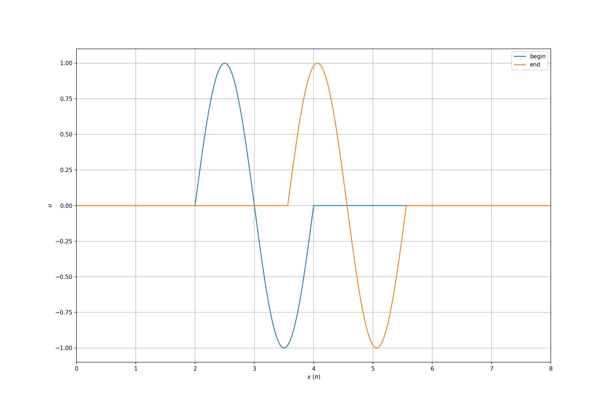
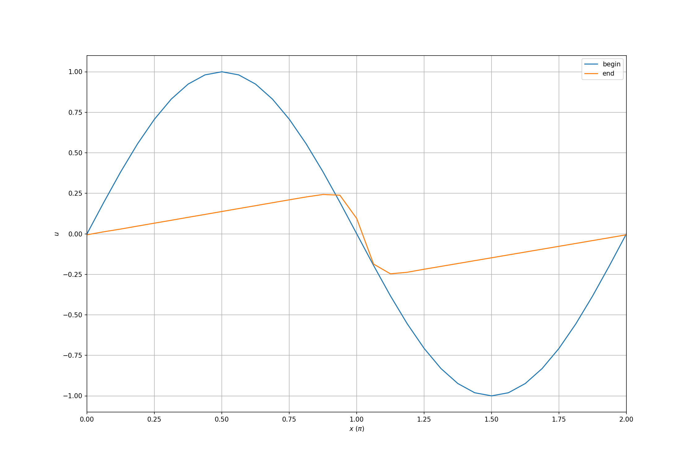
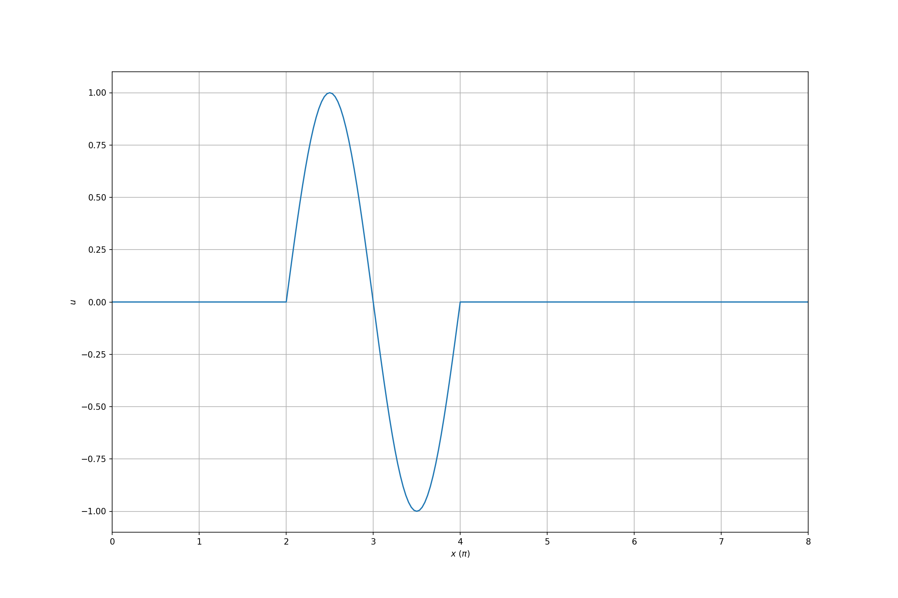

====================
C++ and C for Python
====================

.. contents:: Contents in the chapter
  :local:
  :depth: 1

Expectation from Python
=======================

.. contents:: Contents in the section
  :local:
  :depth: 1

Python is the choice of driving scripts for numerical calculations.  Before
introducing how to connect the low-level C++ and C code to the high-level
Python, I would like to introduce how it looks at the high level.

Linear Wave
+++++++++++

Here is the governing equation of propagating linear waves:

.. math::

  \frac{\partial u}{\partial t} + \frac{\partial u}{\partial x} = 0

Assume a sinusoidal wave is given as the initial condition.  Using the
following code, we will see it propagating from left to right with the phase
velocity of unity.

.. literalinclude:: code/01_linear.py
  :language: python
  :linenos:
  :start-after: # [begin example]
  :end-before: # [end example]

The full example code is in :ref:`01_linear.py <nsd-cpppy-example-linear>`.
The plotted results are:

Inviscid Burgers Equation
+++++++++++++++++++++++++

The second example is a non-linear equation (the inviscid Burgers equation):

.. math::

  \frac{\partial u}{\partial t} + u \frac{\partial u}{\partial x} = 0

The initial condition is still a sinusoidal wave.  But unlike the linear
equation, with the inviscid Burgers equation, the non-linear wave propagates in
a very different way.

.. literalinclude:: code/01_burgers.py
  :language: python
  :linenos:
  :start-after: # [begin example]
  :end-before: # [end example]

The full example code is in :ref:`01_burgers.py <nsd-cpppy-example-burgers>`.
The plotted results are:

pybind11 Build System
=====================

.. contents:: Contents in the section
  :local:
  :depth: 1

`pybind11 <https://pybind11.readthedocs.io/>`_ is a header-only C++ template
library, that allows calling CPython API and provides C++ friendly semantics to
allow Python to call C++ constructs and vise versa.

A header-only library doesn't have anything to be built.  When we say
"building" pybind11, we mean to build the project that uses pybind11.

To build pybind11, we need CPython.  It optionally depends on numpy and eigen.
There are several suggested ways to build.  Here list those I think important:

setuptools
++++++++++

`setuptools <https://setuptools.readthedocs.io/en/latest/>`_ is an enhancement
to Python built-in `distutils
<https://docs.python.org/3/library/distutils.html>`__.  Because pybind11_ is
released on `PyPI <https://pypi.org>`__ as a Python package
(https://pypi.org/project/pybind11/), both setuptools and distutils can get the
header files and use them to build C++ file that use pybind11.

There is `an example for using setuptools to build pybind11
<https://github.com/pybind/python_example/blob/master/setup.py>`__:

.. code-block:: python
  :linenos:

  from setuptools import setup

  # Available at setup time due to pyproject.toml
  from pybind11.setup_helpers import Pybind11Extension, build_ext
  from pybind11 import get_cmake_dir

  import sys

  __version__ = "0.0.1"

  # The main interface is through Pybind11Extension.
  # * You can add cxx_std=11/14/17, and then build_ext can be removed.
  # * You can set include_pybind11=false to add the include directory yourself,
  #   say from a submodule.
  #
  # Note:
  #   Sort input source files if you glob sources to ensure bit-for-bit
  #   reproducible builds (https://github.com/pybind/python_example/pull/53)

  ext_modules = [
      Pybind11Extension("python_example",
          ["src/main.cpp"],
          # Example: passing in the version to the compiled code
          define_macros = [('VERSION_INFO', __version__)],
      ),
  ]

  setup(
      name="python_example",
      version=__version__,
      author="Sylvain Corlay",
      author_email="sylvain.corlay@gmail.com",
      url="https://github.com/pybind/python_example",
      description="A test project using pybind11",
      long_description="",
      ext_modules=ext_modules,
      extras_require={"test": "pytest"},
      # Currently, build_ext only provides an optional "highest supported C++
      # level" feature, but in the future it may provide more features.
      cmdclass={"build_ext": build_ext},
      zip_safe=False,
  )

The full example code is available in :ref:`setup.py <nsd-cpppy-example-setup>`
and :ref:`main.cpp <nsd-cpppy-example-setup-main>`.

cmake with pybind11 in a Sub-Directory
++++++++++++++++++++++++++++++++++++++

When the source tree is put in a sub-directory in your project, as mentioned in
the :ref:`document <pybind11:cmake>`.  you can use `cmake <https://cmake.org>`_
``add_subdirectory`` to include the pybind11_ package:

.. code-block:: cmake

  cmake_minimum_required(VERSION 3.9)
  project(example)

  add_subdirectory(pybind11)
  pybind11_add_module(example example.cpp)

pybind11 provides a cmake command ``pybind11_add_module``.  It sets various
flags to build your C++ code as an extension module.

cmake with Installed pybind11
+++++++++++++++++++++++++++++

If pybind11_ is installed using cmake_ itself, the ``*.cmake`` files that
pybind11 supplies are installed to the specified location.  It is not necessary
to write ``add_subdirectory`` in the ``CMakeLists.txt`` in your project.

Custom Wrapping Layer
=====================

.. contents:: Contents in the section
  :local:
  :depth: 1

Wrapper needs to take care of the differences between the dynamic behaviors in
Python and the staticity in C++.  You can directly call pybind11_ API, but a
better way is to create an additional wrapping layer between the code that uses
pybind11 and your library code.  It allows to insert additional code in a
systematic way.  Since it is not easy to see the point in a small example, I
pull in the code for `a bigger project "turgon"
<https://github.com/yungyuc/turgon>`__ for demonstration.

Intermediate Class Template
+++++++++++++++++++++++++++

Here is one way to implement the additional wrapping layer:

.. code-block:: cpp
  :name: nsd-cpppy-wrap-base
  :caption: The base class template for custom wrappers.
  :linenos:

  /**
   * Helper template for pybind11 class wrappers.
   */
  template
  <
      class Wrapper
    , class Wrapped
      /* The default holder type is a unique pointer. */
    , class Holder = std::unique_ptr<Wrapped>
    , class WrappedBase = Wrapped
  >
  class
  SPACETIME_PYTHON_WRAPPER_VISIBILITY
  WrapBase
  {

  public:

      // These aliases will be used in derived classes.
      using wrapper_type = Wrapper;
      using wrapped_type = Wrapped;
      using wrapped_base_type = WrappedBase;
      using holder_type = Holder;
      using base_type = WrapBase
      <
          wrapper_type
        , wrapped_type
        , holder_type
        , wrapped_base_type
      >;

      // This alias is to help the pybind11 code in this template.
      using class_ = typename std::conditional
      <
          std::is_same< Wrapped, WrappedBase >::value
        , pybind11::class_< wrapped_type, holder_type >
        , pybind11::class_< wrapped_type, wrapped_base_type, holder_type >
      >::type;

      static wrapper_type & commit
      (
          pybind11::module * mod
        , const char * pyname
        , const char * clsdoc
      )
      {
          static wrapper_type derived(mod, pyname, clsdoc);
          return derived;
      }

      WrapBase() = delete;
      WrapBase(WrapBase const & ) = default;
      WrapBase(WrapBase       &&) = delete;
      WrapBase & operator=(WrapBase const & ) = default;
      WrapBase & operator=(WrapBase       &&) = delete;
      ~WrapBase() = default;

  // Make a macro for the wrapping functions by using perfect forwarding.
  #define DECL_ST_PYBIND_CLASS_METHOD(METHOD) \
      template< class... Args > \
      wrapper_type & METHOD(Args&&... args) { \
          m_cls.METHOD(std::forward<Args>(args)...); \
          return *static_cast<wrapper_type*>(this); \
      }

      DECL_ST_PYBIND_CLASS_METHOD(def)
      DECL_ST_PYBIND_CLASS_METHOD(def_readwrite)
      DECL_ST_PYBIND_CLASS_METHOD(def_property)
      DECL_ST_PYBIND_CLASS_METHOD(def_property_readonly)
      DECL_ST_PYBIND_CLASS_METHOD(def_property_readonly_static)

  // Delete the macro after it is not used anymore.
  #undef DECL_ST_PYBIND_CLASS_METHOD

  protected:

      WrapBase(pybind11::module * mod, const char * pyname, const char * clsdoc)
        : m_cls(*mod, pyname, clsdoc)
      {}

  private:

      // This "class_" is the alias we made above, not directly the pybind11::class_.
      class_ m_cls;

  }; /* end class WrapBase */

Wrappers for Data Classes
+++++++++++++++++++++++++

The "turgon" code is built upon several data classes.  The most basic one is
the grid definition class :cpp:class:`!Grid`.  Its wrapper is the simplest:

.. code-block:: cpp
  :name: nsd-cpppy-wrap-grid
  :caption: The custom wrapper class for the class :cpp:class:`!Grid`.
  :linenos:
  :emphasize-lines: 45

  class
  SPACETIME_PYTHON_WRAPPER_VISIBILITY
  WrapGrid
    : public WrapBase< WrapGrid, Grid, std::shared_ptr<Grid> >
  {

      // Need this friendship to access the protected constructor in the base class.
      friend base_type;

      WrapGrid(pybind11::module * mod, const char * pyname, const char * clsdoc)
        : base_type(mod, pyname, clsdoc)
      {
          namespace py = pybind11;
          (*this)
              .def
              (
                  py::init
                  (
                      
                      {
                      return Grid::construct(xmin, xmax, nelm);
                      }
                  ),
                  py::arg("xmin"), py::arg("xmax"), py::arg("nelm")
              )
              .def
              (
                  py::init
                  (
                      
                      {
                          return Grid::construct(xloc);
                      }
                  ),
                  py::arg("xloc")
              )
              .def("__str__", &detail::to_str<wrapped_type>)
              .def_property_readonly("xmin", &wrapped_type::xmin)
              .def_property_readonly("xmax", &wrapped_type::xmax)
              .def_property_readonly("ncelm", &wrapped_type::ncelm)
              .def_property_readonly("nselm", &wrapped_type::nselm)
              .def_property_readonly
              (
                  "xcoord",
                  static_cast<wrapped_type::array_type & (wrapped_type::*)()>
                  (&wrapped_type::xcoord)
              )
              .def_property_readonly_static
              (
                  "BOUND_COUNT"
                , { return Grid::BOUND_COUNT; }
              )
          ;
      }

  }; /* end class WrapGrid */

When there are overloads in the C++ code, sometimes we may need to specify the
function signature using ``static_cast`` like that in (highlighted) line 45.
An alternate way is to use a lambda expression.

A slightly more complex wrapper is for the class :cpp:class:`!Field`.  In
(highlighted) line 19, a :cpp:class:`!Grid` is returned from the wrapper of
:cpp:class:`!Field`.

.. code-block:: cpp
  :name: nsd-cpppy-wrap-field
  :caption: The custom wrapper class for the class :cpp:class:`!Field`.
  :linenos:
  :emphasize-lines: 19

  class
  SPACETIME_PYTHON_WRAPPER_VISIBILITY
  WrapField
    : public WrapBase< WrapField, Field, std::shared_ptr<Field> >
  {

      // Need this friendship to access the protected constructor in the base class.
      friend base_type;

      WrapField(pybind11::module * mod, const char * pyname, const char * clsdoc)
        : base_type(mod, pyname, clsdoc)
      {
          namespace py = pybind11;
          (*this)
              .def("__str__", &detail::to_str<wrapped_type>)
              .def_property_readonly
              (
                  "grid"
                , { return self.grid().shared_from_this(); }
              )
              .def_property_readonly("nvar", &wrapped_type::nvar)
              .def_property
              (
                  "time_increment"
                , &wrapped_type::time_increment
                , &wrapped_type::set_time_increment
               )
              .def_property_readonly("dt", &wrapped_type::dt)
              .def_property_readonly("hdt", &wrapped_type::hdt)
              .def_property_readonly("qdt", &wrapped_type::qdt)
              .def
              (
                  "celm",
                  static_cast<Celm (wrapped_type::*)(sindex_type, bool)>
                  (&wrapped_type::celm_at<Celm>)
                , py::arg("ielm"), py::arg("odd_plane")=false
              )
              .def
              (
                  "selm",
                  static_cast<Selm (wrapped_type::*)(sindex_type, bool)>
                  (&wrapped_type::selm_at<Selm>)
                , py::arg("ielm"), py::arg("odd_plane")=false
              )
          ;
      }

  }; /* end class WrapField */

Hierarchical Wrapper
++++++++++++++++++++

The "turgon" code defines a hierarchy of classes and wrapping them does not
only require :cpp:class:`!WrapBase`, but also other class templates between
:cpp:class:`!WrapBase` and the concrete wrappers.

For example, the following :ref:`Solver <nsd-cpppy-wrap-solver>` and uses
:cpp:class:`!WrapSolverBase` (which is not shown in the notes).  Because
:cpp:class:`!WrapSolver` does not directly inherit from :ref:`WrapBase
<nsd-cpppy-wrap-base>`, it needs more aliases than the previous use cases.

.. code-block:: cpp
  :name: nsd-cpppy-wrap-solver
  :caption: The custom wrapper class for the class :cpp:class:`!Solver`.
  :linenos:
  :emphasize-lines: 7-14

  class
  SPACETIME_PYTHON_WRAPPER_VISIBILITY
  WrapSolver
    : public WrapSolverBase< WrapSolver, Solver >
  {

      // The base class becomes more complex.
      using base_type = WrapSolverBase< WrapSolver, Solver >;
      using wrapper_type = typename base_type::wrapper_type;
      using wrapped_type = typename base_type::wrapped_type;

      // Need these friendships to access the protected constructor in the base class.
      friend base_type;
      friend base_type::base_type;

      WrapSolver(pybind11::module * mod, const char * pyname, const char * clsdoc)
        : base_type(mod, pyname, clsdoc)
      {
          namespace py = pybind11;
          (*this)
              .def
              (
                  py::init
                  (
                      static_cast
                      <
                          std::shared_ptr<wrapped_type> (*)
                          (
                              std::shared_ptr<Grid> const &
                            , typename wrapped_type::value_type
                            , size_t
                          )
                      >
                      (&wrapped_type::construct)
                  )
                , py::arg("grid"), py::arg("time_increment"), py::arg("nvar")
              )
          ;
      }

  }; /* end class WrapSolver */

Wrappers for Element Classes
++++++++++++++++++++++++++++

The following :ref:`WrapCelm <nsd-cpppy-wrap-celm>` and :ref:`WrapSelm
<nsd-cpppy-wrap-selm>` are wrapper classes for elements in the "turgon" code.
They use :cpp:class:`!WrapCelmBase` and :cpp:class:`!WrapSelmBase` (which are
not shown in the notes), respectively.

The element wrappers are not very different from data wrappers, but we should
keep in mind that there may be many more element objects than data objects in
the system.  The element objects are implemented as handles and their data are
stored in the data objects.

.. code-block:: cpp
  :name: nsd-cpppy-wrap-celm
  :caption: The custom wrapper class for the class :cpp:class:`!Celm`.
  :linenos:

  class
  SPACETIME_PYTHON_WRAPPER_VISIBILITY
  WrapCelm
    : public WrapCelmBase< WrapCelm, Celm >
  {

      // The base class becomes more complex.
      using base_type = WrapCelmBase< WrapCelm, Celm >;
      // Need this friendship to access the protected constructor in the base class.
      friend base_type::base_type::base_type;

      WrapCelm(pybind11::module * mod, const char * pyname, const char * clsdoc)
        : base_type(mod, pyname, clsdoc)
      {
          namespace py = pybind11;
          (*this)
              ... wrapper code ...
          ;
      }

  }; /* end class WrapCelm */

.. code-block:: cpp
  :name: nsd-cpppy-wrap-selm
  :caption: The custom wrapper class for the class and :cpp:class:`!Selm`.
  :linenos:

  class
  SPACETIME_PYTHON_WRAPPER_VISIBILITY
  WrapSelm
    : public WrapSelmBase< WrapSelm, Selm >
  {

      // The base class becomes more complex.
      using base_type = WrapSelmBase< WrapSelm, Selm >;
      // Need this friendship to access the protected constructor in the base class.
      friend base_type::base_type::base_type;

      WrapSelm(pybind11::module * mod, const char * pyname, const char * clsdoc)
        : base_type(mod, pyname, clsdoc)
      {
          namespace py = pybind11;
          (*this)
              ... wrapper code ...
          ;
      }

  }; /* end class WrapCelm */

Define the Extension Module
+++++++++++++++++++++++++++

So far, we have used :ref:`WrapperBase <nsd-cpppy-wrap-base>` to save some
duplicated code, but more can be saved.  Another important use of it is to
reduce the ``.cpp`` file used for the Python extension.  The function template
:cpp:func:`!add_solver` (which is not shown in the notes) takes advantage of
the commonality of the wrapper classes and significantly shortens the code.

.. code-block:: cpp
  :name: nsd-cpppy-wrap-module
  :caption: C++ code to define extension module.
  :linenos:
  :emphasize-lines: 10, 15-17, 22-24

  #include "spacetime/python.hpp" // must be first
  #include "spacetime.hpp"

  PYBIND11_MODULE(_libst, mod)
  {
      namespace spy = spacetime::python;
      spy::ModuleInitializer::get_instance()
          .add_solver
          <
              spy::WrapSolver, spy::WrapCelm, spy::WrapSelm
          >
          (&mod, "", "no equation")
          .add_solver
          <
              spy::WrapLinearScalarSolver
            , spy::WrapLinearScalarCelm
            , spy::WrapLinearScalarSelm
          >
          (&mod, "LinearScalar", "a linear scalar equation")
          .add_solver
          <
              spy::WrapInviscidBurgersSolver
            , spy::WrapInviscidBurgersCelm
            , spy::WrapInviscidBurgersSelm
          >
          (&mod, "InviscidBurgers", "the inviscid Burgers equation")
          .initialize(&mod)
      ;
  }

pybind11 Wrapping API
=====================

.. contents:: Contents in the section
  :local:
  :depth: 1

pybind11_ provides API to wrap between C++ and Python.

Function and Property
+++++++++++++++++++++

Let's use the :cpp:class:`!Grid` class as an example to demonstrate how to
expose functions and properties.  We have a constructor:

.. code-block:: cpp

  .def
  (
      py::init
      (
          
          {
              return Grid::construct(xmin, xmax, nelm);
          }
      )
    , py::arg("xmin"), py::arg("xmax"), py::arg("nelm")
  )

It allows creating the :cpp:class:`!Grid` object from Python:

.. code-block:: pycon

  >>> grid = libst.Grid(0, 8, 4*64)

By wrapping for the special special function :py:func:`!__str__`:

.. code-block:: cpp

  .def("__str__", &detail::to_str<wrapped_type>)

It allows to support :py:class:`python:str` for :cpp:class:`!Grid`:

.. code-block:: pycon

  >>> print('call str(Grid):', str(grid))
  call str(Grid): Grid(xmin=0, xmax=8, ncelm=256)
  >>> print('directly call Grid.__str__():', grid.__str__())
  directly call Grid.__str__(): Grid(xmin=0, xmax=8, ncelm=256)

Define properties.  pybind11_ supports both instance properties and static
properties:

.. code-block:: cpp

  .def_property_readonly("xmin", &wrapped_type::xmin)
  .def_property_readonly("xmax", &wrapped_type::xmax)
  .def_property_readonly_static
  (
      "BOUND_COUNT"
    , { return Grid::BOUND_COUNT; }
  )

Check the properties from the instance:

.. code-block:: pycon

  >>> print(grid.BOUND_COUNT)
  2
  >>> print(grid.xmin)
  0.0
  >>> print(grid.xmax)
  8.0

Check the properties from the class:

.. code-block:: pycon

  >>> print(libst.Grid.BOUND_COUNT)
  2
  >>> print(libst.Grid.xmin)
  <property object at 0x110e9ffb0>
  >>> print(libst.Grid.xmax)
  <property object at 0x110ea60b0>

Define a pure Python class that can be compared with the pybind11
wrapped class:

.. code-block:: python

  class PythonGrid:
      BOUND_COUNT = 2
      @property
      def xmin(self):
          return 0
      @property
      def xmax(self):
          return 8

Compare the execution results with that of the C++ :cpp:class:`!Grid`.  They
are identical:

.. code-block:: pycon

  >>> print(PythonGrid.BOUND_COUNT)
  2
  >>> print(PythonGrid.xmin)
  <property object at 0x1112daad0>
  >>> print(PythonGrid.xmax)
  <property object at 0x1112dab30>

Here is a list of property-related API:

* ``def_property_readonly`` and ``def_property_readonly_static`` for read-only
  properties with C++ accessors.
* ``def_property`` and ``def_property_static`` for read/write properties with
  C++ accessors.
* ``def_readonly`` and ``def_readonly_static`` for read-only access to C++ data
  members.
* ``def_readwrite`` and ``def_readwrite_static`` for read/write access to C++
  data members.

See the pybind11 document of :ref:`pybind11:properties` for more information.

Named and Keyword Arguments
+++++++++++++++++++++++++++

pybind11 allows named arguments.  In the above example, we already take the
advantage for wrapping the constructor of :cpp:class:`!Grid``:

.. code-block:: cpp

  .def
  (
      py::init
      (
          
          {
              return Grid::construct(xmin, xmax, nelm);
          }
      )
    , py::arg("xmin"), py::arg("xmax"), py::arg("nelm")
  )

It has been shown how the named arguments are used in Python:

.. code-block:: pycon

  >>> grid = libst.Grid(xmin=0, xmax=8, nelm=4*64)

See the pybind11 document of :ref:`pybind11:keyword_args` for more information.

:cpp:class:`!pybind11::arg` also allows default value to the arguments (keyword
arguments).  The wrapper code of the class :cpp:class:`!Solver` has an example:

.. code-block:: cpp

  .def
  (
      "selms"
    , 
      { return elm_iter_type(self.shared_from_this(), odd_plane, 0, true); }
    , py::arg("odd_plane")=false
  )

Before seeing how it is used, we run some setup code:

.. code-block:: python

  grid = libst.Grid(0, 4*2*np.pi, 4*64)
  cfl = 1
  dx = (grid.xmax - grid.xmin) / grid.ncelm
  dt = dx * cfl
  svr = libst.LinearScalarSolver(grid=grid, time_increment=dt)

The argument *odd_plane* can be accepted in multiple forms.  This uses the default value:

.. code-block:: pycon

  >>> print(svr.selms())
  SolverElementIterator(selm, on_even_plane, current=0, nelem=257)

Pass the argument as positional:

.. code-block:: pycon

  >>> print(svr.selms(False))
  SolverElementIterator(selm, on_even_plane, current=0, nelem=257)
  >>> print(svr.selms(True))
  SolverElementIterator(selm, on_odd_plane, current=0, nelem=256)

Pass the argument as keyword:

.. code-block:: pycon

  >>> print(svr.selms(odd_plane=False))
  SolverElementIterator(selm, on_even_plane, current=0, nelem=257)
  >>> print(svr.selms(odd_plane=True))
  SolverElementIterator(selm, on_odd_plane, current=0, nelem=256)

See the pybind11 document of :ref:`pybind11:default_args` for more information.

What Happens in Python Stays in Python (or pybind11)
++++++++++++++++++++++++++++++++++++++++++++++++++++

When wrapping from C++ to Python, there are constructs only available in the
scripting language but not the low-level implementation.  When it happens,
write the adapting code in the pybind11 layer and do not pollute the low-level
implementation.

One example is :ref:`the Python iterator protocol <python:typeiter>`.  To adapt
the C++ iterator to Python, an adapting class is created in the Python wrapping
layer, along with other code that calls pybind11 API, and above the low-level
C++ library in "turgon".

.. code-block:: cpp
  :linenos:
  :emphasize-lines: 29-30, 40-41

  // The whole class is defined along with other code that calls pybind11 API
  // and includes Python.h.
  template< typename ST >
  class SolverElementIterator
  {

  public:

      using solver_type = ST;

      SolverElementIterator() = delete;
      SolverElementIterator
      (
          std::shared_ptr<ST> sol
        , bool odd_plane
        , size_t starting
        , bool selm
      )
        : m_solver(std::move(sol))
        , m_odd_plane(odd_plane)
        , m_current(starting)
        , m_selm(selm)
      {}

      typename ST::celm_type next_celm()
      {
          size_t ncelm = m_solver->grid().ncelm();
          if (m_odd_plane) { --ncelm; }
          // Use pybind11 API:
          if (m_current >= ncelm) { throw pybind11::stop_iteration(); }
          typename ST::celm_type ret = m_solver->celm(m_current, m_odd_plane);
          ++m_current;
          return ret;
      }

      typename ST::selm_type next_selm()
      {
          size_t nselm = m_solver->grid().nselm();
          if (m_odd_plane) { --nselm; }
          // Use pybind11 API:
          if (m_current >= nselm) { throw pybind11::stop_iteration(); }
          typename ST::selm_type ret = m_solver->selm(m_current, m_odd_plane);
          ++m_current;
          return ret;
      }

      bool is_selm() const { return m_selm; }
      bool on_odd_plane() const { return m_odd_plane; }
      size_t current() const { return m_current; }
      size_t nelem() const
      {
          size_t ret = is_selm() ? m_solver->grid().nselm() : m_solver->grid().ncelm();
          if (m_odd_plane) { --ret; }
          return ret;
      }

  private:

      std::shared_ptr<solver_type> m_solver;
      bool m_odd_plane;
      size_t m_current = 0;
      bool m_selm = false;

  }; /* end class SolverElementIterator */

The wrapping code is:

.. code-block:: cpp
  :linenos:
  :emphasize-lines: 1

  using elm_iter_type = SolverElementIterator<wrapped_type>;
  std::string elm_pyname = std::string(pyname) + "ElementIterator";
  pybind11::class_< elm_iter_type >(*mod, elm_pyname.c_str())
      .def("__str__", &detail::to_str<elm_iter_type>)
      .def("__iter__", { return self; })
      .def(
          "__next__"
        , 
          {
              py::object ret;
              if (self.is_selm()) { ret = py::cast(self.next_selm()); }
              else                { ret = py::cast(self.next_celm()); }
              return ret;
          }
      )
  ;

Here we use a concrete solver of linear wave (governing equation is :math:`u_t
+ u_x = 0`) to demonstrate how it works in Python:

.. literalinclude:: code/04_iter.py
  :language: python
  :linenos:
  :start-after: # [begin example]
  :end-before: # [end example]

The code shows the initial condition of the linear wave:

The full example code is in :ref:`04_iter.py <nsd-cpppy-example-iter>` (which
is the part of :ref:`01_linear.py <nsd-cpppy-example-linear>` that skips the
final time marching).

pybind11 Operating API
======================

.. contents:: Contents in the section
  :local:
  :depth: 1

pybind11_ does not only provide API to wrap between C++ and Python, but also
C++ API for operating the Python interpreter and the some Python containers:
:py:class:`python:tuple`, :py:class:`python:list`, and :py:class:`python:dict`.
See the document of :doc:`pybind11:advanced/pycpp/object` and the unit tests
for more information.

Python Objects in C++
+++++++++++++++++++++

pybind11_ provides C++ API for manipulating Python object (the C struct
:c:type:`python:PyObject`) using the generic :doc:`object protocol
<python:c-api/object>`, so that we don't need to dig into the Python C API and
worry about the reference counting by hand.

The first example is to create a :ref:`None object <python:noneobject>` from
C++:

.. code-block:: cpp

  #include "pybind11/pybind11.h"

  PYBIND11_MODULE(code_none, m)
  {
      namespace py = pybind11;

      m
          .def
          (
              "create_none",  { return py::none(); }
          )
      ;
  }

The results:

.. code-block:: pycon

  >>> print(type(create_none()))
  <class 'NoneType'>
  >>> assert None is create_none()
  >>> print(create_none())
  None

:cpp:class:`pybind11::object <pybind11:object>` is the C++ counterpart of the C
struct :c:type:`python:PyObject`, and it does reference counting for us.  The
following example shows how to use :cpp:class:`pybind11::object
<pybind11:object>` to hold a :ref:`None <python:noneobject>` object:

.. code-block:: cpp

  #include "pybind11/pybind11.h"

  PYBIND11_MODULE(code_object, m)
  {
      namespace py = pybind11;

      m
          .def
          (
              "return_none"
            , 
              {
                  py::object ret = py::none();
                  return ret;
              }
          )
      ;
  }

The result:

.. code-block:: pycon

  >>> print(return_none, return_none())
  <built-in method return_none of PyCapsule object at 0x1111b4300> None

pybind11 allows to use :cpp:func:`pybind11::object::attr()
<pybind11:object_api::attr>` to assign attribute to a Python object:

.. code-block:: cpp

  #include "pybind11/pybind11.h"

  PYBIND11_MODULE(code_attr, m)
  {
      namespace py = pybind11;

      m.attr("string_name") = "string_content";
  }

The result:

.. code-block:: pycon

  >>> print(type(string_name), string_name)
  <class 'str'> string_content

Import Module Using pybind11
++++++++++++++++++++++++++++

pybind11 provides a helper, :cpp:func:`pybind::module::import()
<pybind11:module_::import>`, to import Python module and access attributes of
every Python object, including a Python module:

.. code-block:: cpp

  #include "pybind11/pybind11.h"

  PYBIND11_MODULE(code1, m)
  {
      namespace py = pybind11;

      m
          .def
          (
              "return_numpy_version"
            , 
              {
                  py::object numpy = py::module::import("numpy");
                  return numpy.attr("__version__");
              }
          )
      ;

      m.attr("alias_to_return_numpy_version") = m.attr("return_numpy_version");
  }

The results in the Python side are:

.. code-block:: pycon

  >>> print(return_numpy_version())
  1.17.0.dev0+3c3ba10
  >>> import numpy as np
  >>> print(np.__version__)
  1.17.0.dev0+3c3ba10
  >>> assert np.__version__ is return_numpy_version()
  >>> print(return_numpy_version)
  <built-in method return_numpy_version of PyCapsule object at 0x1111b4060>
  >>> print(alias_to_return_numpy_version)
  <built-in method return_numpy_version of PyCapsule object at 0x1111b4060>

pybind11 for tuple
++++++++++++++++++

To support Python :py:class:`python:tuple`, pybind11 provides the C++ class
:cpp:class:`pybind11::tuple <pybind11:tuple>`.  Since tuple is immutable, its
creation should use :cpp:func:`!pybind11::make_tuple()`:

.. code-block:: cpp

  #include "pybind11/pybind11.h"

  PYBIND11_MODULE(code_tuple, m)
  {
      namespace py = pybind11;

      py::tuple my_tuple = py::make_tuple("string_data_in_tuple", 10, 3.1415926);

      m.attr("my_tuple") = my_tuple;
  }

The results in the Python side are:

.. code-block:: pycon

  >>> print(type(my_tuple), my_tuple)
  <class 'tuple'> ('string_data_in_tuple', 10, 3.1415926)

pybind11 for list
+++++++++++++++++

To support Python :py:class:`python:list`, pybind11 provides the C++ class
:cpp:class:`pybind11::list <pybind11:list>`.  It is mutable and the function
:cpp:func:`!pybind11::list::append` can be used for populating the container in
the C++ side:

.. code-block:: cpp

  #include "pybind11/pybind11.h"

  PYBIND11_MODULE(code2, m)
  {
      namespace py = pybind11;

      py::list my_list = py::list();

      my_list.append("string_data_in_list");
      my_list.append(11);
      my_list.append(2.71828);

      py::list my_list2 = py::make_tuple("string_data_in_list2", 12);

      m.attr("my_list") = my_list;
      m.attr("my_list2") = my_list2;
  }

The results in the Python side are:

.. code-block:: pycon

  >>> print(type(my_list), my_list)
  <class 'list'> ['string_data_in_list', 11, 2.71828]

  >>> print(type(my_list2), my_list2)
  <class 'list'> ['string_data_in_list2', 12]

pybind11 for dict
+++++++++++++++++

To support Python :py:class:`python:dict`, pybind11 provides the C++ class
:cpp:class:`pybind11::dict <pybind11:dict>`.  The example in the C++ side:

.. code-block:: cpp

  #include "pybind11/pybind11.h"

  PYBIND11_MODULE(code2, m)
  {
      namespace py = pybind11;

      py::dict my_dict;

      my_dict["key_string"] = "string_data_in_dict";
      my_dict["key_int"] = 13;
      my_dict["key_real"] = 1.414;

      m.attr("my_dict") = my_dict;
  }

The results in the Python side are:

.. code-block:: pycon

  >>> print(type(my_dict), my_dict)
  <class 'dict'> {'key_string': 'string_data_in_dict', 'key_int': 13, 'key_real': 1.414}

CPython API with pybind11
=========================

.. contents:: Contents in the section
  :local:
  :depth: 1

It is possible to use Python C API along with pybind11_ and we will see how to
do it.  Please keep in mind that the examples here omit a lot of error checking
code that is necessary for a system to run correctly.  When you need to use the
C API, consult the manual: :doc:`python:c-api/index`.

When importing ``pybind11/pybind11.h``, we don't need to import ``Python.h``,
becuase the former does it for us.  But please note that
``pybind11/pybind11.h`` or ``Python.h`` should be included before every other
inclusion.

.. code-block:: cpp

  #include "pybind11/pybind11.h"
  #include "Python.h" // Unnecessary

  using namespace pybind11;

  PYBIND11_MODULE(ex_long, m)
  {
      PyObject * v = PyLong_FromLong(2000000);
      m.attr("integer_value") = v;
      Py_DECREF(v);
  }

.. code-block:: pycon

  >>> print(type(integer_value), integer_value)
  <class 'int'> 2000000

Reference Counting
++++++++++++++++++

:c:type:`python:PyObject` reference counting:

.. code-block:: cpp
  :linenos:

  #include "pybind11/pybind11.h"

  using namespace pybind11;

  static PyObject * s;

  PYBIND11_MODULE(ex_str, m)
  {
      s = PyUnicode_FromString("string_from_c");
      m.attr("string_value") = s;
      Py_DECREF(s);
      m
          .def
          (
              "show_ref_count_with_handle"
            , 
              {
                  return Py_REFCNT(h.ptr());
              }
          )
          .def
          (
              "show_ref_count_with_object"
            , 
              {
                  return Py_REFCNT(o.ptr());
              }
          )
          .def
          (
              "show_string_value_ref_count"
            , [&]()
              {
                  return Py_REFCNT(s);
              }
          )
      ;
  }

.. code-block:: python
  :linenos:

  def check_string_value():
      print(type(string_value), string_value)
      print('before aliasing')
      print(show_ref_count_with_object(string_value), 'refcnt by object')
      print(show_ref_count_with_handle(string_value), 'refcnt by handle')
      print(sys.getrefcount(string_value), 'refcnt by sys')
      print(show_string_value_ref_count(), 'refcnt from c++')
      string_value_aliasing = string_value
      print('after aliasing')
      print(show_ref_count_with_object(string_value), 'refcnt by object')
      print(show_ref_count_with_handle(string_value), 'refcnt by handle')
      print(sys.getrefcount(string_value), 'refcnt by sys')
      print(show_string_value_ref_count(), 'refcnt from c++')

.. code-block:: pycon

  >>> check_string_value()
  <class 'str'> string_from_c
  before aliasing
  7 refcnt by object
  6 refcnt by handle
  5 refcnt by sys
  4 refcnt from c++
  after aliasing
  8 refcnt by object
  7 refcnt by handle
  6 refcnt by sys
  5 refcnt from c++

pybind11 offers two low-level shorthands for reference counting:
``handle::inc_ref()`` and ``handle::dec_ref()``.  If we don't want to go so
low-level, it provides ``reinterpret_borrow`` and ``reinterpret_steal``
function templates.

Cached Value
++++++++++++

Python caches small (-5 to 256) integers (see `the code
<https://github.com/python/cpython/blob/4830f581af57dd305c02c1fd72299ecb5b090eca/Objects/longobject.c#L40>`__).
Don't get surprised when you see a large reference count for some of them
integers:

.. code-block:: pycon

  >>> print('ref counts of 0:', sys.getrefcount(0))
  ref counts of 0: 10198
  >>> print('ref counts of 257:', sys.getrefcount(257))
  ref counts of 257: 3

Real number doesn't have that cache:

.. code-block:: pycon

  >>> print(sys.getrefcount(0.0))
  3

Python interns strings consisting of alphanumerical and underscore characters.

.. code-block:: pycon

  >>> print('' is '')
  True
  >>> print(sys.getrefcount(''))
  5552

.. code-block:: python

  def check_string_intern():
      s1 = 'numerical'
      print(sys.getrefcount('numerical'))
      print(s1 is 'numerical')
      s2 = 'num' + 'erical'
      print(s1 is s2)
      print(sys.getrefcount('numerical'))

.. code-block:: pycon

  >>> check_string_intern()
  4
  True
  True
  5

Attribute Access
++++++++++++++++

:doc:`The Python object protocol <python:c-api/object>` defines a set of API
for accessing object attributes.  Here is a simple example that sets and gets
an attribute of an object using the API:

.. code-block:: cpp

  int PyObject_SetAttr(PyObject *o, PyObject *attr_name, PyObject *v);
  PyObject* PyObject_GetAttr(PyObject *o, PyObject *attr_name);

.. code-block:: cpp
  :linenos:

  #include "pybind11/pybind11.h"

  using namespace pybind11;

  void attach_attr(PyObject * o, PyObject * name, PyObject * attr)
  {
      /*int ret =*/
      PyObject_SetAttr(o, name, attr);
  }

  PyObject * retrieve_attr(PyObject * o, PyObject * name)
  {
      PyObject * ret = PyObject_GetAttr(o, name);
      return ret;
  }

  PYBIND11_MODULE(ex_attr, m)
  {
      m
          .def
          (
              "attach_attr"
            , 
              {
                  attach_attr(o.ptr(), name.ptr(), attr.ptr());
              }
          )
          .def
          (
              "retrieve_attr"
            , 
              {
                  handle(retrieve_attr(o.ptr(), name.ptr()));
              }
          )
      ;
  }

.. code-block:: pycon
  :linenos:

  >>> class Cls():
  >>>     pass
  >>> obj = Cls()
  >>> val = 'attached value'
  >>> print(sys.getrefcount(val))
  3
  >>>
  >>> attach_attr(obj, 'name', val)
  >>> print(sys.getrefcount(val))
  4
  >>>
  >>> print(obj.name is val)
  True
  >>> print(sys.getrefcount(val))
  4
  >>>
  >>> val2 = retrieve_attr(obj, 'name')
  >>> print(sys.getrefcount(val))
  5

There are shorthand versions of the API that takes C string for the attribute
name:

.. code-block:: cpp
  :linenos:

  #include "pybind11/pybind11.h"

  #include <string>

  using namespace pybind11;

  void attach_attr(PyObject * o, char const * name, PyObject * attr)
  {
      /*int ret =*/
      PyObject_SetAttrString(o, name, attr);
  }

  PyObject * retrieve_attr(PyObject * o, char const * name)
  {
      PyObject * ret = PyObject_GetAttrString(o, name);
      return ret;
  }

  PYBIND11_MODULE(ex_attr_by_string, m)
  {
      m
          .def
          (
              "attach_attr_by_string"
            , 
              {
                  std::string name_str = cast<std::string>(name);
                  attach_attr(o.ptr(), name_str.c_str(), attr.ptr());
              }
          )
          .def
          (
              "retrieve_attr_by_string"
            , 
              {
                  std::string name_str = cast<std::string>(name);
                  handle(retrieve_attr(o.ptr(), name_str.c_str()));
              }
          )
      ;
  }

.. code-block:: pycon
  :linenos:

  >>> class Cls():
  >>>     pass
  >>> obj = Cls()
  >>> val = 'attached value'
  >>> print(sys.getrefcount(val))
  3
  >>>
  >>> attach_attr_by_string(obj, 'name', val)
  >>> print(sys.getrefcount(val))
  4
  >>>
  >>> print(obj.name is val)
  True
  >>> print(sys.getrefcount(val))
  4
  >>>
  >>> val2 = retrieve_attr_by_string(obj, 'name')
  >>> print(sys.getrefcount(val))
  5

See also the documentation of :doc:`python:c-api/object`.

Function Call
+++++++++++++

This section shows how to make Python function call from C.

.. code-block:: cpp
  :linenos:

  #include "pybind11/pybind11.h"

  #include <string>

  using namespace pybind11;

  PyObject * function_call(PyObject * callable, PyObject * args, PyObject * kw)
  {
      PyObject * ret = PyObject_Call(callable, args, kw);
      return ret;
  }

  PYBIND11_MODULE(ex_call, m)
  {
      m
          .def
          (
              "function_call"
            , 
              {
                  return handle(function_call(o.ptr(), t.ptr(), kw.ptr()));
              }
          )
      ;
  }

.. code-block:: pycon
  :linenos:

  >>> def my_func(arg1, kw1='default'):
  >>>     return 'results: {}, {}'.format(arg1, kw1)
  >>>
  >>> print('(direct call)  ', my_func('first argument'))
  (direct call)   results: first argument, default
  >>> print('(function_call)', function_call(my_func, ('first argument',), {}))
  (function_call) results: first argument, default
  >>>
  >>> print('(direct call)  ', my_func('first argument', kw1='non default'))
  (direct call)   results: first argument, non default
  >>> print('(function_call)', function_call(my_func, ('first argument',), {'kw1': 'non default'}))
  (function_call) results: first argument, non default

See the documentation of :doc:`python:c-api/object` for other variants of the API.

Python C API for tuple
++++++++++++++++++++++

:py:class:`python:tuple`:

.. code-block:: cpp
  :linenos:

  #include "pybind11/pybind11.h"

  #include <string>

  using namespace pybind11;

  PyObject * reverse_tuple(PyObject * tup)
  {
      PyObject * ret = PyTuple_New(PyTuple_Size(tup));

      for (Py_ssize_t i = 0 ; i < PyTuple_Size(tup) ; ++i)
      {
          PyObject * item = PyTuple_GetItem(tup, i);
          Py_INCREF(item);
          PyTuple_SetItem(ret, i, item); // This only works when 1 == Py_REFCNT(ret)
      }

      return ret;
  }

  PYBIND11_MODULE(ex_tuple, m)
  {
      m
          .def
          (
              "reverse_tuple"
            , 
              {
                  return handle(reverse_tuple(t.ptr()));
              }
          )
      ;
  }

.. code-block:: pycon

  >>> tv0 = "value0"
  >>> tv1 = object()
  >>> tup = (tv0, tv1)
  >>> print(sys.getrefcount(tv1))
  3
  >>> rtup = reverse_tuple(tup)
  >>> print(sys.getrefcount(tv1))
  4

See :ref:`the C API documentation for the tuple protocol <python:tupleobjects>`
and the `code implementing
<https://github.com/python/cpython/blob/v3.8.0/Objects/tupleobject.c#L167>`__
:c:func:`python:PyTuple_SetItem`.

Python C API for dict
+++++++++++++++++++++

Python C API for :py:class:`python:dict`:

.. code-block:: cpp
  :linenos:

  #include "pybind11/pybind11.h"

  #include <string>

  using namespace pybind11;

  PyObject * make_dict()
  {
      PyObject * ret = PyDict_New();
      return ret;
  }

  void add_dict_item(PyObject * d, PyObject * k, PyObject * v)
  {
      /*int ret =*/
      PyDict_SetItem(d, k, v);
  }

  PYBIND11_MODULE(ex_dict, m)
  {
      m
          .def
          (
              "make_dict"
            , 
              {
                  return handle(make_dict());
              }
          )
          .def
          (
              "add_dict_item"
            , 
              {
                  add_dict_item(d.ptr(), k.ptr(), v.ptr());
              }
          )
      ;
  }

.. code-block:: pycon

  >>> d0 = {}
  >>> d1 = make_dict()
  >>> print(d0 is d1)
  False
  >>> print(d0 == d1)
  True
  >>> d0['k1'] = 'value1'
  >>> print(d0)
  {'k1': 'value1'}
  >>> add_dict_item(d1, 'k1', 'value1')
  >>> print(d1)
  {'k1': 'value1'}
  >>> print(d0 == d1)
  True

See :ref:`the C API documentation for the dict protocol <python:dictobjects>`.

Python C API for list
+++++++++++++++++++++

Python C API for :py:class:`python:list`:

.. code-block:: cpp
  :linenos:

  #include "pybind11/pybind11.h"

  #include <string>

  using namespace pybind11;

  PyObject * make_list_from_iterator(PyObject * o)
  {
      PyObject * iter = PyObject_GetIter(o);
      PyObject * ret = PyList_New(0);
      PyObject * item = nullptr;
      while (nullptr != (item = PyIter_Next(iter)))
      {
          PyList_Append(ret, item);
          Py_DECREF(item);
      }
      Py_DECREF(iter);
      return ret;
  }

  PYBIND11_MODULE(ex_list, m)
  {
      m
          .def
          (
              "make_list_from_iterator"
            , 
              {
                  PyObject * ret = make_list_from_iterator(o.ptr());
                  return handle(ret);
              }
          )
      ;
  }

.. code-block:: pycon
  :linenos:

  >>> v0 = 'first value'
  >>> v1 = 'second value'
  >>> tup = (v0, v1)
  >>> print(sys.getrefcount(v1))
  4
  >>> lst = make_list_from_iterator(tup)
  >>> print(sys.getrefcount(v1))
  5
  >>> print(lst)
  ['first value', 'second value']

See :ref:`the C API documentation for the list protocol <python:listobjects>`
and :ref:`the C API documentation for the iterator protocol <python:iterator>`.

Import
++++++

.. code-block:: cpp
  :linenos:

  #include "pybind11/pybind11.h"

  #include <string>

  using namespace pybind11;

  PyObject * get_modules()
  {
      PyObject * sysmod = PyImport_ImportModule("sys");
      PyObject * modules = PyObject_GetAttrString(sysmod, "modules");
      Py_DECREF(sysmod);
      return modules;
  }

  PYBIND11_MODULE(ex_import, m)
  {
      m
          .def
          (
              "get_modules"
            , 
              {
                  PyObject * ret = get_modules();
                  return handle(ret);
              }
          )
      ;
  }

.. code-block:: pycon

  >>> modules = get_modules();
  >>> print(type(modules), len(modules))
  <class 'dict'> 1146

Exception
+++++++++

.. code-block:: cpp
  :linenos:

  #include "pybind11/pybind11.h"

  #include <string>

  using namespace pybind11;

  PyObject * function_with_exception(PyObject * o)
  {
      // Normal processing code.
      PyObject * ret = nullptr;
      PyObject * item = nullptr;
      PyObject * iter = PyObject_GetIter(o);
      if (nullptr == iter) { goto error; }
      ret = PyList_New(0);
      if (nullptr == ret) { goto error; }
      while (nullptr != (item = PyIter_Next(iter)))
      {
          int status = PyList_Append(ret, item);
          Py_DECREF(item);
          if (0 != status) { goto error; }
      }
      Py_DECREF(iter);

      // Exception.
      PyErr_SetString(PyExc_RuntimeError, "intentional exception");

  error: // A good use of goto: clean up.
      Py_XDECREF(iter);
      Py_XDECREF(ret);
      return nullptr;
  }

  PYBIND11_MODULE(ex_except, m)
  {
      m
          .def
          (
              "function_with_exception"
            , 
              {
                  PyObject * ret = function_with_exception(o.ptr());
                  if (nullptr == ret) { throw error_already_set(); }
                  return handle(ret);
              }
          )
      ;
  }

.. code-block:: pycon

  >>> try:
  >>>     function_with_exception(1)
  >>> except TypeError as e:
  >>>     print(e)
  >>> else:
  >>>     print('error not raised')
  'int' object is not iterable

.. code-block:: pycon

  >>> tup = ('first value', 'second value')
  >>> try:
  >>>     function_with_exception(('first value', 'second value'))
  >>> except RuntimeError as e:
  >>>     print(e)
  >>> else:
  >>>     print('error not raised')
  intentional exception

See also :ref:`python:api-exceptions` and :doc:`python:c-api/exceptions`.

Python Memory Management
========================

.. contents:: Contents in the section
  :local:
  :depth: 1

Python has its own memory manager.  When writing Python extension, they should
be used for :c:type:`python:PyObject`.  The memory managing system has three levels:

1. Raw memory interface: wrapper to the C standard memory managers.  It allows
   distinct addressed returned when requesting 0 byte.  GIL is not involved.
2. Normal memory interface: 'pymalloc' with small memory optimization.  GIL is
   required when calling.
3. Object memory interface: allocate for :c:type:`python:PyObject`.  GIL is
   required when calling.

The public API are:

.. code-block:: c

  void * PyMem_RawMalloc(size_t size);
  void * PyMem_RawCalloc(size_t nelem, size_t elsize);
  void * PyMem_RawRealloc(void *ptr, size_t new_size);
  void   PyMem_RawFree(void *ptr);

  void * PyMem_Malloc(size_t size);
  void * PyMem_Calloc(size_t nelem, size_t elsize);
  void * PyMem_Realloc(void *ptr, size_t new_size);
  void   PyMem_Free(void *ptr);

  void * PyObject_Malloc(size_t size);
  void * PyObject_Calloc(size_t nelem, size_t elsize);
  void * PyObject_Realloc(void *ptr, size_t new_size);
  void   PyObject_Free(void *ptr);

In
[`Include/cpython/pymem.h`](https://github.com/python/cpython/blob/v3.8.0/Include/cpython/pymem.h#L53),
Python provides a struct and a set of API to switch to custom memory managers:

.. code-block:: c

  typedef struct {
      /* user context passed as the first argument to the 4 functions */
      void *ctx;

      /* allocate a memory block */
      void* (*malloc) (void *ctx, size_t size);

      /* allocate a memory block initialized by zeros */
      void* (*calloc) (void *ctx, size_t nelem, size_t elsize);

      /* allocate or resize a memory block */
      void* (*realloc) (void *ctx, void *ptr, size_t new_size);

      /* release a memory block */
      void (*free) (void *ctx, void *ptr);
  } PyMemAllocatorEx;

  /* Get the memory block allocator of the specified domain. */
  PyAPI_FUNC(void) PyMem_GetAllocator(PyMemAllocatorDomain domain,
                                      PyMemAllocatorEx *allocator);

  /* Set the memory block allocator of the specified domain.

     The new allocator must return a distinct non-NULL pointer when requesting
     zero bytes.

     For the PYMEM_DOMAIN_RAW domain, the allocator must be thread-safe: the GIL
     is not held when the allocator is called.

     If the new allocator is not a hook (don't call the previous allocator), the
     PyMem_SetupDebugHooks() function must be called to reinstall the debug hooks
     on top on the new allocator. */
  PyAPI_FUNC(void) PyMem_SetAllocator(PyMemAllocatorDomain domain,
                                      PyMemAllocatorEx *allocator);

See the official documentation :ref:`python:customize-memory-allocators`.  The
public API is wrappers to the functions populated in the struct, e.g.:

.. code-block:: c

  void *
  PyMem_RawMalloc(size_t size)
  {
      /*
       * Limit ourselves to PY_SSIZE_T_MAX bytes to prevent security holes.
       * Most python internals blindly use a signed Py_ssize_t to track
       * things without checking for overflows or negatives.
       * As size_t is unsigned, checking for size < 0 is not required.
       */
      if (size > (size_t)PY_SSIZE_T_MAX)
          return NULL;
      return _PyMem_Raw.malloc(_PyMem_Raw.ctx, size);
  }

Also see `the code
<https://github.com/python/cpython/blob/v3.8.0/Objects/obmalloc.c#L562>`__.

Small Memory Optimization
+++++++++++++++++++++++++

Take a look at the documentation in `the
code<https://github.com/python/cpython/blob/v3.8.0/Objects/obmalloc.c#L766>`__.
This is the 'pymalloc', and it uses 256 KB for allocation not greater than 512
bytes.

Tracemalloc
+++++++++++

Tracemalloc is a standard library that uses the custom memory manager to
profile and debug Python memory use: :doc:`python:library/tracemalloc`.  We can
follow the implementation to create more specific analysis.

Exercises
=========

1. Use pybind11 to expose a memory buffer to Python as a numpy ndarray.

References
==========

.. [1] Project turgon (work in progress): https://github.com/yungyuc/turgon.

.. [2] S.C. Chang, "The Method of Space-Time Conservation Element and Solution
   Element -- A New Approach for Solving the Navier-Stokes and Euler
   Equations," J. Comput. Phys., 119, pp. 295-324, (1995).  DOI:
   `10.1006/jcph.1995.1137 <https://doi.org/10.1006/jcph.1995.1137>`__

.. vim: set ff=unix fenc=utf8 sw=2 ts=2 sts=2:
