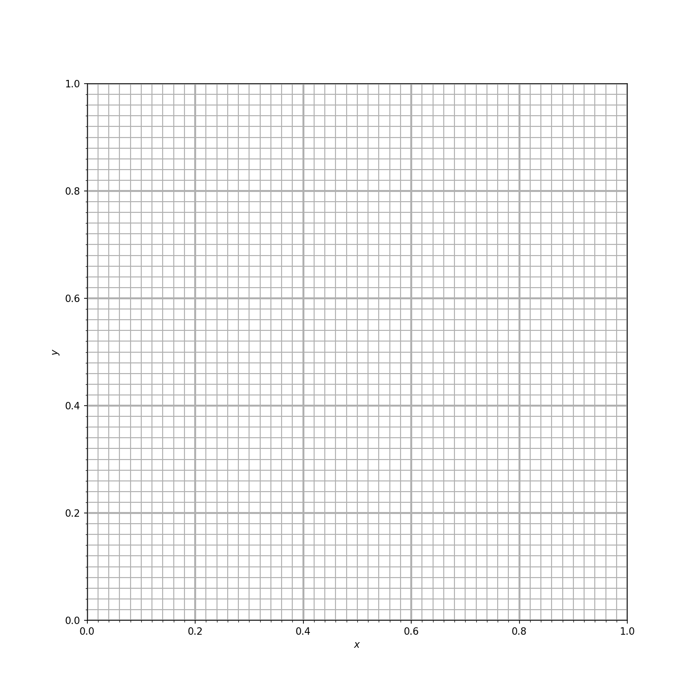
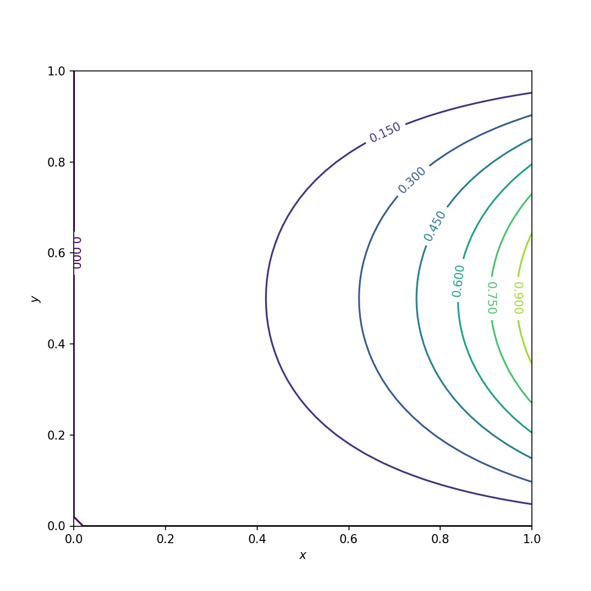
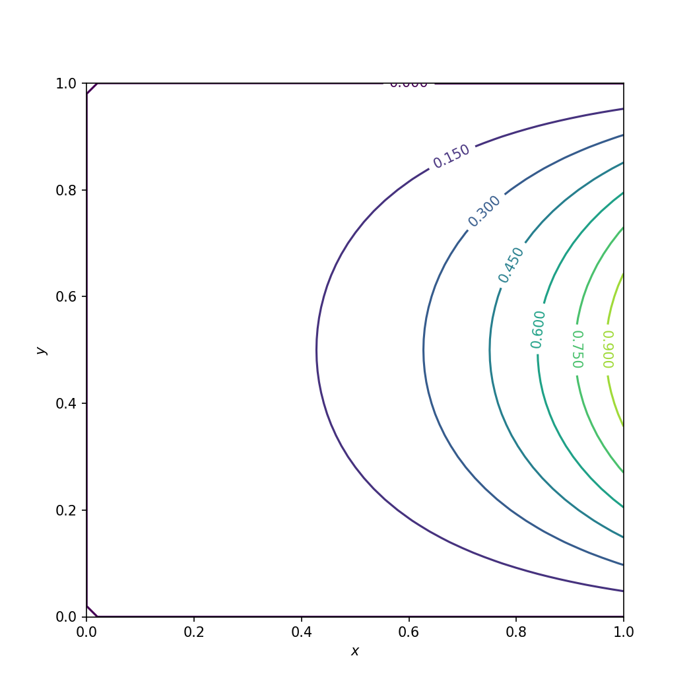
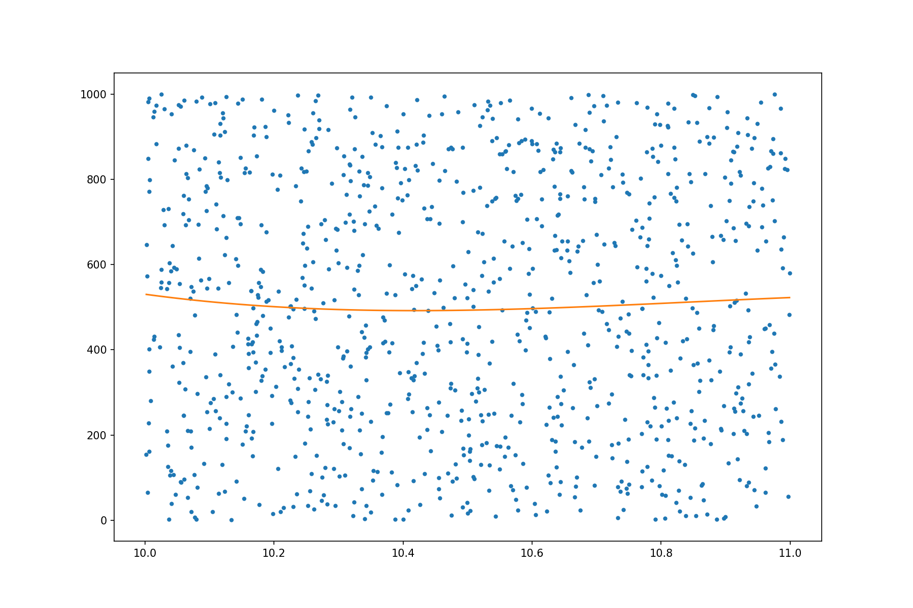

=================
Array Code in C++
=================

As we have learned in :doc:`../04matrix/matrix`, :doc:`../05cache/cache`, and
:doc:`../06simd/simd`, fast code calls for regular access to compact data.  Not
all data structures offer fast runtime.  For writing fast code, arrays are the
simplest and most commonly used data structure.  We will discuss how to use
arrays to achieve high speed.

Python Is Slow
==============

When using Python for number-crunching, the fact of its slowness needs to be
kept in mind always.  Handling the slowness is the key to make Python run as
fast as C.

Here we consider a boundary value problem of the Laplace equation for
temperature distribution in a :math:`1\times1` square area.

.. math::

  & \frac{\partial^2 u}{\partial x^2} + \frac{\partial^2 u}{\partial y^2}
    = 0 \quad (0<x<1; 0<y<1) \\
  &\left\{\begin{array}{lll}
    u(0,y) = 0, & u(1,y) = \sin(\pi y) & \rule{4ex}{0pt} (0 \le y \le 1) \\
    u(x,0) = 0, & u(x,1) = 0 & \rule{4ex}{0pt} (0 \le x \le 1)
  \end{array}\right.

.. _nsd-arraydesign-python:

Laplace Equation in Python
++++++++++++++++++++++++++

To solve it numerically, we choose the finite-difference method.  The
finite-difference method needs a grid to discretize the spatial domain.  The
simplest spatial discretization is the homogeneous Cartesian grid.  Let's make
a :math:`51\times51` Cartesian grid.  The Python code is:

.. literalinclude:: code/01_grid.py
  :language: python
  :linenos:
  :start-after: # [begin example]
  :end-before: # [end example]

The full code is in :ref:`01_grid.py <nsd-arraydesign-example-grid>`.  Plot the
grid using matplotlib:

  A Cartesian grid of :math:`51\times51` grid points.

After the grid is defined, we derive the finite-differencing formula.  Use the
Taylor series expansion to obtain the difference equation:

.. math::

  & \frac{u(x_{i+1}, y_j) - 2u(x_i, y_j) + u(x_{i-1}, y_j)}{(\Delta x)^2} \\
  &\quad + \frac{u(x_i, y_{j+1}) - 2u(x_i, y_j) + u(x_i, y_{j+1})}{(\Delta y)^2} = 0

Note :math:`\Delta x = \Delta y`.  The difference equation is rewritten as

.. math::

  u(x_i, y_j) = \frac{u(x_{i+1}, y_j) + u(x_{i-1}, y_j)
    + u(x_i, y_{j+1}) + u(x_i, y_{j-1})}{4}

Apply the point-Jacobi method to write a formula to iteratively solve the
difference equation:

.. math::

  u^{n+1}(x_i, y_i) = \frac{u^n(x_{i+1}, y_j) + u^n(x_{i-1}, y_j)
    + u^n(x_i, y_{j+1}) + u^n(x_i, y_{j-1})}{4}

where :math:`u^n` is the solution at the :math:`n`-th iteration.

Using the above formula, we are ready to implement the solver in Python.  The
code is short and straight-forward:

.. literalinclude:: code/01_solve_python_loop.py
  :language: python
  :linenos:
  :start-after: # [begin example]
  :end-before: # [end example]

The full code is in :ref:`01_solve_python_loop.py
<nsd-arraydesign-example-solvepy>`.  The solution can be plotted using
matplotlib:

.. figure:: image/01_solve_python_loop.png
  :name: nsd-arraydesign-laplace-python
  :align: center
  :width: 100%

  Numerical solution of the Laplace equation in Python.

The solution takes quite a while (4.797 seconds) to converge using 2097
iterations:

.. code-block:: pycon

  >>> with Timer():
  >>>    u, step, norm = solve_python_loop()
  >>> print(step)
  Wall time: 4.79688 s
  2097

.. _nsd-arraydesign-analytical:

Analytical Solution
+++++++++++++++++++

Is the calculation correct?  It is the first question to ask for any numerical
application.

We may compare the numerical solution to the analytical solution.  Recall the
PDE and its boundary conditions:

.. math::

  & \frac{\partial^2 u}{\partial x^2} + \frac{\partial^2 u}{\partial y^2}
    = 0 \quad (0<x<1; 0<y<1) \\
  &\left\{\begin{array}{lll}
    u(0,y) = 0, & u(1,y) = \sin(\pi y) & \rule{4ex}{0pt} (0 \le y \le 1) \\
    u(x,0) = 0, & u(x,1) = 0 & \rule{4ex}{0pt} (0 \le x \le 1)
  \end{array}\right.

Use separation of variable.  Assume the solution :math:`u(x,y) =
\phi(x)\psi(y)`.

.. math::

  & \frac{\partial^2 u}{\partial x^2} + \frac{\partial^2 u}{\partial y^2} = 0
    \quad \Rightarrow \quad
  \phi''\psi + \phi\psi'' = 0 \\
  & \Rightarrow \quad \frac{\phi''}{\phi} = -\frac{\psi''}{\psi} = \lambda

.. math::

  \left\{\begin{array}{ll}
    \phi'' - \lambda\phi = 0, & \phi(0) = 0 \\
    \psi'' + \lambda\psi = 0, & \psi(0) = 0, \, \psi(1) = 0
  \end{array}\right.

:math:`\lambda` is the eigenvalue.  The general solution of the ODE of
:math:`\psi` can be obtained as

.. math::

  \psi(y) = c\cos(\kappa y) + d\sin(\kappa y), \quad \kappa^2 = \lambda

Substitute the boundary conditions to the general solution

.. math::

  & \psi(0) = c = 0 \, \Rightarrow \, c = 0 \\
  & \psi(1) = d\sin(\kappa) = 0
    \, \Rightarrow \, \kappa = n\pi, \, n = 1, 2, 3, \ldots \\
  & \psi(y) = \sum_{n=1}^{\infty} \psi_n(y),
    \; \mbox{where} \; \psi_n(y) = d_n\sin(n\pi y) \\
  & \Rightarrow \psi(y) = \sum_{n=1}^{\infty} d_n \sin(n\pi y)

Substitute the eigenvalue :math:`\lambda` into the ODE of :math:`\phi`

.. math::

  \phi'' - (n\pi)^2\phi = 0

The general solution is

.. math::

  \phi_n(x) = a_n\cosh(\kappa x) + b_n\sinh(\kappa x)

Apply the boundary condition :math:`\phi_n(0) = a_n = 0` and obtain
:math:`\phi_n(x) = b_n\sinh(\kappa x)`.

The solution :math:`u(x, y)` can now be written as

.. math::

  u(x,y) = \sum_{n=1}^{\infty}\phi_n(x)\psi_n(y)
    = \sum_{n=1}^{\infty} \alpha_n \sinh(n\pi x)\sin(n\pi y)

where :math:`\alpha_n = b_nd_n`.  Apply the last boundary condition

.. math::

  u(1,y) = \sin(\pi y) = \sum_{n=1}^{\infty}\alpha_n\sinh(n\pi)\sin(n\pi)

to obtain that :math:`\alpha_1 = \sinh^{-1}(\pi)` and :math:`\alpha_n = 0 \;
\forall \; n > 1`.  The solution of :math:`u` is then determined:

.. math::

  u(x, y) = \frac{\sinh(\pi x)}{\sinh(\pi)} \sin(\pi y)

.. literalinclude:: code/01_solve_analytical.py
  :language: python
  :linenos:
  :start-after: # [begin example]
  :end-before: # [end example]

The full code is in :ref:`01_solve_analytical.py
<nsd-arraydesign-example-solveana>`.  The solution is plotted:

  Analytical solution of the Laplace equation.

Say :math:`u_a` is the analytical solution.  The numerical solution is compared
against the analytical solution, and the result :math:`|u-u_a|_{\infty} <
0.005` is good enough.

.. code-block:: pycon

  >>> uanalytical = solve_analytical()
  >>> # Calculate the L inf norm.
  >>> print("Linf of difference is %f" % np.abs(u - uanalytical).max())
  Linf of difference is 0.004962

.. _nsd-arraydesign-numpy:

Array-Based Code with Numpy
+++++++++++++++++++++++++++

To speed up the slow Python loops, numpy is usually a solution.  Numpy
implements fast calculations in C.  By using numpy, the intensive calculation
is delegated to C.

.. literalinclude:: code/02_solve_array.py
  :language: python
  :linenos:
  :start-after: # [begin example]
  :end-before: # [end example]

The full code is in :ref:`02_solve_array.py <nsd-arraydesign-example-solvenp>`.
The solution is verified to be the same as that with naive Python loops and
then plotted:

.. figure:: image/02_solve_array.png
  :name: nsd-arraydesign-laplace-numpy
  :align: center
  :width: 100%

  Numerical solution of the Laplace equation using numpy.

The speed is much better: less than 0.1 second.  Compared to that of the naive
Python loops, the speed up is more than 50x (to be exact, :ref:`87x
<runtime-comparison>`):

.. code-block:: pycon

  >>> # Run the Python solver
  >>> with Timer():
  >>>     u, step, norm = solve_array()
  Wall time: 0.0552309 s

.. _nsd-arraydesign-cpp:

Nested Loop in C++
++++++++++++++++++

While numpy does speed up the naive Python loops, it has two drawbacks:

1. It is still not optimal speed.
2. The code is not easy to read, compared to the element-wise code in the loop
   version.  Nested loop reads more straight-forward for our point-Jacobi
   method.

Here we will see how much faster it can get to move the code from numpy to C++.
To simplify the implementation, I use an array library from `modmesh
<https://github.com/solvcon/modmesh>`_.  It helps to organize the code and
achieve faster runtime.

Except the parentheses, the C++ version looks almost the same as the Python
version.

.. literalinclude:: code/solve_cpp.cpp
  :language: cpp
  :linenos:
  :start-after: // [begin example]
  :end-before: // [end example]

The full C++ code is in :ref:`solve_cpp.cpp
<nsd-arraydesign-example-solvecpp>`.  The Python driver code for the C++ kernel
is in :ref:`03_solve_cpp.py <nsd-arraydesign-example-solvecpppy>`.  We verify
the C++ code is to verify the solution is the same as before.  It is plotted:

  Numerical solution of the Laplace equation using C++.

Then we time the C++ version:

.. code-block:: pycon

  >>> with Timer():
  >>>     u, step, norm = solve_cpp.solve_cpp(uoriginal)
  Wall time: 0.0251369 s

It is twice as fast as the numpy version (0.0552309 seconds).

Overall Comparison
++++++++++++++++++

Now make a comparison for the three different implementations.

Runtime Performance
-------------------

By putting all timing data in a table, it is clear how much the C++ version
wins:

.. list-table:: Runtime with Python loop, Numpy array, and C++ loop.
  :name: runtime-comparison
  :align: center

  * - Code
    - Time (s)
    - Speedup
    -
  * - Python nested loop
    - 4.797
    - 1 (baseline)
    - n/a
  * - Numpy array
    - 0.055
    - 87.22
    - 1 (baseline)
  * - C++ nested loop
    - 0.025
    - 191.88
    - 2.2

Readability and/or Maintainability
----------------------------------

To compare the easy-of-reading among the three versions, we list the three
different computing kernels side by side:

.. code-block:: python
  :name: nsd-arraydesign-kernel-py
  :caption:
    Element-wise kernel using pure Python (full case in
    :ref:`nsd-arraydesign-python`).

  for it in range(1, nx-1):
      for jt in range(1, nx-1):
          un[it,jt] = (u[it+1,jt] + u[it-1,jt] + u[it,jt+1] + u[it,jt-1]) / 4

.. code-block:: python
  :name: nsd-arraydesign-kernel-np
  :caption:
    Element-wise kernel using numpy (full case in
    :ref:`nsd-arraydesign-numpy`).

  un[1:nx-1,1:nx-1] = (u[2:nx,1:nx-1] + u[0:nx-2,1:nx-1] +
                       u[1:nx-1,2:nx] + u[1:nx-1,0:nx-2]) / 4

.. code-block:: cpp
  :name: nsd-arraydesign-kernel-cpp
  :caption:
    Element-wise kernel using C++ (full case in :ref:`nsd-arraydesign-cpp`).

  for (size_t it=1; it<nx-1; ++it)
  {
      for (size_t jt=1; jt<nx-1; ++jt)
      {
          un(it,jt) = (u(it+1,jt) + u(it-1,jt) + u(it,jt+1) + u(it,jt-1)) / 4;
      }
  }

Overhead in Data Preparation
============================

Numerical calculation takes time.  Intuitively, developers spend time on
optimizing the number-crunching code.  However, for a useful application, the
house-keeping code for preparing the calculation data and post-processing the
results is equally important.

In our previous example of solving the Laplace equation, all the conditions are
hard-coded.  It's OK for the teaching purpose, but not useful to those who
don't know so much about the math and numerical.  This time, I will use an
example of polynomial curve fitting for variable-size data groups to show how
the house-keeping code affects performance.

Least-Square Regression
+++++++++++++++++++++++

The problem is to find an :math:`n`\ -th order algebraic polynomial function

.. math::

  p_n(x) = \sum_{i=0}^n a_ix^i

such that there is :math:`\min(f(\mathbf{a}))`, where the :math:`L_2` norm is

.. math::

  f(\mathbf{a}) = \sum_{k=1}^m\left(p_n(x_k) - y_k\right)^2

for the point cloud :math:`(x_k, y_k), \; k = 1, 2, \ldots, m`.  For the
function :math:`f` to have global minimal, there must exist a vector
:math:`\mathbf{a}` such that :math:`\nabla f = 0`.  Take the partial derivative
with respected to each of the polynomial coefficients :math:`a_0, a_1, \ldots,
a_n`

.. math::

  \frac{\partial f}{\partial a_i}
  & =
    \frac{\partial}{\partial a_i}
    \left[
      \sum_{k=1}^m
      \left(
        \sum_{j=0}^n a_jx_k^j - y_k
      \right)
    \right]^2 \\
  & = 
    2 \sum_{k=1}^m x_k^i
      \left(
        \sum_{j=0}^n a_jx_k^j - y_k
      \right) \\
  & = 
    2 \sum_{k=1}^m
      \left(
        \sum_{j=0}^n a_jx_k^{i+j} - x_k^iy_k
      \right)
  , \; i = 0, 1, \ldots, n

Because :math:`\frac{\partial f}{\partial a_i} = 0`, we obtain

.. math::

    \sum_{j=0}^n a_j \sum_{k=1}^m x_k^{i+j} = \sum_{k=1}^m x_k^iy_k

The equations may be written in the matrix-vector form

.. math::

  \mathrm{M}\mathbf{a} = \mathbf{b}

The system

.. math::

  \mathrm{M} = \left(\begin{array}{ccccc}
    m & \sum_{k=1}^m x_k^1 & \sum_{k=1}^m x_k^2 & \cdots & \sum_{k=1}^m x_k^n \\
    \sum_{k=1}^m x_k^1 & \sum_{k=1}^m x_k^2 & \sum_{k=1}^m x_k^2 &
      \cdots & \sum_{k=1}^m x_k^{1+n} \\
    \sum_{k=1}^m x_k^2 & \sum_{k=1}^m x_k^3 & \sum_{k=1}^m x_k^4 &
      \cdots & \sum_{k=1}^m x_k^{2+n} \\
    \vdots & \vdots & \vdots & \ddots & \vdots \\
    \sum_{k=1}^m x_k^n & \sum_{k=1}^m x_k^{n+1} & \sum_{k=1}^m x_k^{n+2} &
      \cdots & \sum_{k=1}^m x_k^{2n}
  \end{array}\right)

The vector for the polynomial coefficients and the right-hand side vector are

.. math::

  \mathbf{a} = \left(\begin{array}{c}
    a_0 \\ a_1 \\ a_2 \\ \vdots \\ a_n
  \end{array}\right), \;
  \mathbf{b} = \left(\begin{array}{c}
    \sum_{k=1}^m y_k \\
    \sum_{k=1}^m x_ky_k \\
    \sum_{k=1}^m x_k^2y_k \\
    \vdots \\
    \sum_{k=1}^m x_k^ny_k
  \end{array}\right)

The full example code is in :ref:`data_prep.cpp
<nsd-arraydesign-example-dataprep>`.  The Python driver is in
:ref:`04_fit_poly.py <nsd-arraydesign-example-fitpoly>`.

This is the helper function calculating the coefficients of one fitted
polynomial by using the least square regression:

.. literalinclude:: code/data_prep.cpp
  :name: nsd-arraydesign-fit-single
  :caption: C++ function for fitting a single polynomial function.
  :language: cpp
  :linenos:
  :start-after: // [begin example: single fit]
  :end-before: // [end example: single fit]

This is another helper function calculating the coefficients of a sequence of
fitted polynomials:

.. literalinclude:: code/data_prep.cpp
  :name: nsd-arraydesign-fit-multi
  :caption: C++ function for fitting multiple polynomial functions.
  :language: cpp
  :linenos:
  :start-after: // [begin example: multiple fit]
  :end-before: // [end example: multiple fit]

Prepare Data in Python
++++++++++++++++++++++

Now we create the data to test for how much time is spent in data preparation:

.. code-block:: pycon

  >>> with Timer():
  >>>     # np.unique returns a sorted array.
  >>>     xdata = np.unique(np.random.sample(1000000) * 1000)
  >>>     ydata = np.random.sample(len(xdata)) * 1000
  Wall time: 0.114635 s

.. note::

  The data is created in a certain way so that :ref:`the multi-polynomial
  helper <nsd-arraydesign-fit-multi>` can automatically determine the grouping
  of the variable-size groups of the input.

Before testing the runtime, we take a look at a fitted polynomial:

.. code-block:: python
  :linenos:
  :emphasize-lines: 9

  import data_prep

  plt.rc('figure', figsize=(12, 8))

  def plot_poly_fitted(i):
      slct = (xdata>=i)&(xdata<(i+1))
      sub_x = xdata[slct]
      sub_y = ydata[slct]
      poly = data_prep.fit_poly(sub_x, sub_y, 3)
      print(poly)
      poly = np.poly1d(poly)
      xp = np.linspace(sub_x.min(), sub_x.max(), 100)
      plt.plot(sub_x, sub_y, '.', xp, poly(xp), '-')

  plot_poly_fitted(10)

Fitting a single polynomial is fairly fast.  In what follows, we test the
runtime by fitting many polynomials:

.. code-block:: pycon

  >>> with Timer():
  >>>     # Do the calculation for the 1000 groups of points.
  >>>     polygroup = np.empty((1000, 3), dtype='float64')
  >>>     for i in range(1000):
  >>>         # Use numpy to build the point group.
  >>>         slct = (xdata>=i)&(xdata<(i+1))
  >>>         sub_x = xdata[slct]
  >>>         sub_y = ydata[slct]
  >>>         polygroup[i,:] = data_prep.fit_poly(sub_x, sub_y, 2)
  Wall time: 1.49671 s

To analyze, we separate the house-keeping code outside the calculating helper:

.. code-block:: pycon

  >>> with Timer():
  >>>     # Using numpy to build the point groups takes a lot of time.
  >>>     data_groups = []
  >>>     for i in range(1000):
  >>>         slct = (xdata>=i)&(xdata<(i+1))
  >>>         data_groups.append((xdata[slct], ydata[slct]))
  Wall time: 1.24653 s

The real fitting code:

.. code-block:: pycon

  >>> with Timer():
  >>>     # Fitting helper runtime is much less than building the point groups.
  >>>     polygroup = np.empty((1000, 3), dtype='float64')
  >>>     for it, (sub_x, sub_y) in enumerate(data_groups):
  >>>         polygroup[it,:] = data_prep.fit_poly(sub_x, sub_y, 2)
  Wall time: 0.215859 s

Although the house-keeping code is much easier to write in Python than in C++,
it runs more than 5 times slower (the fitting code takes only 17% of the
runtime of the house-keeping code).

Prepare Data in C++
+++++++++++++++++++

Now run :ref:`the C++ multi-polynomial helper <nsd-arraydesign-fit-multi>`.  It
detects the point group right before fitting:

.. code-block:: pycon

  >>> with Timer():
  >>>     rbatch = data_prep.fit_polys(xdata, ydata, 2)
  Wall time: 0.21058 s

The overhead of the Python house-keeping code is all gone.

.. _nsd-arraydesign-simplearray:

SimpleArray
===========

It has been shown that array is important for high-performance code.  It is
commonplace to develop a home-brewed array library for your system in C++,
because it does not only provide general array operations, but also a place to
house the ad hoc optimization that is crucial to performance.

In the above code we use a class template named ``SimpleArray``.  It is a
header-only library that provides multi-dimensional accessors to a contiguous
memory buffer.  The primary use case is for fundamental numerical types.  It has
the following behaviors:

* Multi-dimensional access to regular memory buffers
* Simple memory allocation by using fixed size
* Separate buffer ownership and meta data

``SimpleArray`` makes available the basic array meta data: shape, stride, and
type.  In addition to a spcific application, it also allows ghost (negative)
index in the first dimension.

.. note::

  A comparison between ``SimpleArray`` and the C++ ``std::vector`` is made below
  in the table :ref:`nsd-simplearray-stdvector`.

  .. list-table:: Comparison between SimpleArray and C++ Vector
    :name: nsd-simplearray-stdvector
    :header-rows: 1
    :align: left

    * - ``SimpleArray``
      - ``std::vector``
    * - | Fixed size (length):
        | * Only allocate memory on construction
        |
      - | Variable size (length):
        | * Buffer may be invalidated
        | * Implicit memory allocation (reallocation)
    * - | Multi-dimensional access
        | * Use ``operator()``
      - | One-dimensional access
        | * Use ``operator[]``

  While the STL container ``std::vector`` is frequently used as a
  one-dimensional array of dynamic memory allocation, it does not have the exact
  capability and limitation that we want for high-performance code.

  ``std::vector`` is definitely a powerful container.  But its flexbility
  sometimes slows down the system or makes it harder to control.
  ``SimpleArray`` fills in the gap.

.. _nsd-arraydesign-concretebuffer:

Buffer Ownership
++++++++++++++++

``SimpleArray`` uses a class ``ConcreteBuffer`` to manage the memory buffer, as
shown below in the listing :ref:`nsd-arraydesign-simplearray-buffer`:

.. code-block:: cpp
  :name: nsd-arraydesign-simplearray-buffer
  :caption: ``SimpleArray`` uses ``ConcreteBuffer`` to Manage Buffer
  :linenos:

  template <typename T>
  class SimpleArray
  {
      using buffer_type = ConcreteBuffer;
      std::shared_ptr<buffer_type> m_buffer;
  };

``ConcreteBuffer`` itself is a class managed by ``std::shared_ptr``:

.. code-block:: cpp
  :linenos:

  class ConcreteBuffer
      : public std::enable_shared_from_this<ConcreteBuffer>
  {
  private:
      // Protect the constructors
      struct ctor_passkey {};

  public:
      static std::shared_ptr<ConcreteBuffer> construct(size_t nbytes)
      {
          return std::make_shared<ConcreteBuffer>(nbytes, ctor_passkey());
      }

      ...
  };

We would like to turn off the move semantics so that the memory controlled by
``ConcreteBuffer`` is not moved away unexpectedly:

.. code-block:: cpp
  :linenos:

  // Turn off move
  ConcreteBuffer(ConcreteBuffer &&) = delete;
  ConcreteBuffer & operator=(ConcreteBuffer &&) = delete;

To make it possible to control when the memory controlled by ``ConcreteBuffer``
may be released, it internally is implemented by using ``std::unique_ptr`` and a
custom deleter class:

.. code-block:: cpp
  :linenos:

  // Use a deleter to customize memory management with unique_ptr
  using data_deleter_type = detail::ConcreteBufferDataDeleter;
  using unique_ptr_type = std::unique_ptr<int8_t, data_deleter_type>;

  size_t m_nbytes;  // Remember the amount of bytes
  unique_ptr_type m_data;  // Point to the allocated momery

Memory allocation is done in the constructor:

.. code-block:: cpp
  :linenos:

  ConcreteBuffer(size_t nbytes, const ctor_passkey &)
      : m_nbytes(nbytes)
      , m_data(allocate(nbytes))
  {}

  // Allocate memory
  static unique_ptr_type allocate(size_t nbytes)
  {
      unique_ptr_type ret(nullptr, data_deleter_type());
      if (0 != nbytes)
      {
          ret = unique_ptr_type(new int8_t[nbytes], data_deleter_type());
      }
      return ret;
  }

``ConcreteBuffer`` Remover
--------------------------

The deleter ``ConcreteBufferDataDeleter`` is a proxy to a polymorphic remover
functor type ``ConcreteBufferRemover``:

.. code-block:: cpp
  :linenos:

  struct ConcreteBufferDataDeleter
  {
      using remover_type = ConcreteBufferRemover;
      explicit ConcreteBufferDataDeleter(std::unique_ptr<remover_type> && remover_in)
          : remover(std::move(remover_in))
      {}
      void operator()(int8_t * p) const
      {
          if (!remover)
          {
              delete[] p;  // Array deletion if no remover is available.
          }
          else
          {
              (*remover)(p);
          }
      }
      std::unique_ptr<remover_type> remover{nullptr};
  };

The base class and the default implementation of ``ConcreteBufferRemover`` also
uses the array deletion:

.. code-block:: cpp
  :linenos:

  struct ConcreteBufferRemover
  {
      virtual ~ConcreteBufferRemover() = default;
      virtual void operator()(int8_t * p) const
      {
          delete[] p;
      }
  };

It may be customized to avoid releasing memory.  When using ``ConcreteBuffer``
to hold pointer to a memory buffer managed by another sub-system, we may need to
avoid releasing the memory when ``ConcreteBuffer`` destructs.

.. code-block:: cpp
  :linenos:

  struct ConcreteBufferNoRemove : public ConcreteBufferRemover
  {
      void operator()(int8_t *) const override {}
  };

The full code is in :ref:`ConcreteBuffer.hpp
<nsd-arraydesign-example-concretebuffer>`.

Multi-Dimensional Data Access
+++++++++++++++++++++++++++++

Three basic meta data are stored in ``SimpleArray`` to support multi-dimensional
data access: shape, stride, and type.  The type information is provided by the
template argument.  We do not need to pay a lot of attention to it.

.. code-block:: cpp
  :linenos:

  template <typename T>
  class SimpleArray
  {
  public:
      // Type information.
      using value_type = T;
      static constexpr size_t ITEMSIZE = sizeof(value_type);

      using buffer_type = ConcreteBuffer;
      /// Contiguous data buffer for the array.
      std::shared_ptr<buffer_type> m_buffer;

      using shape_type = small_vector<size_t>;
      /// Each element in this vector is the number of element in the
      /// corresponding dimension.
      shape_type m_shape;
      /// Each element in this vector is the number of elements (not number of
      /// bytes) to skip for advancing an index in the corresponding dimension.
      shape_type m_stride;
  };

Shape describes the number of elements in each of the dimension of the array.
In a one-dimensional array, the shape has only one element:

.. code-block:: cpp
  :linenos:

  explicit SimpleArray(size_t length)
      : m_buffer(buffer_type::construct(length * ITEMSIZE))
      , m_shape{length}
      , m_stride{1}
      , m_body(m_buffer->data<T>())
  {}

The size of the shape vector is the number of dimensionality:

.. code-block:: cpp
  :linenos:

  explicit SimpleArray(shape_type const & shape)
      : m_shape(shape)
      , m_stride(calc_stride(m_shape))
  {
      if (!m_shape.empty())
      {
          m_buffer = buffer_type::construct(m_shape[0] * m_stride[0] * ITEMSIZE);
          m_body = m_buffer->data<T>();
      }
  }

Stride is the number of elements to be skipped when the index is changed by 1 in
the corresponding dimension.  The calculation is done by ``calc_stride()``.

.. code-block:: cpp
  :linenos:

  static shape_type calc_stride(shape_type const & shape)
  {
      shape_type stride(shape.size());
      if (!shape.empty())
      {
          stride[shape.size() - 1] = 1;
          for (size_t it = shape.size() - 1; it > 0; --it)
          {
              stride[it - 1] = stride[it] * shape[it];
          }
      }
      return stride;
  }

Now the shape and stride are determined, and will be used in the
multi-dimensional accessor.  The accessor is broken into the
element accessor in the form of ``operator()()`` and pointer accessor
``vptr()``.  When getting the address of an element, the pointer accessor is
handy.

.. code-block:: cpp
  :linenos:

  template <typename T>
  class SimpleArray
  {
      ...
      template <typename... Args>
      value_type const & operator()(Args... args) const
      { return *vptr(args...); }
      template <typename... Args>
      value_type & operator()(Args... args)
      { return *vptr(args...); }

      template <typename... Args>
      value_type const * vptr(Args... args) const
      { return m_body + buffer_offset(m_stride, args...); }
      template <typename... Args>
      value_type * vptr(Args... args)
      { return m_body + buffer_offset(m_stride, args...); }
      ...
  };

``SimpleArray`` uses the variadic template to get the indices in each of the
dimensions and calculate the memory offset of the specified element.  The
helper template ``buffer_offset()`` is used to avoid conditioned branching in
runtime.

.. code-block:: cpp
  :linenos:

  namespace detail
  {
  // Use recursion in templates.
  template <size_t D, typename S>
  size_t buffer_offset_impl(S const &)
  {
      return 0;
  }
  template <size_t D, typename S, typename Arg, typename... Args>
  size_t buffer_offset_impl(S const & strides, Arg arg, Args... args)
  {
      return arg * strides[D] +
             buffer_offset_impl<D + 1>(strides, args...);
  }
  } /* end namespace detail */

  template <typename S, typename... Args>
  size_t buffer_offset(S const & strides, Args... args)
  {
      return detail::buffer_offset_impl<0>(strides, args...);
  }

To this point, we will be able to access the elements using ``operator()()``:

.. code-block:: cpp

  SimpleArray<int> arr(small_vector<size_t>{3, 4});
  arr_int(1, 2) = -8;

The full code is in :ref:`SimpleArray.hpp
<nsd-arraydesign-example-simplearray>`.

.. _nsd-arraydesign-smallvector:

Small Vector Optimization
-------------------------

For implmenting the shape and stride, ``SimpleArray`` employs the small vector
optimization.  When using arrays it is actually rare to use very high
dimensions, e.g., 6.  Instead, 1, 2, and 3 dimensions are the majority of the
use cases.  As we know dynamic allocation is expensive, it is good to spend a
little bit of memory space to reduce the runtime overhead.

The optimization is to use a small block of memory in the class template
(``small_vector``).  Instead of using pointers for size and capacity, unsigned
integers are used to keep track of the number of elements.

.. code-block:: cpp
  :linenos:

  template <typename T, size_t N = 3>
  class small_vector
  {
  public:
      T const * data() const { return m_head; }
      T * data() { return m_head; }
  private:
      T * m_head = nullptr;
      unsigned int m_size = 0;
      unsigned int m_capacity = N;
      std::array<T, N> m_data;
  };

Upon construction, if the requested size is smaller than ``N``, no dynamic
memory allocation is done:

.. code-block:: cpp
  :linenos:

  explicit small_vector(size_t size)
      : m_size(static_cast<unsigned int>(size))
  {
      if (m_size > N)
      {
          m_capacity = m_size;
          // Allocate only when the size is too large.
          m_head = new T[m_capacity];
      }
      else
      {
          m_capacity = N;
          m_head = m_data.data();
      }
  }

  small_vector() { m_head = m_data.data(); }

No deallocation is needed in the destructor if there was not dynamic memory
used:

.. code-block:: cpp
  :linenos:

  ~small_vector()
  {
      if (m_head != m_data.data() && m_head != nullptr)
      {
          delete[] m_head;
          m_head = nullptr;
      }
  }

Copy constructor (as well as copy assignment operator, which is omitted here for
clarity) may also allocate memory:

.. code-block:: cpp
  :linenos:

  small_vector(small_vector const & other)
      : m_size(other.m_size)
  {
      if (other.m_head == other.m_data.data())
      {
          m_capacity = N;
          m_head = m_data.data();
      }
      else
      {
          m_capacity = m_size;
          m_head = new T[m_capacity];
      }
      std::copy_n(other.m_head, m_size, m_head);
  }

The move constructor (and move assignment operator, which is omitted here for
clarity) should not allocate memory, but should take the 

.. code-block:: cpp
  :linenos:

  small_vector(small_vector && other) noexcept
      : m_size(other.m_size)
  {
      if (other.m_head == other.m_data.data())
      {
          m_capacity = N;
          std::copy_n(other.m_data.begin(), m_size, m_data.begin());
          m_head = m_data.data();
      }
      else
      {
          m_capacity = m_size;
          m_head = other.m_head;
          other.m_size = 0;
          other.m_capacity = N;
          other.m_head = other.m_data.data();
      }
  }

The full code is in :ref:`small_vector.hpp
<nsd-arraydesign-example-smallvector>`.

Ghost (Negative) Index
++++++++++++++++++++++

Normally we access the element in an array using non-negative indices.  But just
like the C-style POD array, it is not wrong to allow negative indices as long as
we do not access the memory out of the bound.  It is a common trick played for
implementing lookup tables.

To avoid incurring overhead for a normal array whose index starts with 0,
``SimpleArray`` implement the feature with only the leading dimension.  What
we need to do is to add the number of ghost elements (indexed using negative
integer) and the starting address of the "non-ghost" body elements.

.. code-block:: cpp
  :linenos:

  template <typename T>
  class SimpleArray
  {
  private:
      // Number of ghost elements
      size_t m_nghost = 0;
      // Starting address of non-ghost
      value_type * m_body = nullptr;
  };

The body address is calculated based on the data pointer, stride, and the ghost
number:

.. code-block:: cpp
  :linenos:

  static T * calc_body(T * data, shape_type const & stride, size_t nghost)
  {
      if (nullptr == data || stride.empty() || 0 == nghost)
      {
          // Do nothing.
      }
      else
      {
          shape_type shape(stride.size(), 0);
          shape[0] = nghost;
          data += buffer_offset(stride, shape);
      }
      return data;
  }

The ghost number and body address are calculated and assigned upon construction,
e.g., in the copy and move constructors:

.. code-block:: cpp
  :linenos:

  SimpleArray(SimpleArray const & other)
      : m_buffer(other.m_buffer->clone())
      , m_shape(other.m_shape)
      , m_stride(other.m_stride)
      , m_nghost(other.m_nghost)
      , m_body(calc_body(m_buffer->data<T>(), m_stride, other.m_nghost))
  {}

  SimpleArray(SimpleArray && other) noexcept
      : m_buffer(std::move(other.m_buffer))
      , m_shape(std::move(other.m_shape))
      , m_stride(std::move(other.m_stride))
      , m_nghost(other.m_nghost)
      , m_body(other.m_body)
  {}

AOS and SOA
===========

To write code for arrays, i.e., contiguous buffers of data, we go with either
:ref:`AOS (array of structures) <nsd-arraydesign-aos>` or :ref:`SOA (structure
of arrays) <nsd-arraydesign-soa>`.  As a rule of thumb, AOS is easier to code
and SOA is more friendly to SIMD.  However, it is not true that SOA is always
faster than AOS [5]_ [6]_.

The demonstration of AOS and SOA here is elementary.  Benchmarking the two
different layouts is usually infeasible for a non-trivial system.

.. _nsd-arraydesign-aos:

Array of Structures
+++++++++++++++++++

AOS is commonplace in object-oriented programming that encourages encapsulating
logic with data.  Even though SOA is more friendly to memory access, the
productivity of encapsulation makes it a better choice to start the system
implementation.

.. code-block:: cpp
  :name: nsd-arraydesign-aoscode
  :caption: Array of structures.
  :linenos:

  struct Point
  {
      double x, y;
  };

  /**
   * Use a contiguous buffer to store the struct data element.
   */
  using ArrayOfStruct = std::vector<Point>;

.. _nsd-arraydesign-soa:

Structure of Arrays
+++++++++++++++++++

In the following :ref:`example code <nsd-arraydesign-soacode>`, each of the
fields of a point is collected into the corresponding container in a structure
:cpp:class:`!StructOfArray`.

It is not a good idea to expose the layout of the data, which is considered
implementation detail.  To implement the necessary encapsulation, we will need
a handle or proxy class to access the point data.

.. code-block:: cpp
  :name: nsd-arraydesign-soacode
  :caption: Structure of arrays.
  :linenos:

  /**
   * In a real implementation, this data class needs encapsulation too.
   */
  struct StructOfArray
  {
      std::vector<double> x;
      std::vector<double> y;
  };

  /**
   * Because the data is "pool" in StructOfArray, it takes a handle or proxy
   * object to access the content point.
   */
  struct PointHandle
  {
      StructOfArray * soa;
      size_t idx;
      double   x() const { return soa.x[idx]; }
      double & x()       { return soa.x[idx]; }
      double   y() const { return soa.y[idx]; }
      double & y()       { return soa.y[idx]; }
  };

Translation between Dynamic and Static
======================================

In C++ we can use template to do many things during compile time without
needing to use a CPU instruction during runtime.  For example, we may use CRTP
(see :ref:`nsd-cpp-crtp`) for the static polymorphism, instead of really
checking for the type during runtime (dynamically).

But when we are trying to present the nicely optimized code to Python users,
there is a problem: a dynamic language like Python does not know anything about
a compile time entity like template.  In Python, everything is dynamic (happens
during runtime).  We need to translate between the dynamic behaviors in Python
and the static behaviors in C++.

This translation matters to our system design using arrays because the arrays
carry type information that helps the C++ compiler generate efficient
executables, and we do not want to lose the performance when doing the
translation.  Thus, it is not a bad idea to do it manually.  Spelling out the
static to dynamic conversion makes it clear what do we want to do.  When we
work in the inner-most loop, no :c:type:`python:PyObject` or virtual function
table should be there.  The explicitness will help us add ad hoc optimization
or debug for difficult performance issues.

We will use an example to show one way to explicitly separate the static and
dynamic behaviors.  The model problem is to define the operations of the
spatially discretized grid and the elements.

Class Templates for General Behaviors
+++++++++++++++++++++++++++++++++++++

There should be general code and information for all of the grids, and they are
kept in some class templates.  The C++ compiler knows when to put the code and
information in proper places.

.. code-block:: cpp
  :caption: The (static) class template for grids.
  :linenos:

  /**
   * Spatial table basic information.  Any table-based data store for spatial
   * data should inherit this class template.
   */
  template <size_t ND>
  class SpaceBase
  {
  public:
      static constexpr const size_t NDIM = ND;
      using serial_type = uint32_t;
      using real_type = double;
  };

  /**
   * Base class template for structured grid.
   */
  template <dim_t ND>
  class StaticGridBase
    : public SpaceBase<ND>
  {
      // Code that is general to the grid of any dimension.
  };

Classes for Specific Behaviors
++++++++++++++++++++++++++++++

There may be different behaviors for each of the dimension, and we may use a
class to house the code and data.

.. code-block:: cpp
  :caption: The classes instantiating the grid class templates.
  :linenos:

  class StaticGrid1d
    : public StaticGridBase<1>
  {
  };

  class StaticGrid2d
    : public StaticGridBase<2>
  {
  };

  class StaticGrid3d
    : public StaticGridBase<3>
  {
  };

Dynamic Behaviors in Interpreter
++++++++++++++++++++++++++++++++

Everything in Python needs to be dynamic, and we can absorb it in the wrapping
layer.

.. code-block:: cpp
  :caption: The ad hoc wrappers for each of the grid classes.
  :linenos:

  /*
   * WrapStaticGridBase has the pybind11 wrapping code.
   */

  class WrapStaticGrid1d
    : public WrapStaticGridBase< WrapStaticGrid1d, StaticGrid1d >
  {
  };

  class WrapStaticGrid2d
    : public WrapStaticGridBase< WrapStaticGrid2d, StaticGrid2d >
  {
  };

  class WrapStaticGrid3d
    : public WrapStaticGridBase< WrapStaticGrid3d, StaticGrid3d >
  {
  };

  PYBIND11_MODULE(_modmesh, mod)
  {
      WrapStaticGrid1d::commit(mod);
      WrapStaticGrid2d::commit(mod);
      WrapStaticGrid3d::commit(mod);
  }

How pybind11 Translates
+++++++++++++++++++++++

We rely on `pybind11 <https://pybind11.readthedocs.io/>`_ for doing the
translate behind the wrappers.

Here we take a look at `the code of a older version 2.4.3
<https://github.com/pybind/pybind11/tree/v2.4.3>`__ to understand what is
happening behind the scenes.  pybind11 uses the class
:cpp:class:`!pybind11::cppfunction` to wrap everything that is callable in C++
to be a callable in Python (`see line 56 in pybind11.h
<https://github.com/pybind/pybind11/blob/v2.4.3/include/pybind11/pybind11.h#L56>`__):

.. code-block:: cpp
  :linenos:

  /// Wraps an arbitrary C++ function/method/lambda function/.. into a callable Python object
  class cpp_function : public function {
  public:
      cpp_function() { }
      cpp_function(std::nullptr_t) { }

      /// Construct a cpp_function from a vanilla function pointer
      template <typename Return, typename... Args, typename... Extra>
      cpp_function(Return (*f)(Args...), const Extra&... extra) {
          initialize(f, f, extra...);
      }

      /// Construct a cpp_function from a lambda function (possibly with internal state)
      template <typename Func, typename... Extra,
                typename = detail::enable_if_t<detail::is_lambda<Func>::value>>
      cpp_function(Func &&f, const Extra&... extra) {
          initialize(std::forward<Func>(f),
                     (detail::function_signature_t<Func> *) nullptr, extra...);
      }

      /// Construct a cpp_function from a class method (non-const)
      template <typename Return, typename Class, typename... Arg, typename... Extra>
      cpp_function(Return (Class::*f)(Arg...), const Extra&... extra) {
          initialize([f](Class *c, Arg... args) -> Return { return (c->*f)(args...); },
                     (Return (*) (Class *, Arg...)) nullptr, extra...);
      }

      /// Construct a cpp_function from a class method (const)
      template <typename Return, typename Class, typename... Arg, typename... Extra>
      cpp_function(Return (Class::*f)(Arg...) const, const Extra&... extra) {
          initialize([f](const Class *c, Arg... args) -> Return { return (c->*f)(args...); },
                     (Return (*)(const Class *, Arg ...)) nullptr, extra...);
      }

  // ...
  }

The constructors call :cpp:func:`!pybind11::cppfunction::initialize` to
populate necessary information for the callables: to be a callable in Python
(`see line 98 in pybind11.h
<https://github.com/pybind/pybind11/blob/v2.4.3/include/pybind11/pybind11.h#L98>`__):

.. code-block:: cpp

  /// Special internal constructor for functors, lambda functions, etc.
  template <typename Func, typename Return, typename... Args, typename... Extra>
  void initialize(Func &&f, Return (*)(Args...), const Extra&... extra) {
    // Code populating necessary information for calling the callables.
  }

When Python wants to call a callable controlled by
:cpp:class:`!pybind11::cppfunction`, pybind11 uses
:cpp:func:`!pybind11::cppfunction::dispatch` to find the corresponding object
(`see line 423 in pybind11.h
<https://github.com/pybind/pybind11/blob/v2.4.3/include/pybind11/pybind11.h#L423>`__):

.. code-block:: cpp

  static PyObject *dispatcher(PyObject *self, PyObject *args_in, PyObject *kwargs_in) {
    // Read the Python information and find the right cppfunction for execution.
  }

Scoped-Based Timer
==================

Profiling is the first thing to do when we need to optimize the code we write.
While profiling itself has nothing specific to array code, it is common for us
to consider profiling along with writing the high-performance array-style code,
because both are meant for improving the system performance.

In addition to using OS-provided profiling tools, e.g., Linux's perf and
Macos's Instruments, we should also add a custom profiling layer in the code.
We usually use a simple scope-based profiler for ease of implementation, but
sample-based works as well.

The custom profiler is especially useful in two scenarios:

1. The destination platform does not have a very good profiler.
2. We may not access to a system profiler for some reasons (permission,
   accessibility, etc.)

Even though a custom profiler may not use the most delicate implementation, it
is the last thing you may rely on.  Another benefit of using a custom profiler
is that you may add code specific to your applications, which is usually
infeasible for a general profiler.

The following example implements a simple scoped-based timer that is controlled
by a pre-processor macro:

.. code-block:: cpp
  :name: nsd-arraydesign-scoped-timer
  :caption: A simple scoped-based timer in C++.
  :linenos:

  /*
   * MODMESH_PROFILE defined: Enable profiling API.
   */
  #ifdef MODMESH_PROFILE

  #define MODMESH_TIME(NAME) \
      ScopedTimer local_scoped_timer_ ## __LINE__(NAME);

  /*
   * No MODMESH_PROFILE defined: Disable profiling API.
   */
  #else // MODMESH_PROFILE

  #define MODMESH_TIME(NAME)

  #endif // MODMESH_PROFILE
  /*
   * End MODMESH_PROFILE.
   */

  struct ScopedTimer
  {

      ScopedTimer() = delete;

      ScopedTimer(const char * name) : m_name(name) {}

      ~ScopedTimer()
      {
          TimeRegistry::me().add(m_name, m_sw.lap());
      }

      StopWatch m_sw;
      char const * m_name;

  }; /* end struct ScopedTimer */

This is the usage example:

.. code-block:: cpp
  :name: nsd-arraydesign-scoped-timer-use
  :caption: Use the simple timer.
  :linenos:

  // Manually
  void StaticGrid1d::fill(StaticGrid1d::real_type val)
  {
      MODMESH_TIME("StaticGrid1d::fill");
      std::fill(m_coord.get(), m_coord.get()+m_nx, val);
  }

The system provides a way to keep and print the timing data (`see the code
elsewhere <https://github.com/solvcon/modmesh>`__):

.. code-block:: pycon

  >>> import modmesh as mm
  >>>
  >>> gd = mm.StaticGrid1d(1000000)
  >>> for it in range(100):
  >>>     gd.fill(0)
  >>> print(mm.time_registry.report())
  StaticGrid1d.__init__ : count = 1 , time = 6.36e-06 (second)
  StaticGrid1d.fill : count = 100 , time = 0.0346712 (second)
  StaticGrid1d::fill : count = 100 , time = 0.0344818 (second)

.. note::

  There are many ways to do a custom profiler.  Another good way to do it is to
  add one at the pybind11 wrapping layer.  Python function calls are much more
  expensive than C++ ones.  Adding timers when calling from Python to C++ never
  makes a dent to the overall runtime.

Exercises
=========

1. By allowing changing the signature of the function ``fit_poly()``, how can
   we ensure the shapes of ``xarr`` and ``yarr`` to be the same, without the
   explicit check with ``"xarr and yarr size mismatch"``?  Write code to show.

References
==========

.. [1] :doc:`./example`

.. [2] modmesh: https://github.com/solvcon/modmesh

.. [3] pybind11 Seamless operability between C++11 and Python:
   https://pybind11.readthedocs.io/en/stable/

.. [4] IPython / Jupyter integration for pybind11:
   https://github.com/aldanor/ipybind

.. [5] Memory Layout Transformations:
   https://software.intel.com/content/www/us/en/develop/articles/memory-layout-transformations.html

.. [6] Chapter 31 - Abstraction for AoS and SoA Layout in C++, *GPU Computing
   Gems Jade Edition*, pp. 429-441, Robert Strzodka, January 1, 2012.
   http://www.sciencedirect.com/science/article/pii/B9780123859631000319

.. vim: set ff=unix fenc=utf8 sw=2 ts=2 sts=2:
