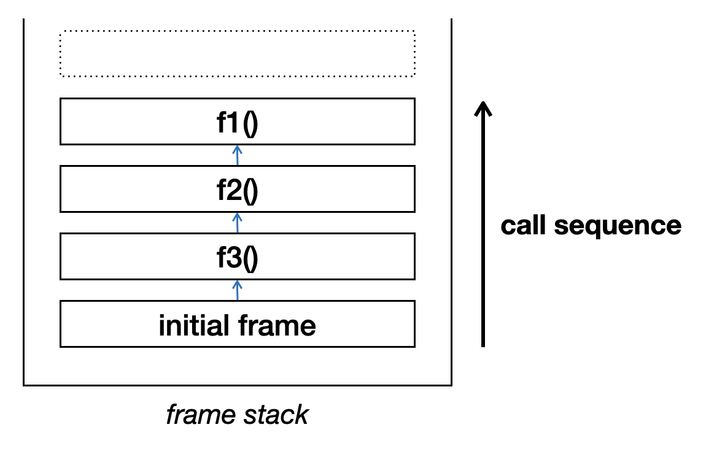
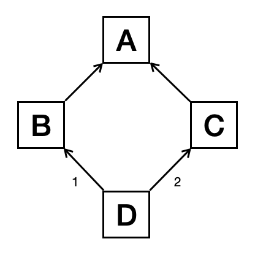
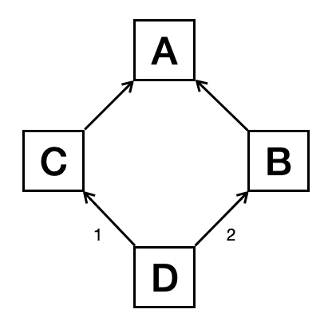
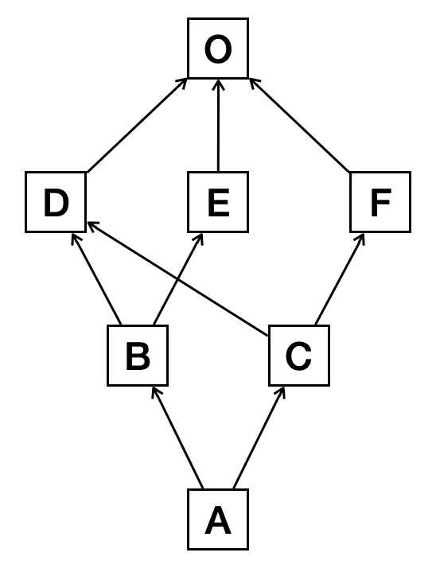

===============
Advanced Python
===============

Python is a simple language, but its base on dynamicity makes it to easily
implement some magical behaviors.  Although the cost at runtime is high, the
magics is very convenient.  Combined with the high-speed C++ and C code, the
advanced Python features are powerful when used correctly.

Iterator
========

When processing a big amount of data, repetition is used everywhere. The data
need to be kept somewhere, and that is why we use containers. We write code to
access the elements one by one.  This pattern is called iteration.

Python provides the :ref:`iterator protocol <python:typeiter>` for this pattern.
Let us see a simple.  Create a list holding 10 integer elements:

.. code-block:: pycon

  >>> # Build a list of numerical data:
  >>> data = [0, 1, 2, 3, 4, 5, 6, 7, 8, 9]
  >>> type(data)  # Show the type: it's indeed a list.
  <class 'list'>

Then iterate over all the elements in ``data`` through the ``for ... in ...``
loop:

.. code-block:: pycon

  >>> # This uses the iterator protocol.
  >>> for v in data:
  ...     print(v)
  ... 
  0
  1
  2
  3
  4
  5
  6
  7
  8
  9

.. note::

  Python iteration is slow.  High-performance code almost never loops in Python.
  However it is easy to write and helpful when debugging.  A high-performance
  system commonly provides it as a supplement for a fast but hard-to-debug API.

Custom Iterator
+++++++++++++++

The iterator protocol works closely with the ``for`` loop.  A programmer can use
it to change the behavior of the loop.  In the following example, we create a
class implementing the iterator protocol.  It takes a sequence, and create a new
value on the fly when returning the elements.

.. code-block:: python
  :linenos:

  class ListIterator:
      """
      This class takes an offset value for all the element in the container.
      """

      def __init__(self, data, offset=0):

          self.data = data  # The data container.
          self.it = None  # The current index in the container.
          self.offset = offset  # The offset value.

      # Return the iterator object itself.
      def __iter__(self):

          return self

      # Return the next element from the iterator.
      def __next__(self):

          if None is self.it:

              self.it = 0

          elif self.it >= len(self.data)-1:

              self.it = None

              # Raise the exception if there is no more elements to be iterated.
              raise StopIteration

          else:

              self.it += 1

          return self.data[self.it] + self.offset

To use it, we need to create the custom iterator from the existing data list:

.. code-block:: pycon

  >>> # Iterate all elements but return (100 + v) instead of v.
  >>> list_iterator = ListIterator(data, offset=100)
  >>> # Print the iterator object and review the type.
  >>> print(list_iterator)
  <__main__.ListIterator object at 0x10cfaebd0>

Take a look at its members.  Look for ``__iter__`` and ``__next__``.

.. code-block:: pycon
  :emphasize-lines: 5, 7

  >>> print(dir(list_iterator))
  ['__class__', '__delattr__', '__dict__', '__dir__', '__doc__', '__eq__',
  '__format__', '__ge__', '__getattribute__', '__gt__', '__hash__', '__init__',
  '__init_subclass__',
  '__iter__',
  '__le__', '__lt__', '__module__', '__ne__', '__new__',
  '__next__',
  '__reduce__', '__reduce_ex__', '__repr__', '__setattr__', '__sizeof__',
  '__str__', '__subclasshook__', '__weakref__', 'data', 'it', 'offset']

Every time the construct needs the next element, ``ListIterator.__next__()`` is
called.  Let us see how it runs.  In the ``for`` loop iterating over
``list_iterator``, it does not return the value in the ``data`` list, but the
value offset by 100.

.. code-block:: pycon

  >>> # The iterator offset the value in the list.
  >>> for v in list_iterator:
  ...     print(v)
  ... 
  100
  101
  102
  103
  104
  105
  106
  107
  108
  109

If hard-coding the offset value in the loop, you can do the same thing without
the custom iterator.  To put it in another way, we may say, the custom iterator
parameterizes the offset value.

.. code-block:: pycon

  >>> # Hard-code the offset value in the loop.
  >>> for v in data:
  ...     print(v + 100)
  ... 
  100
  101
  102
  103
  104
  105
  106
  107
  108
  109

Built-In Iterator
+++++++++++++++++

Python provides a built-in iterator helper :py:func:`python:iter` so it is not
really necessary to create a custom iterator class if you do not need a very
special treatment. (The custom class ``ListIterator`` is not really special
enough to warrant a custom class. We will cover this part later.)

.. code-block:: pycon

  >>> # Create an iterator object using the built-in iter() function.
  >>> list_iterator2 = iter(data)
  >>> # Check the type of the built-in iterator object:
  >>> print(list_iterator2)
  <list_iterator object at 0x10cfb2990>
  >>> # The built-in iterator works the same as directly iterating the list.
  >>> for v in list_iterator2:
  ...     print(v)
  ...
  0
  1
  2
  3
  4
  5
  6
  7
  8
  9

.. admonition:: Comparison

  Compare with the type of our custom iterator:

  .. code-block:: pycon

    >>> print(list_iterator)
    <__main__.ListIterator object at 0x10cfaebd0>

Take a look at its members of the built-in iterator.  Look for ``__iter__`` and
``__next__`` like we did for the custom iterator.

.. code-block:: pycon
  :emphasize-lines: 5, 7

  >>> print(dir(list_iterator2))
  ['__class__', '__delattr__', '__dir__', '__doc__', '__eq__',
  '__format__', '__ge__', '__getattribute__', '__gt__', '__hash__', '__init__',
  '__init_subclass__',
  '__iter__',
  '__le__', '__length_hint__', '__lt__', '__ne__', '__new__',
  '__next__',
  '__reduce__', '__reduce_ex__', '__repr__',
  '__setattr__', '__setstate__', '__sizeof__', '__str__', '__subclasshook__']

.. admonition:: Comparison

  Compare with the members of our custom iterator.  The only difference is that
  the custom iterator has one additional member ``__dict__``.

  .. code-block:: pycon
    :emphasize-lines: 5, 7

    >>> print(dir(list_iterator))
    ['__class__', '__delattr__', '__dict__', '__dir__', '__doc__', '__eq__',
    '__format__', '__ge__', '__getattribute__', '__gt__', '__hash__', '__init__',
    '__init_subclass__',
    '__iter__',
    '__le__', '__lt__', '__module__', '__ne__', '__new__',
    '__next__',
    '__reduce__', '__reduce_ex__', '__repr__', '__setattr__', '__sizeof__',
    '__str__', '__subclasshook__', '__weakref__', 'data', 'it', 'offset']

Implicitly Created Iterator
+++++++++++++++++++++++++++

The built-in iterator may also be created by calling
:py:meth:`python:container.__iter__` method on the container object
(:py:func:`python:iter` simply does it for you):

.. code-block:: pycon

  >>> # Create an iterator object using the iterator protocol.
  >>> list_iterator3 = data.__iter__()
  >>> print(list_iterator3)
  <list_iterator object at 0x10cfbab90>

Aided by :py:meth:`python:container.__iter__`, most of the time we can directly
use a container in the loop construct ``for ... in ...``, because the construct
knows about the iterator protocol.

Generator
+++++++++

:term:`Generator <python:generator>` is an advanced use of the :ref:`iterator
protocol <python:typeiter>`.  It is a special way to make a function to return
an iterator.  It is a special iterator that is also known as a :term:`generator
iterator <python:generator iterator>`.  Let us see a simple example of the
generator function.

.. code-block:: python

  def list_generator(input_data, offset=0):
      """
      Generator function to return the element in a sequence by adding the given
      offset value.
      """
      for v in input_data:
          # This is what makes it special.
          yield v + offset

What makes it special is the :ref:`yield <python:yield>` statement. A generator
function uses the yield statement instead of the :ref:`return <python:return>`
statement.  The yield statement does not return the object it takes, but a
generator object that will return the object it takes.

The generator function can do the same thing as the custom iterator class
``ListIterator`` we made previously.  Let us see how it works step by step.

The first step is to call the generator function and print its return.

.. code-block:: pycon

  >>> # Call the generator function and get the return.
  >>> generator = list_generator(data, offset=100)
  >>> # Print the return.  See it is not the value returned by "yield".
  >>> print(generator)
  <generator object list_generator at 0x10cf756d0>

The object returned by the generator function ``list_generator()`` is a
generator object.  The generator object is an :ref:`iterator <python:typeiter>`,
and has the methods :py:meth:`python:iterator.__iter__` and
:py:meth:`python:iterator.__next__`. (The members in line 10 -- 11 are not in
the built-in iterator.  But just like the additional members in our
``ListIterator``, these members do no harm either.)

.. code-block:: pycon
  :linenos:
  :emphasize-lines: 5, 7, 10-11

  >>> print(dir(generator))
  ['__class__', '__del__', '__delattr__', '__dir__', '__doc__', '__eq__',
  '__format__', '__ge__', '__getattribute__', '__gt__', '__hash__', '__init__',
  '__init_subclass__',
  '__iter__',
  '__le__', '__lt__', '__name__', '__ne__', '__new__',
  '__next__',
  '__qualname__', '__reduce__', '__reduce_ex__', '__repr__', '__setattr__',
  '__sizeof__', '__str__', '__subclasshook__',
  'close', 'gi_code', 'gi_frame', 'gi_running', 'gi_yieldfrom', 'send',
  'throw']

The second step is to put the generator in a for loop.  And we will see it works
in the same way as the iterators we used earlier.

.. code-block:: pycon

  >>> # Iterate over the generator iterator.
  >>> for v in generator:
  ...     print(v)
  ... 
  100
  101
  102
  103
  104
  105
  106
  107
  108
  109

List Comprehension
++++++++++++++++++

By :ref:`list comprehensions <python:tut-listcomps>`, we are talking about
the construct:

.. code-block:: python
  
  [ ... for ... in ... ]

It is not an iterator but heavily depends on the iterator protocol.

Python borrowed the syntax of list :ref:`comprehension
<python:comprehensions>` from other languages, e.g., Haskell.  List
comprehensions also follow the :ref:`iterator protocol <python:typeiter>`.  And
that is why we are talking about it in this section.

The list comprehensions provide an elegant way to build a list in a one-liner.
It makes code look cleaner when used wisely.  For example, the ``for``
loop:

.. code-block:: pycon

  >>> for v in data:
  ...     print(v)
  ... 
  0
  1
  2
  3
  4
  5
  6
  7
  8
  9

can be replaced by a one-liner:

.. code-block:: pycon

  >>> print("\n".join([str(v) for v in data]))
  0
  1
  2
  3
  4
  5
  6
  7
  8
  9

They make it easier to change the format of the print.

.. code-block:: pycon

  >>> print(", ".join([str(v) for v in data]))
  0, 1, 2, 3, 4, 5, 6, 7, 8, 9

In the above examples, the code using the list comprehensions is more readable
than the ``for`` loop version.  That is usually the guideline for choosing
between a list comprehension or a ``for`` loop: readability.

And back to our custom iterator example.  The list comprehensions also provide a
nicer way to do what we did with the class ``ListIterator``.

.. code-block:: pycon

  >>> # The single line offset list.
  >>> print([v+100 for v in data])
  [100, 101, 102, 103, 104, 105, 106, 107, 108, 109]
  >>> # The multi-line version of the offset list.
  >>> print("\n".join([str(v+100) for v in data]))
  100
  101
  102
  103
  104
  105
  106
  107
  108
  109

.. note::

  While list comprehensions are mostly a short-hand to the ``for`` loop, it may
  runs faster or slowers than the ``for`` loop.  It depends on the complexity
  of your statement and the container.

Generator Expression
++++++++++++++++++++

The list comprehensions pave the road for explaining what is a generator
expression. The :ref:`generator expression <python:genexpr>`

.. code-block:: python
  
  ( ... for ... in ... )

is a more convenient way to create a :term:`generator <python:generator>`.

.. note::

  Although a generator expression ``( ... for ... in ... )`` (using parentheses)
  looks like a list comprehension ``[ ... for ... in ... ]`` (using brackets),
  they are different things.

Take a look at its members and confirm that it also has ``__iter__`` and
``__next__``.

.. code-block:: pycon

  >>> # Use the generator expression to create a generator.
  >>> generator2 = (v + 100 for v in data)  # Hard-code the offset.
  >>> # See the type of the object.
  >>> print(generator2)
  <generator object <genexpr> at 0x10cfce1d0>

See what are in the object.

.. code-block:: pycon
  :emphasize-lines: 5, 7

  >>> print(dir(generator2))
  ['__class__', '__del__', '__delattr__', '__dir__', '__doc__', '__eq__',
  '__format__', '__ge__', '__getattribute__', '__gt__', '__hash__', '__init__',
  '__init_subclass__',
  '__iter__',
  '__le__', '__lt__', '__name__', '__ne__', '__new__',
  '__next__',
  '__qualname__', '__reduce__', '__reduce_ex__', '__repr__', '__setattr__',
  '__sizeof__', '__str__', '__subclasshook__',
  'close', 'gi_code', 'gi_frame', 'gi_running', 'gi_yieldfrom', 'send',
  'throw']

The generator iterator returned from the generator expression works just like
the iterator shown before:

.. code-block:: pycon

  >>> for v in generator2:
  ...     print(v)
  ... 
  100
  101
  102
  103
  104
  105
  106
  107
  108
  109

Because it is an expression, it can be used to replace the list comprehension in
an expression.  The one-liner that printed the data can have the brackets
removed (turning from using a list comprehension to using a generator
expression):

.. code-block:: pycon

  >>> print("\n".join(str(v + 100) for v in data))
  100
  101
  102
  103
  104
  105
  106
  107
  108
  109

.. admonition:: Comparison

  Compare with the list comprehension.

  .. code-block:: pycon

    >>> print("\n".join( [ str(v+100) for v in data ] ))
    100
    101
    102
    103
    104
    105
    106
    107
    108
    109

While it is not obvious in this small test, the list-comprehension version uses
more memory than the generator-expression version, because the list
comprehension really creates a new list.  The generator, on the other hand, is a
small iterator object.  It makes a big difference in memory consumption when the
``data`` object is large.

Stack Frame
===========

Python uses a stack-based interpreter.  When calling a function, the interpreter
adds a *frame* object on a stack, and the frame object is responsible for
keeping track of the state in the execution construct. The frame is considered
the implementation detail of the Python interpreter, so it is not guaranteed to
always work or be backward compatible, but the implementation has been pretty
stable.

Consider the following code that calls ``f3()``, ``f2()``, and then ``f1()`` in
chain:

.. code-block:: python
  :linenos:

  def f1():
      pass

  def f2():
      f1()

  def f3():
      f2()

  f3()

The call stack will look like:

Python provides helpers to access the frame data in :py:mod:`python:traceback`
and :py:mod:`python:inspect`.

Print the Call Stack
++++++++++++++++++++

The following code uses :py:mod:`python:traceback` to print all the previous
stack frames in ``f1()``:

.. code-block:: python
  :linenos:
  :caption:
    Code for showing the call stack (:download:`showstack.py
    <code/showstack.py>`).

  import traceback

  def f1():
      traceback.print_stack()

  def f2():
      f1()

  def f3():
      f2()

Run ``f3()``:

.. code-block:: pycon

  >>> f3()
    File "<stdin>", line 1, in <module>
    File "<stdin>", line 2, in f3
    File "<stdin>", line 2, in f2
    File "<stdin>", line 2, in f1

Frame Object
++++++++++++

We can get the ``frame`` object of the current stack frame using
:py:func:`python:inspect.currentframe`:

.. code-block:: pycon

  >>> import inspect
  >>> f = inspect.currentframe()

A ``frame`` object has the following attributes, as documented in
the :py:mod:`python:inspect` module in the standard library.  The attributes
can be put in two groups.

* Namespace attributes for the data accessible from the frame:

  * ``f_builtins``: builtin namespace seen by this frame (as a
    :py:class:`python:dict`)
  * ``f_globals``: global namespace seen by this frame (as a
    :py:class:`python:dict`)
  * ``f_locals``: local namespace seen by this frame (as a
    :py:class:`python:dict`)
* Other information:

  * ``f_back``: next outer frame object (this frame's caller)
  * ``f_code``: code object being executed in this frame
  * ``f_lasti``: index of last attempted instruction in bytecode
  * ``f_lineno``: current line number in Python source code
  * ``f_trace``: tracing function for this frame, or None

Let us see it ourselves:

.. code-block:: pycon

  >>> print([k for k in dir(f) if not k.startswith('__')])
  ['clear', 'f_back', 'f_builtins', 'f_code', 'f_globals', 'f_lasti',
  'f_lineno', 'f_locals', 'f_trace', 'f_trace_lines', 'f_trace_opcodes']

The :py:mod:`python:inspect` module provides other helpers for getting frames.
For example, the function :py:func:`python:inspect.stack` allows us to obtain
all frames in the stack.  The following code uses it to print the stack frames
in a custom way:

.. literalinclude:: code/showframe.py
  :name: nsd-advpy-example-showframe
  :caption:
    Custom code for showing stack frame (:download:`showframe.py
    <code/showframe.py>`).
  :language: python
  :linenos:
  :end-before: # [end example]

.. code-block:: console

  $ ./showframe.py
  frame #0:
    line 9

  frame #1:
    line 12

.. danger::

  Because a :class:`!frame` object holds everything a construct uses, after
  finishing using the :class:`!frame` object, make sure to break the reference
  to it:

  .. code-block:: pycon

    >>> f.clear()
    >>> del f

  If we don't do it, it may take long time for the interpreter to break the
  reference for you.

Frame Namespace
+++++++++++++++

The 3 namespaces Python provides in each frame can be explained in the following
example function:

.. code-block:: python
  :linenos:
  :caption:
    Example code of namespace (:download:`shownamespace.py
    <code/shownamespace.py>`).

  import inspect

  module_specific = "module data"

  def main():
      function_local = "local data"

      f = inspect.currentframe()

The builtins namespace holds the symbols that are available no matter what are
defined in the source code.  We can print it using:

.. code-block:: python

  print(sorted(f.f_builtins.keys()))

The result is:

.. code-block:: pycon

  ['ArithmeticError', 'AssertionError', 'AttributeError', 'BaseException',
  'BlockingIOError', 'BrokenPipeError', 'BufferError', 'BytesWarning',
  'ChildProcessError', 'ConnectionAbortedError', 'ConnectionError',
  'ConnectionRefusedError', 'ConnectionResetError', 'DeprecationWarning',
  'EOFError', 'Ellipsis', 'EnvironmentError', 'Exception', 'False',
  'FileExistsError', 'FileNotFoundError', 'FloatingPointError', 'FutureWarning',
  'GeneratorExit', 'IOError', 'ImportError', 'ImportWarning',
  'IndentationError', 'IndexError', 'InterruptedError', 'IsADirectoryError',
  'KeyError', 'KeyboardInterrupt', 'LookupError', 'MemoryError',
  'ModuleNotFoundError', 'NameError', 'None', 'NotADirectoryError',
  'NotImplemented', 'NotImplementedError', 'OSError', 'OverflowError',
  'PendingDeprecationWarning', 'PermissionError', 'ProcessLookupError',
  'RecursionError', 'ReferenceError', 'ResourceWarning', 'RuntimeError',
  'RuntimeWarning', 'StopAsyncIteration', 'StopIteration', 'SyntaxError',
  'SyntaxWarning', 'SystemError', 'SystemExit', 'TabError', 'TimeoutError',
  'True', 'TypeError', 'UnboundLocalError', 'UnicodeDecodeError',
  'UnicodeEncodeError', 'UnicodeError', 'UnicodeTranslateError',
  'UnicodeWarning', 'UserWarning', 'ValueError', 'Warning', 'ZeroDivisionError',
  '__build_class__', '__debug__', '__doc__', '__import__', '__loader__',
  '__name__', '__package__', '__spec__', 'abs', 'all', 'any', 'ascii', 'bin',
  'bool', 'breakpoint', 'bytearray', 'bytes', 'callable', 'chr', 'classmethod',
  'compile', 'complex', 'copyright', 'credits', 'delattr', 'dict', 'dir',
  'divmod', 'enumerate', 'eval', 'exec', 'exit', 'filter', 'float', 'format',
  'frozenset', 'getattr', 'globals', 'hasattr', 'hash', 'help', 'hex', 'id',
  'input', 'int', 'isinstance', 'issubclass', 'iter', 'len', 'license', 'list',
  'locals', 'map', 'max', 'memoryview', 'min', 'next', 'object', 'oct', 'open',
  'ord', 'pow', 'print', 'property', 'quit', 'range', 'repr', 'reversed',
  'round', 'set', 'setattr', 'slice', 'sorted', 'staticmethod', 'str', 'sum',
  'super', 'tuple', 'type', 'vars', 'zip']

We do not need to do anything and the symbols are available (automatically
"built in").

The global namespace holds symbols defined in the module.  In the above example
code, there are a module, a function, and a variable defined in the "global"
namespace.

.. code-block:: python
  :linenos:

  # Commonly imported modules are global
  assert "inspect" in f.f_globals
  # Commonly defined functions are global
  assert "main" in f.f_globals
  # The "global" variables are actually module-level
  assert "module_specific" in f.f_globals
  assert "module data" == f.f_globals["module_specific"]

.. note::

  Python "global" variables are actually module-level global.  The "really
  global" symbols are the builtins, which we rarely change.

The local namespace holds the symbols defined in the frame:

.. code-block:: python
  :linenos:

  # The local variables are in the local namespace
  assert "function_local" in f.f_locals
  assert "local data" == f.f_locals["function_local"]

Although the frame can access both the global and local variables, the
namespaces are different. The locally defined symbols are not available in the
global namespace, and vice versa.

.. code-block:: python
  :linenos:

  # Local variables are not in globals
  assert "function_local" not in f.f_globals

  # "Global" variables are not in local namespace
  assert "module_specific" not in f.f_locals

The 3 namespaces are useful in many ways.  We only need to get them from the
frame object when we want to access those not in the current frame.  If we want
to programmatically access the namespaces in the current scope, Python provides
more convenient API: ``__builtins``, ``globals``, and ``locals()``.

.. code-block:: python
  :linenos:

  # f_builtins is exactly the __builtins__ available at the frame
  assert f.f_builtins == __builtins__.__dict__
  assert f.f_builtins is __builtins__.__dict__
  # f_globals is exactly the globals() available at the frame
  assert f.f_globals == globals()
  assert f.f_globals is globals()
  # f_locals is exactly the locals() available at the frame
  assert f.f_locals == locals()
  assert f.f_locals is locals()

Frame Code
++++++++++

The field ``f_code`` is a mysterious ``code`` object. When studying the Python
interpreter internal, these fields are a great starting point.

.. code-block:: pycon

  >>> print(f.f_code)
  <code object <module> at 0x10d0d1810, file "<ipython-input-26-dac680851f0c>",
  line 3>

It contains a lot of information:

.. code-block:: pycon

  >>> print(sorted(k for k in dir(f.f_code) if not k.startswith("__")))
  ['co_argcount', 'co_cellvars', 'co_code', 'co_consts', 'co_filename',
  'co_firstlineno', 'co_flags', 'co_freevars', 'co_kwonlyargcount', 'co_lnotab',
  'co_name', 'co_names', 'co_nlocals', 'co_posonlyargcount', 'co_stacksize',
  'co_varnames', 'replace']

We can find a list of the fields in the document of the module
:py:mod:`python:inspect`.  That's pretty much the official document of the
``code`` object.  We need to do study outselves to learn more.  In the following
example code, it shows the following fields:

* ``co_name``: name with which this code object was defined
* ``co_argcount``: number of arguments (not including keyword only arguments,
  ``*`` or ``**`` args)
* ``co_filename``: name of file in which this code object was created
* ``co_firstlineno``: number of first line in Python source code

.. code-block:: python
  :linenos:
  :caption:
    Example code for showing the code object (:download:`showcode.py
    <code/showcode.py>`).

  #!/usr/bin/env python3

  import inspect

  def main():
      f = inspect.currentframe()

      # Get the code object
      c = f.f_code
      
      # Show the function name and argument count
      print("name and argcount:", c.co_name, c.co_argcount)
      # Show file name and line number
      print("filename, line number:", c.co_filename, c.co_firstlineno)

  main()

The result is:

.. code-block:: pycon

  name and argcount: main 0
  filename, line number: /Users/yungyuc/work/ynote/nsd/12advpy/code/./showcode.py 5

Module Magic with meta_path
===========================

Python modules are also Python objects.  There is API to create it from Python
(:py:class:`python:types.ModuleType`) and from C
(:c:var:`python:PyModule_Type`).  When writing Python, we simply use:

.. code-block:: python

  import useful_module

to import a module and use the code written in it.  It may be interesting to
know that a module is also an object:

.. code-block:: pycon

  >>> isinstance(useful_module, object)
  True
  >>> type(useful_module)
  <class 'module'>

We can print the module to show some information:

.. code-block:: pycon

  >>> print(useful_module)
  <module 'useful_module' from '/path/to/useful_module.py'>

In most scenarios, that's what we need to know about modules.  But there are
cases that we want to control how to import a module, which involves the
creation of the module object.

Python :py:mod:`python:importlib` allows us to customize how modules are
imported with a high degree of freedom.  Among many approaches, a convenient
facility is :py:data:`python:sys.meta_path`.

Here I will use an example to show how to use :py:data:`python:sys.meta_path` to
customize module loading.  I will use a module, ``onemod``, locating in an
alternate directory, ``altdir/``, and ask Python to load it from the
non-standard location.

.. note::

  Before running the example, make a shallow copy of the list to back it up:

  .. code-block:: pycon

    >>> old_meta_path = sys.meta_path[:]  # Keep the original meta path

  Then later the meta path can be reset by:

  .. code-block:: pycon

    >>> sys.meta_path = old_meta_path  # Reset meta path to original

Meta Path
+++++++++

:py:data:`python:sys.meta_path` defines a list of
:py:class:`python:importlib.abc.MetaPathFinder` objects for customizing the
import process.  Take a look at the contents in
:py:data:`python:sys.meta_path`:

.. code-block:: pycon

  >>> print(sys.meta_path)
  [<class '_frozen_importlib.BuiltinImporter'>,
  <class '_frozen_importlib.FrozenImporter'>,
  <class '_frozen_importlib_external.PathFinder'>]

At this point, ``onemod`` cannot be imported, because the path ``altdir/`` is
not in :py:data:`python:sys.path`:

.. code-block:: pycon

  >>> import onemod
  Traceback (most recent call last):
    File "<stdin>", line 1, in <module>
  ModuleNotFoundError: No module named 'onemod'

In normal Python code, you will be asked to modify :py:data:`python:sys.path` to
include the path ``altdir/`` for correctly import ``onemod``.  But to show how
to customize module import, we will take another approach.

Meta Path Finder
++++++++++++++++

Here we will use :py:class:`python:importlib.abc.MetaPathFinder`.  Derive from
the abstract base class (ABC) and override the
:py:meth:`python:importlib.abc.MetaPathFinder.find_spec` method to tell it to
load the module ``onemod`` at the place we specify.

For our path finder to work, we need to properly set up a
:py:class:`python:importlib.machinery.ModuleSpec` and create a
:py:class:`python:importlib.machinery.SourceFileLoader` object:

.. code-block:: python
  :linenos:
  :emphasize-lines: 8-9

  import os
  import importlib.abc
  import importlib.machinery

  class MyMetaPathFinder(importlib.abc.MetaPathFinder):
      def find_spec(self, fullname, path, target=None):
          if fullname == 'onemod':
              print('DEBUG: fullname: {} , path: {} , target: {}'.format(
                  fullname, path, target))
              fpath = os.path.abspath('altdir/onemod.py')
              loader = importlib.machinery.SourceFileLoader('onemod', fpath)
              return importlib.machinery.ModuleSpec(fullname, loader, origin=fpath)
          else:
              return None

Add an instance of ``MyMetaPathFinder`` in :py:data:`python:sys.meta_path`:

.. code-block:: pycon

  >>> sys.meta_path = old_meta_path + [MyMetaPathFinder()]
  >>> print(sys.meta_path)
  [<class '_frozen_importlib.BuiltinImporter'>, <class
  '_frozen_importlib.FrozenImporter'>, <class
  '_frozen_importlib_external.PathFinder'>, <__main__.MyMetaPathFinder object
  at 0x10117b850>]

With the meta path finder inserted, ``onemod`` can be imported:

.. code-block:: pycon

  >>> import onemod
  DEBUG: fullname: onemod , path: None , target: None
  >>> print("show content in onemod module:", onemod.content)
  show content in onemod module: string in onemod

It limits the special loading scheme to the specific module ``onemod``. To test,
ask it to load a module that does not exist:

.. code-block:: pycon

  >>> import one_non_existing_module
  Traceback (most recent call last):
    File "<stdin>", line 1, in <module>
  ModuleNotFoundError: No module named 'one_non_existing_module'

See the module we loaded.  Compare it with a "normal module".

.. code-block:: pycon

  >>> import re
  >>> print('onemod:', onemod)
  onemod: <module 'onemod' (/Users/yungyuc/work/web/ynote/nsd/12advpy/code/altdir/onemod.py)>
  >>> print('re:', re)
  re: <module 're' from '/Users/yungyuc/hack/usr/opt39_210210/lib/python3.9/re.py'>

The module objects have an important field ``__spec__``, which is the
:py:class:`python:importlib.machinery.ModuleSpec` we created:

.. code-block:: pycon

  >>> print('onemod.__spec__:', onemod.__spec__)
  onemod.__spec__: ModuleSpec(name='onemod',
  loader=<_frozen_importlib_external.SourceFileLoader object at 0x10117bd30>,
  origin='/Users/yungyuc/work/web/ynote/nsd/12advpy/code/altdir/onemod.py')
  >>> print('re.__spec__:', re.__spec__)
  re.__spec__: ModuleSpec(name='re',
  loader=<_frozen_importlib_external.SourceFileLoader object at 0x1010b4fa0>,
  origin='/Users/yungyuc/hack/usr/opt39_210210/lib/python3.9/re.py')

.. _nsd-descriptor:

Descriptor
==========

Python is very flexible in accessing attributes in an object.  There are
multiple ways to customize the access, and the :ref:`descriptor protocol
<python:descriptors>` provides the most versatile API and allows us to route
attribute access anywhere [1]_.

Naive Accessor
++++++++++++++

To show how :ref:`descriptors <python:descriptors>` work, make a naive accessor
class (by following the descriptor protocol):

.. code-block:: python
  :linenos:
  :emphasize-lines: 7, 10

  class ClsAccessor:
      """Routing access to all instance attributes to the descriptor object."""
      def __init__(self, name):
          self._name = name
          self._val = None
      def __get__(self, obj, objtype):
          print('On object {} , retrieve: {}'.format(obj, self._name))
          return self._val
      def __set__(self, obj, val):
          print('On object {} , update: {}'.format(obj, self._name))
          self._val = val

Use the descriptor in a class:

.. code-block:: python

  class MyClass:
      x = ClsAccessor('x')

See the message printed while getting the attribute :py:attr:`!x`:

.. code-block:: pycon

  >>> o = MyClass()
  >>> print(o.x)
  On object <__main__.MyClass object at 0x1011c02b0> , retrieve: x
  None

Setting the attribute also shows a message:

.. code-block:: pycon

  >>> o.x = 10
  On object <__main__.MyClass object at 0x1011c02b0> , update: x
  >>> print(o.x)
  On object <__main__.MyClass object at 0x1011c02b0> , retrieve: x
  10

This naive descriptor has a problem.  Because the attribute value is kept in
the descriptor object, and the descriptor is kept in the :py:class:`class
<python:type>` object, attributes of all instances of :py:class:`!MyClass`
share the same value:

.. code-block:: pycon

  >>> o2 = MyClass()
  >>> print(o2.x) # Already set, not None!
  On object <__main__.MyClass object at 0x1011c02e0> , retrieve: x
  10
  >>> o2.x = 100 # Set the value on o2.
  On object <__main__.MyClass object at 0x1011c02e0> , update: x
  >>> print(o.x) # The value of o changes too.
  On object <__main__.MyClass object at 0x1011c02b0> , retrieve: x
  100

Keep Data on the Instance
+++++++++++++++++++++++++

Having all instances sharing the attribute value usually undesirable, but of
course the :ref:`descriptor protocol <python:descriptors>` allows to bind the
values to the instance.  Let us change the accessor class a little bit:

.. code-block:: python
  :linenos:
  :emphasize-lines: 7,13

  class InsAccessor:
      """Routing access to all instance attributes to alternate names on the instance."""
      def __init__(self, name):
          self._name = name
      def __get__(self, obj, objtype):
          print('On object {} , instance retrieve: {}'.format(obj, self._name))
          varname = '_acs' + self._name
          if not hasattr(obj, varname):
              setattr(obj, varname, None)
          return getattr(obj, varname)
      def __set__(self, obj, val):
          print('On object {} , instance update: {}'.format(obj, self._name))
          varname = '_acs' + self._name
          return setattr(obj, varname, val)

The key of preserving the value in the instance is in lines 7 and 13.  We
mangle the variable name and use it to add a reference on the instance.  Now
add the descriptor to a class:

.. code-block:: python

  class MyClass2:
      x = InsAccessor('x')

Create the first instance.  The descriptor can correctly set and retrieved:

.. code-block:: pycon

  >>> mo = MyClass2()
  >>> print(mo.x) # The value is uninitialized
  On object <__main__.MyClass2 object at 0x101190250> , instance retrieve: x
  None
  >>> mo.x = 10
  On object <__main__.MyClass2 object at 0x101190250> , instance update: x
  >>> print(mo.x)
  On object <__main__.MyClass2 object at 0x101190250> , instance retrieve: x
  10

Create another instance.  According to our implementation, what we did in the
first instance is not seen in the second one:

.. code-block:: pycon

  >>> mo2 = MyClass2()
  >>> print(mo2.x) # The value remains uninitialized
  On object <__main__.MyClass2 object at 0x101190a90> , instance retrieve: x
  None

Metaclass
=========

:ref:`Metaclasses <python:metaclasses>` is a mechanism to perform
meta-programming in Python.  That is, metaclasses change how the Python code
works by writing Python code, but do not use a code generator.

Class is an Object
++++++++++++++++++

In Python, a class is also an object, which is of the type
":py:class:`python:type`".  Let us observe this interesting fact.  Make a
class:

.. code-block:: python

  class ClassIsObject:
      pass

The class can be manipulated like a normal object:

.. code-block:: pycon

  >>> print(ClassIsObject) # Operate the class itself, not the instance of the class
  <class '__main__.ClassIsObject'>

The class has its own namespace (:py:attr:`!__dict__`):

.. code-block:: pycon

  >>> print(ClassIsObject.__dict__) # The namespace of the class, not of the instance
  {'__module__': '__main__',
   '__dict__': <attribute '__dict__' of 'ClassIsObject' objects>,
   '__weakref__': <attribute '__weakref__' of 'ClassIsObject' objects>,
   '__doc__': None}

The class is an :py:class:`python:object` as well as a :py:class:`python:type`.
A :py:class:`python:type` is also an :py:class:`python:object`:

.. code-block:: pycon

  >>> isinstance(ClassIsObject, object)
  True
  >>> isinstance(ClassIsObject, type)
  True
  >>> isinstance(type, object)
  True

Customize Class Creation
++++++++++++++++++++++++

Now we can discuss how to customize class creation using :ref:`metaclasses
<python:metaclasses>`, after knowing that the classes are just Python objects.
We will continue to use the accessor example in :ref:`nsd-descriptor`.  In the
previous example, the descriptor object needs to take an argument for its name:

.. code-block:: python

  x = InsAccessor('x')

I would like to lift that inconvenience.  First, I create a new descriptor:

.. code-block:: python
  :linenos:

  class AutoAccessor:
      """Routing access to all instance attributes to alternate names on the instance."""
      def __init__(self):
          self.name = None
      def __get__(self, obj, objtype):
          print('On object {} , auto retrieve: {}'.format(obj, self.name))
          varname = '_acs' + self.name
          if not hasattr(obj, varname):
              setattr(obj, varname, None)
          return getattr(obj, varname)
      def __set__(self, obj, val):
          print('On object {} , auto update: {}'.format(obj, self.name))
          varname = '_acs' + self.name
          return setattr(obj, varname, val)

The new descriptor class :py:class:`!AutoAccessor` does not take the attribute
name in the constructor.  Then I create a corresponding metaclass:

.. code-block:: python
  :linenos:

  class AutoAccessorMeta(type):
      """Metaclass to use the new automatic descriptor."""
      def __new__(cls, name, bases, namespace):
          print('DEBUG before names:', name)
          print('DEBUG before bases:', bases)
          print('DEBUG before namespace:', namespace)
          for k, v in namespace.items():
              if isinstance(v, AutoAccessor):
                  v.name = k
          # Create the class object for MyAutoClass.
          newcls = super(AutoAccessorMeta, cls).__new__(cls, name, bases, namespace)
          print('DEBUG after names:', name)
          print('DEBUG after bases:', bases)
          print('DEBUG after namespace:', namespace)
          return newcls

The metaclass :py:class:`!AutoAccessorMeta` assigns the correct attribute name.
We will compare the effects of the metaclass by creating two classes.  The
first is to use the :py:class:`!AutoAccessor` without the metaclass:

.. code-block:: pycon

  >>> class MyAutoClassDefault(metaclass=type):
  ...     x = AutoAccessor()  # Note: no name is given.
  ...
  >>> # Nothing happens and it is not right.
  >>> ao = MyAutoClassDefault()
  >>> ao.x
  On object <__main__.MyAutoClassDefault object at 0x101232040> , auto retrieve: None
  Traceback (most recent call last):
    File "<stdin>", line 1, in <module>
    File "/path/to/autoaccessor.py", line 8, in __get__
      varname = '_acs' + self.name
  TypeError: can only concatenate str (not "NoneType") to str

The second is to use the metaclass.  The metaclass scans the class namespace
and assigns the attribute name to the corresponding descriptor:

.. code-block:: pycon

  >>> class MyAutoClass(metaclass=AutoAccessorMeta):
  ...     x = AutoAccessor()  # Note: no name is given.
  ...
  DEBUG before names: MyAutoClass
  DEBUG before bases: ()
  DEBUG before namespace: {'__module__': '__main__',
  '__qualname__': 'MyAutoClass',
  'x': <__main__.AutoAccessor object at 0x10117bcd0>}
  DEBUG after names: MyAutoClass
  DEBUG after bases: ()
  DEBUG after namespace: {'__module__': '__main__',
  '__qualname__': 'MyAutoClass',
  'x': <__main__.AutoAccessor object at 0x10117bcd0>}

Now we successfully upgrade the descriptor to avoid the explicit argument for
the attribute name:

.. code-block:: pycon

  >>> ao = MyAutoClass()
  >>> print(ao.x) # The value is uninitialized
  On object <__main__.MyAutoClass object at 0x101190460> , auto retrieve: x
  None
  >>> ao.x = 10
  On object <__main__.MyAutoClass object at 0x101190460> , auto update: x
  >>> print(ao.x)
  On object <__main__.MyAutoClass object at 0x101190460> , auto retrieve: x
  10
  >>> print(ao._acsx)
  10

Abstract Base Class (ABC)
=========================

Python is object-oriented and supports inheritance.  Most of the time we use a
simple inheritance relation, and it works as expected.

.. code-block:: pycon
  :caption: Create two classes with a simple inheritance

  >>> class MyBaseClass:
  ...     pass
  ...
  >>> class MyDerivedClass(MyBaseClass):
  ...     pass
  ...
  >>> base = MyBaseClass()
  >>> derived = MyDerivedClass()

The instance "``base``" instantiated from :py:class:`!MyBaseClass` is an
instance of :py:class:`!MyBaseClass` but not :py:class:`!MyDerivedClass`:

.. code-block:: pycon

  >>> print('base {} MyBaseClass'.format(
  ...     'is' if isinstance(base, MyBaseClass) else 'is not'))
  base is MyBaseClass
  >>> print('base {} MyDerivedClass'.format(
  ...     'is' if isinstance(base, MyDerivedClass) else 'is not'))
  base is not MyDerivedClass

The instance "``derived``" instantiated from :py:class:`!MyDerivedClass` is an
instance of both :py:class:`!MyBaseClass` and :py:class:`!MyDerivedClass`:

.. code-block:: pycon

  >>> print('derived {} MyBaseClass'.format(
  ...     'is' if isinstance(derived, MyBaseClass) else 'is not'))
  derived is MyBaseClass
  >>> print('derived {} MyDerivedClass'.format(
  ...     'is' if isinstance(derived, MyDerivedClass) else 'is not'))
  derived is MyDerivedClass

Nothing surprises.  But Python also supports :py:mod:`Abstract Base Class (abc)
<python:abc>` and to turn it up side down.

.. _nsd-mro:

Method Resolution Order (MRO)
+++++++++++++++++++++++++++++

When we need to use ABC, the inheritance is usually much more complex than what
we just described and involves multiple inheritance.  There needs to be a
definite way to resolve the multiple inheritance and Python uses the "C3"
algorithm [2]_.  The description can also be found in the Python `method
resolution order (MRO) <https://www.python.org/download/releases/2.3/mro/>`__
[3]_.

Let us see how MRO works with a single-level inheritance:

.. code-block:: python
  :name: nsd-advpy-single
  :caption: Example of single diamond inheritance.
  :linenos:
  :emphasize-lines: 15

  class A:
      def process(self):
          print('A process()')

  class B(A):
      def process(self):
          print('B process()')
          super(B, self).process()

  class C(A):
      def process(self):
          print('C process()')
          super(C, self).process()

  class D(B, C):
      pass

In the above code, the inheritance relationship among the four classes form a
"diamond":

The MRO in the diamond inheritance is:

.. code-block:: pycon
  :emphasize-lines: 3

  >>> print(D.__mro__)
  (<class '__main__.D'>,
  <class '__main__.B'>, <class '__main__.C'>,
  <class '__main__.A'>, <class 'object'>)
  >>> obj = D()
  >>> obj.process()
  B process()
  C process()
  A process()

If we change the order in the inheritance declaration:

.. code-block:: python
  :emphasize-lines: 1

  class D(C, B):
      pass

the inheritance diagram becomes:

and the MRO changes accordingly:

.. code-block:: pycon
  :emphasize-lines: 3

  >>> print(D.__mro__)
  (<class '__main__.D'>,
  <class '__main__.C'>, <class '__main__.B'>,
  <class '__main__.A'>, <class 'object'>)

In a more complex inheritance relationship, there may not be a single diamond.
The following example have 3 diamonds crossing multiple levels:

.. code-block:: python
  :name: nsd-advpy-multiple
  :caption: Example of multiple diamond inheritance.
  :linenos:

  O = object
  class F(O): pass
  class E(O): pass
  class D(O): pass
  class C(D, F): pass
  class B(D, E): pass
  class A(B, C): pass

The inheritance diagram is:

The MRO of the complex inheritance is:

.. code-block:: pycon

  >>> print(A.__mro__)
  (<class '__main__.A'>, <class '__main__.B'>, <class '__main__.C'>, <class '__main__.D'>,
  <class '__main__.E'>, <class '__main__.F'>, <class 'object'>)
  >>> print(B.__mro__)
  (<class '__main__.B'>, <class '__main__.D'>, <class '__main__.E'>, <class 'object'>)
  >>> print(C.__mro__)
  (<class '__main__.C'>, <class '__main__.D'>, <class '__main__.F'>, <class 'object'>)
  >>> print(D.__mro__)
  (<class '__main__.D'>, <class 'object'>)
  >>> print(E.__mro__)
  (<class '__main__.E'>, <class 'object'>)
  >>> print(F.__mro__)
  (<class '__main__.F'>, <class 'object'>)

And an instance of :py:class:`!A` is an instance of all the classes based on
the inheritance rule:

.. code-block:: pycon

  >>> a = A()
  >>> print('a {} A'.format('is' if isinstance(a, A) else 'is not'))
  a is A
  >>> print('a {} B'.format('is' if isinstance(a, B) else 'is not'))
  a is B
  >>> print('a {} C'.format('is' if isinstance(a, C) else 'is not'))
  a is C
  >>> print('a {} D'.format('is' if isinstance(a, D) else 'is not'))
  a is D
  >>> print('a {} E'.format('is' if isinstance(a, E) else 'is not'))
  a is E
  >>> print('a {} F'.format('is' if isinstance(a, F) else 'is not'))
  a is F

.. note::

  In production code, we usually do not want to deal with inheritance that is
  so complex.  If possible, try to avoid it through the system design.

Virtual Base Class
++++++++++++++++++

Python :py:doc:`abstract base class (abc) <python:library/abc>` provides the
capabilities to overload :py:func:`python:isinstance` and
:py:func:`python:issubclass`, and define abstract methods.

We can use :py:meth:`python:abc.ABCMeta.register` method to ask a class
:py:class:`!MyABC` that is not in a inheritance chain of another class
:py:class:`!A` to be a "virtual" base class of the latter.

.. code-block:: python

  import abc

  class MyABC(metaclass=abc.ABCMeta):
      pass

.. warning::

  Python "virtual" base classes have nothing to do with the C++ virtual
  classes.

As we know, :py:class:`!A` is not a subclass of :py:class:`!MyABC`:

.. code-block:: pycon

  >>> print('A {} a subclass of MyABC'.format('is' if issubclass(A, MyABC) else 'is not'))
  A is not a subclass of MyABC

But once we ":py:meth:`register <python:abc.ABCMeta.register>`" :py:class:`!MyABC` to be
a virtual base class of :py:class:`!A`, we will see :py:class:`!A` becomes
subclass of :py:class:`!MyABC`:

.. code-block:: pycon

  >>> MyABC.register(A)
  <class '__main__.A'>
  >>> print('A {} a subclass of MyABC'.format('is' if issubclass(A, MyABC) else 'is not'))
  A is a subclass of MyABC

Abstract Methods
++++++++++++++++

Using :py:mod:`python:abc`, we can add abstract methods to an class (making it
abstract).

.. code-block:: python

  class AbstractClass(metaclass=abc.ABCMeta):
      @abc.abstractmethod
      def process(self):
          pass

An abstract class cannot be instantiated:

.. code-block:: pycon

  >>> a = AbstractClass()
  Traceback (most recent call last):
    File "<stdin>", line 1, in <module>
  TypeError: Can't instantiate abstract class AbstractClass with abstract method process

In a derived class, the abstract method needs to be overridden

.. code-block:: python

  class GoodConcreteClass(AbstractClass):
      def process(self):
          print('GoodConcreteClass process')

Then the good concrete class can run.

.. code-block:: pycon

  >>> g = GoodConcreteClass()
  >>> g.process()
  GoodConcreteClass process

If the abstract method is not overridden

.. code-block:: python

  class BadConcreteClass(AbstractClass):
      pass

the derived class cannot run.

.. code-block:: pycon

  >>> b = BadConcreteClass()
  Traceback (most recent call last):
    File "<stdin>", line 1, in <module>
  TypeError: Can't instantiate abstract class BadConcreteClass with abstract method process

References
==========

.. [1] :doc:`python:howto/descriptor`

.. [2] K. Barrett, B. Cassels, P. Haahr, D. A. Moon, K. Playford, and P. T.
   Withington, "A monotonic superclass linearization for Dylan," SIGPLAN Not.,
   vol. 31, no. 10, pp. 69–82, Oct. 1996, doi: 10.1145/236338.236343.
   https://dl.acm.org/doi/10.1145/236338.236343.

.. [3] The Python 2.3 Method Resolution Order,
   https://www.python.org/download/releases/2.3/mro/.

.. vim: set ff=unix fenc=utf8 sw=2 ts=2 sts=2:
