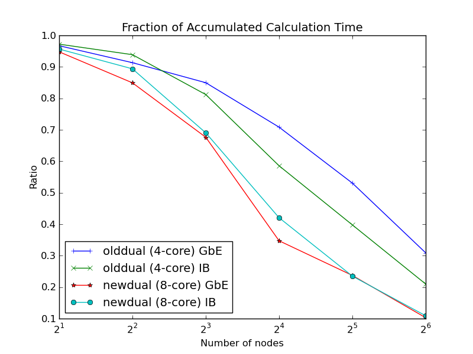
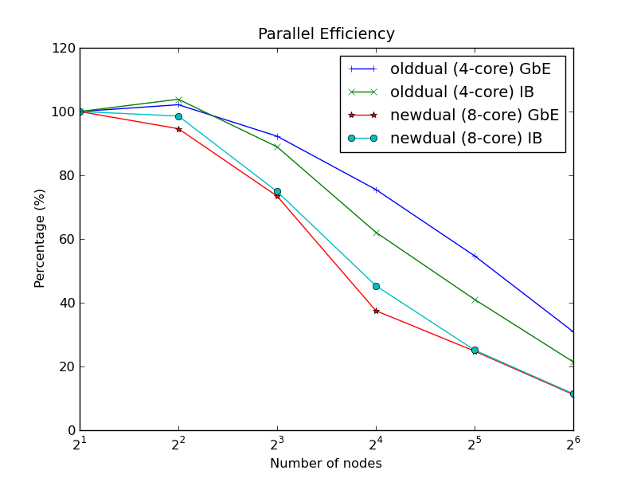
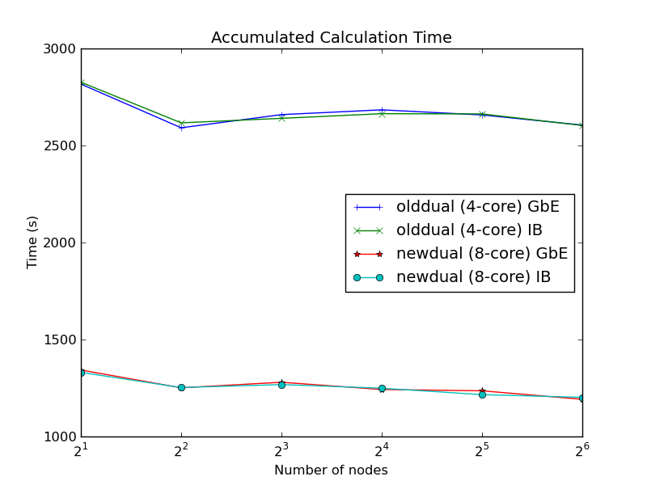
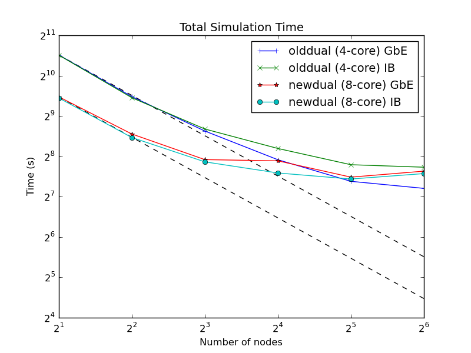
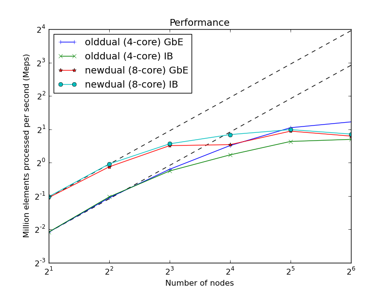
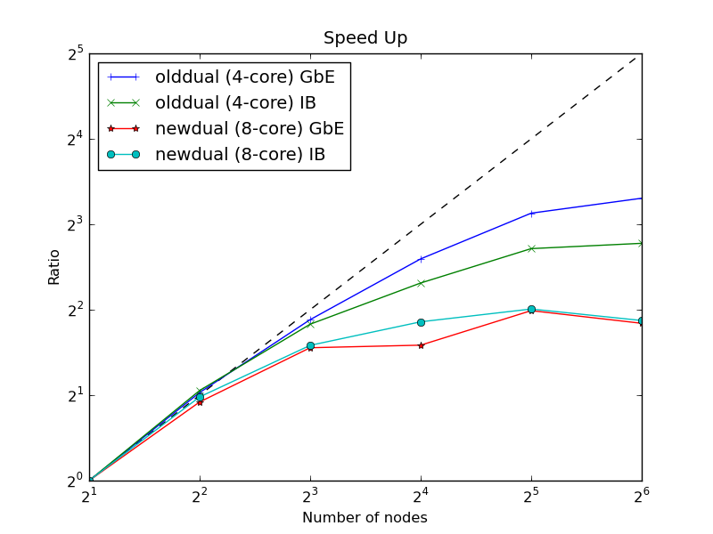

=========================
3M Mesh Benchmark Results
=========================

One month after the :doc:`go large <../solvcon_10M/index>` note, the parallel
pre-processor to load mesh file has been done.  The parallel loader facilitates
realistic benchmark of the current 3D Euler solver with modest resolution mesh
(3M and 16M).  Jobs for benchmarking 16M mesh are still queued at OSC, so this
note contains only 3M benchmark.  Having said that, important facts are
revealed from the smaller mesh.

Before demonstrating and analyzing the benchmark, I'd like to point out that
SOLVCON has successfully utilized 512 4-core (olddual) nodes on OSC.  The run
was performed weeks ago and didn't generated benchmark result.  Benchmarking
runs are currently queued.

SOLVCON now is more robust in bootstrapping after using libtorque to execute
remote processes.  I haven't heard any complaint from OSC staff about left-over
processes.

Communication Overhead
======================

Years ago, the performance of Python mixed with C/FORTRAN has been verified to
be as fast as pure FORTRAN or C by Cai et al., and I don't feel the need to
redo it.

For PDE solvers, parallel efficiency are dominated by the communication
overhead.  Fig. 1 shows the ratio of total time spent in calculation to
communication aggregated from all nodes.  Smaller ratio means more
communication.  Fig. 2 shows the parallel efficiency calculated with the
reference of the performance of two node.  Compare Fig. 1 and 2, one can
conclude that the parallel efficiency strictly follows the
calculation/communication ratio.

   Fig. 1. The ratio of total time spent in calculation to communication
   aggregated from all nodes.

   Fig. 2. Parallel efficiency.

The total time spent in calculation (summed from all nodes) subroutines should
be constant no matter how many nodes are used in calculations and do not depend
on interconnect.  The fact is verified in Fig. 3.  The 8-core newdual at OSC is
much faster than 4-core olddual, more than 100%.  However, newdual is also
busier than olddual.

   Fig. 3. The total time spend in calculation aggregated from all nodes.

An interesting point of the results is that IB does not significantly reduce
the communication overhead.  On the contrary, communication with IB takes more
time than that with GbE, as shown in Fig. 1.  There could be two reasons: (i)
IB network is busier than GbE network, and (ii) the IB binding in SOLVCON is
not effective.

Speed Up
========

The simulation time decreases when nodes increase before 32 nodes, as shown in
Fig. 4.  The speed-up starts to saturate after 32 nodes for olddual.  For
simulations on newdual, since the per-node performance is doubled to olddual,
simulation time starts to increase when more than 32 nodes are used.  The same
trend can be obtained from the performance plot in Fig. 5.

   Fig. 4. Time spent in simulation.

   Fig. 5. Performance measure in million element per second (Meps).

Figure 6 normalizes the speed-up of simulations on olddual and newdual.
Because the per-node speed of newdual is more than twice faster than olddual,
newdual suffers more from the communication overhead.

   Fig. 6. Speed-up by using the performance of two nodes as reference.

Comments
========

#. Also haven't all finished yet, some generated 16M benchmarks suggest that
   the increased element count helps parallel efficiency.

#. It is mysterious why doesn't IB help.

#. Faster node makes communication overhead more significant.

#. Currently the communication layer in SOLVCON is implemented with Python
   standard library (no MPI used) and is blocking.  Non-blocking communication
   should be further investigated.

#. It makes more sense now to consider using MPI libraries.
