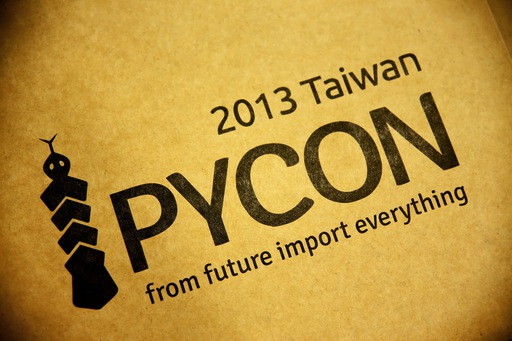
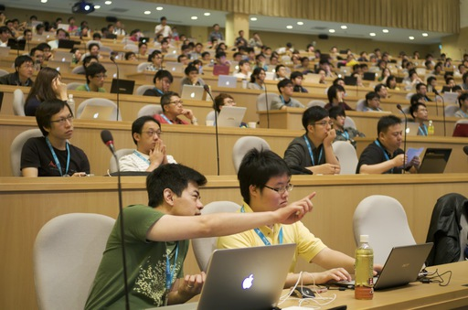
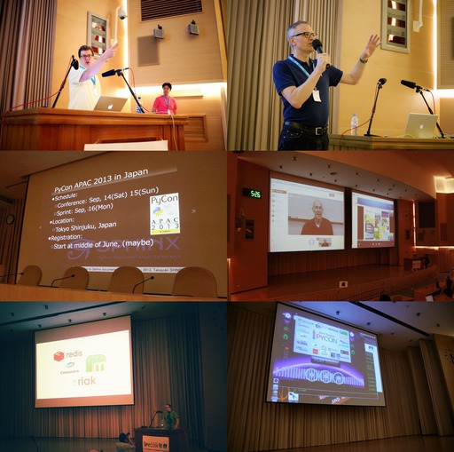
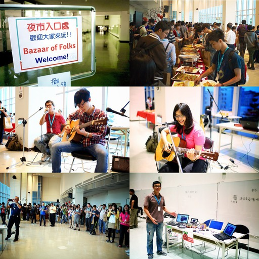
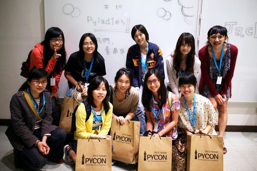
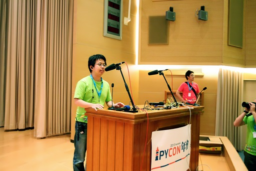

=======================
After PyCon Taiwan 2013
=======================

:date: 2013/6/6

  More and bigger pictures are in the `gallery
  <https://plus.google.com/events/gallery/clq2or6jeuei9lskcci9tupsh4g>`__.

This year `the conference <http://tw.pycon.org/2013/en/>`__ was great.  Totally
beyond my imagination.  This single sentence hit me when I walked into the
conference hall: "Oh yes, THIS is what I always want to see."

A vibrant community of gentle people enthusiastic to Python.  The second PyCon
Taiwan worked just like what described by Peter, one of our organizers: "The
annual convention in Taiwan for the Python community, by the Python community,
and of the Python community".  I hereby thank all the participants to the
conference.  You made it great!

.. figure:: everyone.jpg
  :align: center

Everything in the conference was great, but perhaps the most exciting thing is
`the technical program <http://tw.pycon.org/2013/en/program/>`__.  This year we
ended up with 33 talks selected from 50 proposals (plus 4 keynotes, 1
off-conference tutorial, and 1 in-conference workshop).  It's a pity that we
had to reject some very good ones, because we were too conservative when
planning the conference venue.  Three rooms were just too few (yes, if you were
rejected this year, don't be sad.  You are good.  The 30% rejecting rate is
totally my fault).  Our invited speakers made a lot of contribution to the
technical program: David Beazley, Jan Decaluwe, Allen Downey, and David Cramer.
There are also people from overseas came to join us, even from the other edge
of this continent.  In the conference, I can feel that Python and its
development are at the center.  I like it so much.

One really cool thing we tried this time was the night market.  In the agenda
it was named "Reception" or "BoF (Bazaar of Folks)", but really what we meant
was "night market (夜市)".  Yes, the night markets, a.k.a. night bazaars or
street markets that operate at night, you are told the must-see in Taiwan.  We
brought it from the street to the conference for Python.

The success of PyConTW night market surprised everyone of us, because it was
worked out in only two weeks by only two volunteers: bug and strong (and they
were also having other tasks at the same time).  For late start, when Strong
spoke to me at the first day: "Hey Yung-Yu, could you please make an
advertisement at the opening that there are still 3 booths left for sign-up?"
my reaction was: "Are you kidding me that you have filled all the booths with
only 3 left?  Are you sure you were not saying we have 3 booths signed up?" (Of
course I was just thinking those words without speaking out :)  It turned out
that almost all the tables we prepared were occupied, and PyLadies at Taiwan
kicked off at that night.  And there were many cool stuff exhibited at that
night.  It's simply great!

Night markets are one honking great idea -- let's do more of those!

In the second year of PyCon Taiwan, we reached 400 attendees.  Compared to the
260 attendees last year, the number increased 50%.  Last year we received 20
proposals, and compared to the 50 we got this year, the technical proposals
grew 150%.  These facts showed the Taiwan Python community is being motivated.
In addition to the conference, we've also seen metro-area user groups are
founded.  After we started `PyHUG <http://www.meetup.com/pythonhug/>`_ in 2011,
`Taipei.py <http://www.meetup.com/Taipei-py/>`_ was founded in 2012, and
`Tainan.py <http://www.meetup.com/Tainan-py-Python-Tainan-User-Group/>`_ will
kick off soon.  More and more people are getting together and sharing Python.
We are building a happy community.

I have a feeling that we've reached the critical mass, and the community is
moving by itself.  At this time, the people who initiated the efforts should
fade out from the spotlight, so that more people can come and drive the
community with more diversity.  After discussion in the last organizing meeting
before the conference, the organizing team concluded that `WenChang "Tim" Hsu
<https://twitter.com/timyellow>`__ will be the new conference chairperson.
There will be a period of transition, but after a couple of months, Tim will
lead the team to organize our next PyCon in Taiwan of more fun.

We'd like to thank all the attendees and sponsors to the conference.  During
the organizing process we were reaffirmed that we really are of the same
community.  I want to give special thanks to the organizing team.  You have
contributed tremendous efforts to make the conference great.  There are many
works that are not so "cool" but critically important, like coordinating
sponsorship, registration, venue preparation, finance, so on and so forth.
None of the staff complained a word when doing some really tedious tasks.
Please be reminded, all of the staff paid the tickets, did the work, and missed
many great talks.  I think the whole Python community in Taiwan should thank
for their dedication!  (But of course, better scheduling for volunteers' time
is on the top of our to-be-improved list.)

And if you want to give to the community, you are lucky!  There will be a lot
of things you can do.  Send an email to organizers@pycon.tw and tell us what
you can do for the community.

If you miss what you've just experienced in PyCon Taiwan 2013, don't hesitate
to go to your local Python user group.  In Hsinchu you have PyHUG_, in Taipei
there's Taipei.py_, and visit the Tainan.py_ page to find out what you can do
to help build it.  Having fun with Python and the community everyday surely
will be better than doing it once a year!

蛇年真是 Python 年，是吧。
